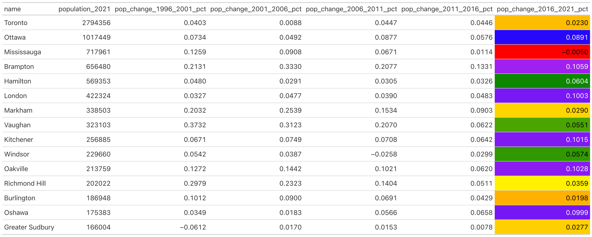
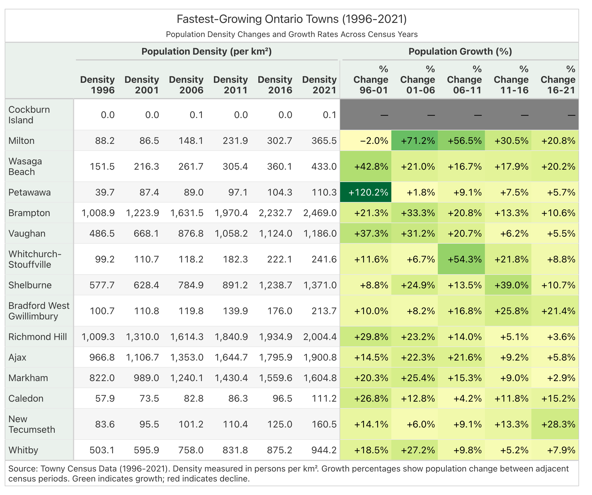
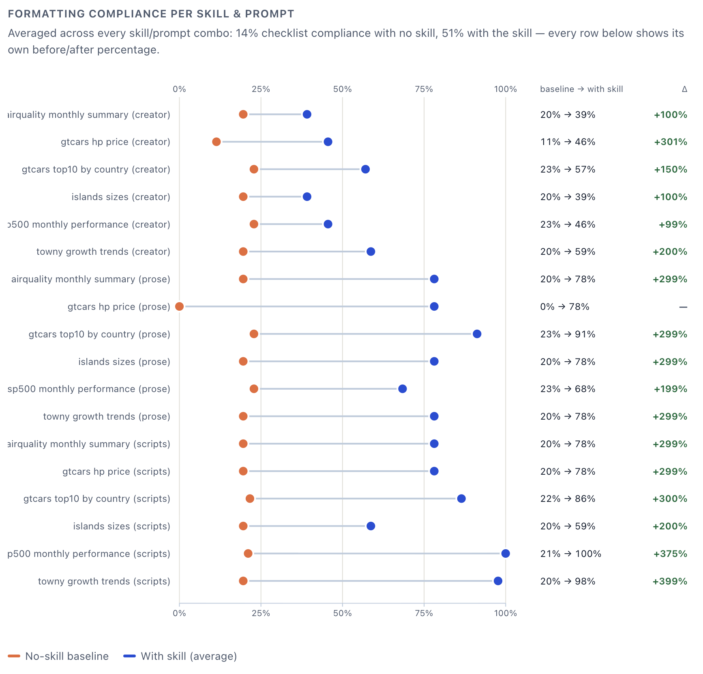
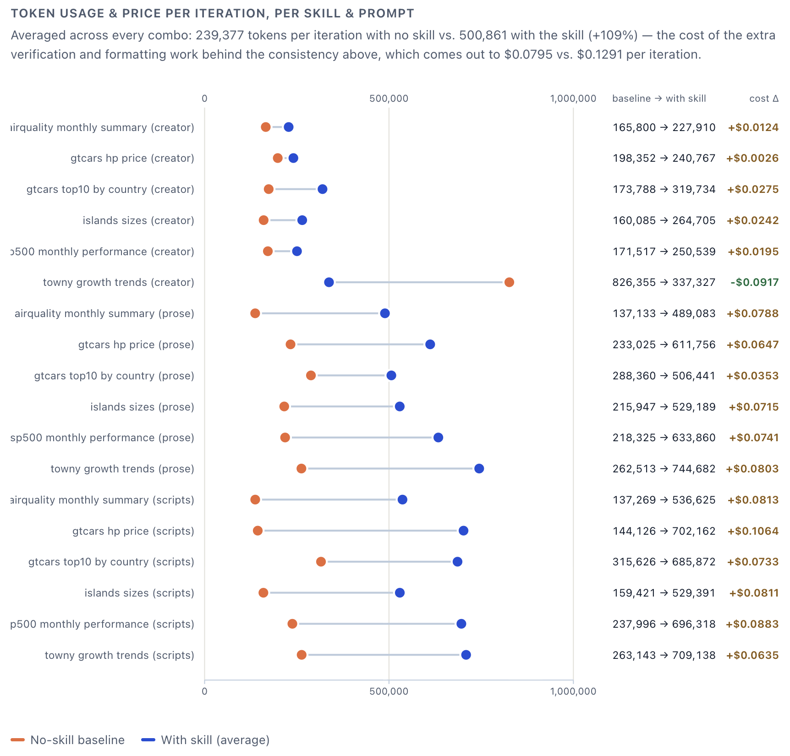
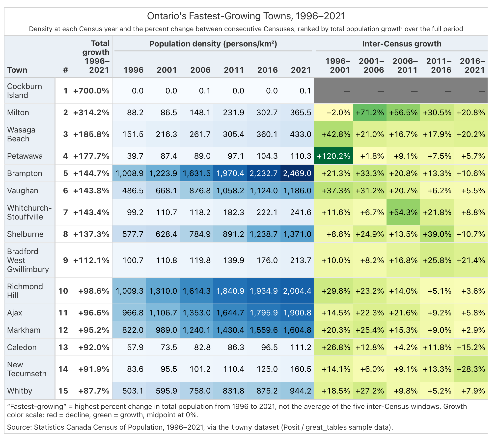

Plenty of data scientists now let an LLM write the code behind their tables instead
of writing it themselves. The trouble is you get something back, but you have no
real way of knowing if it's any good until you actually look at it yourself. The
colors, the layout, the column choices are all just whatever the model happened to
feel like doing on that particular run. [**Great Tables**][great-tables] already
gives you everything you need to build a genuinely good table in Python. The harder
part is getting an LLM to actually use all of that well, on purpose, every time you
ask it. That's what this [**Agent Skill**][great-docs-skills] is for: a folder of
instructions the agent reads before it writes any code, so the same design decisions
get made the same way on every run instead of getting reinvented from scratch each
time.

### Why table design is worth getting right

A table isn't good just because the numbers in it happen to be correct. Getting it
right means a whole list of smaller decisions actually line up. Color should draw
your eye toward what matters instead of sitting there for decoration. A title and
subtitle should tell you what you're even looking at. Column labels need to be
readable instead of raw variable names you have to translate in your head. Data
should be grouped so you're comparing within a category rather than across the whole
table at once. Units and abbreviations should stay compact without leaving you
guessing. A caption should say where the numbers came from, and a stub column should
anchor the row labels so you always know which row you're on.

An LLM makes every one of those calls whether you notice it happening or not. Left
alone, it tends to make a different set of them each time you ask it the same thing.

### What the skill actually changes

Here's the same prompt, run against the same data with the same model, once without
the skill and once with it attached: "Create a table showing population growth
trends for the top 15 fastest-growing Ontario towns, comparing their density changes
across all census years from 1996 to 2021, with the percentage changes between each
period."

Without the skill loaded, this is what comes back.

{width="90%" fig-align="center" fig-alt="A table of Ontario cities sorted by raw population, colored with an arbitrary rainbow of unrelated hues per row, decimals left unformatted, no title or caption."}

With the skill attached, same prompt and same data, this is what comes back instead.

{width="82%" fig-align="center" fig-alt="A table of Ontario's fastest-growing towns from 1996 to 2021, grouped under density and growth-rate column spanners, growth percentages colored on a green sequential scale, with a title, subtitle, and source note."}

Nobody touched the prompt, went back and forth with the model, or cleaned the output
up by hand afterward. The first table doesn't hit a single item from the list above.
The second one hits all of them.

It isn't just that one table has color and the other doesn't. The skill runs
through the same handful of decisions on every table it builds, and you can see
each one land in the towns example above. Color choice isn't a free pick: a measure
that's a plain magnitude, like price or population density, always gets a blue
scale, and a measure with a clear direction, like growth, gets green for more and
red for less, so a reader learns the color language once and it holds across every
table the skill produces. The bad table breaks that immediately. Every row gets an
unrelated color pulled from a different part of the spectrum, which tells you
nothing about which numbers are actually good or bad. The good table sticks to one
green scale for growth, and the shade alone tells you roughly how big the change was
without reading a single number.

The same discipline shows up in the smaller details. A shaded band sits behind the
column headers whenever there's a color story to introduce. Row dividers stay thin
and consistent instead of turning into a heavy grid. A stub column holds the row
labels apart from the rest of the data instead of letting them blend into an
ordinary column like everything else. None of these are dramatic on their own, but a
table that gets all of them right looks like someone actually planned it out instead
of assembling it in a hurry.

### The Numbers

One example doesn't prove much on its own, so the project ran this same comparison
across a whole corpus of prompts and three different skill designs, scoring every
run against its own hand-built answer key instead of trusting a gut feeling about
which table looked nicer.

{width="95%" fig-align="center" fig-alt="Dot plot of formatting-checklist compliance per skill design and prompt, no-skill baseline versus with-skill average, ranging roughly 11 to 23 percent baseline against 39 to 100 percent with the skill."}

Averaged across every skill and prompt combination, checklist compliance goes from 14
percent with no skill to 51 percent with the skill attached, and that holds up
prompt by prompt, not only once everything gets averaged together.

{width="95%" fig-align="center" fig-alt="Dot plot of run-to-run consistency per skill design and prompt, a single no-skill attempt against the skill's own repeats, ranging roughly 31 to 94 percent baseline against 69 to 100 percent with the skill."}

Consistency is where the skill earns its keep the most. A single no-skill attempt
only lands on the skill's own consensus about 54 percent of the time. Ask the skill
to repeat the same prompt several times over, though, and its own outputs agree with
each other 80 percent of the time. For anyone handing this off without babysitting
every single run, that number matters more than the compliance score does.

{width="95%" fig-align="center" fig-alt="Dot plot of token usage and cost per iteration per skill design and prompt, no-skill baseline against with-skill average, most baseline runs under 300,000 tokens and most with-skill runs between 250,000 and 750,000 tokens."}

That consistency costs something. Tokens per iteration run about 109 percent higher
on average once the skill is attached, and the price per iteration climbs by roughly
62 percent along with it. More reading happens before the model writes a single
line, and the result is steadier once it does.

### Checking it against the answer key

Looking better is the easy part. What actually matters for a data scientist handing a
request off to an LLM is whether the table is right: the correct measure colored, the
correct structure, the story the data is actually telling. So put the skill's table
next to the project's own hand-built answer key for that same prompt, made the way a
careful analyst would build it.

Here's the answer key.

{width="82%" fig-align="center" fig-alt="The hand-authored ground truth table: a ranked stub column, a total-growth summary column, both density and growth columns colored, and two separate footer notes."}

And here's the skill's table again, side by side with it.

{width="82%" fig-align="center" fig-alt="The skill's output table again, shown for direct comparison against the ground truth above."}

The skill's table gets the part that actually counts. It colors the right measure on
the right kind of scale, groups the data the way the prompt asked for, formats the
percentages properly, and writes a real caption. A careful human reviewer would still
add a rank column, color the density measure too instead of leaving it plain, and
split that one footer note into two. None of that is a misreading of the assignment.
It's the kind of polish a person adds on top of an answer the model already got
right.

### Get it

Installing `great_tables` already installs the skill. `SKILL.md` and its reference
files ship inside the package itself, so there's nothing extra to download. For an
agent to actually find it, though, it needs to sit in a folder an agent knows to look
in, like `.claude/skills/great-tables`, and that part is a separate step:

```bash
python -m great_tables.skill install
```

That copies the skill out of the installed package and into `.claude/skills/great-tables`,
ready for an agent to read. Point a different agent's skill installer at the same
folder, or copy it out by hand, either works. Read `references/REFERENCE.md` first;
it's the one file that tells you where everything else in the skill lives.

We're happy to talk more about any of this over on our [Discord server](https://discord.com/invite/Ux7nrcXHVV).

[great-tables]: https://github.com/posit-dev/great-tables
[great-docs-skills]: https://posit-dev.github.io/great-docs/
