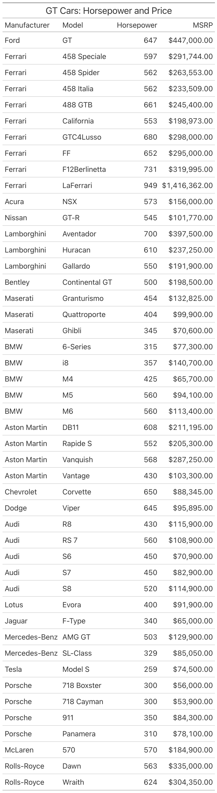
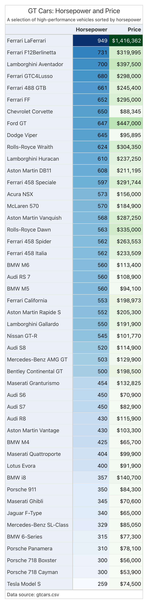
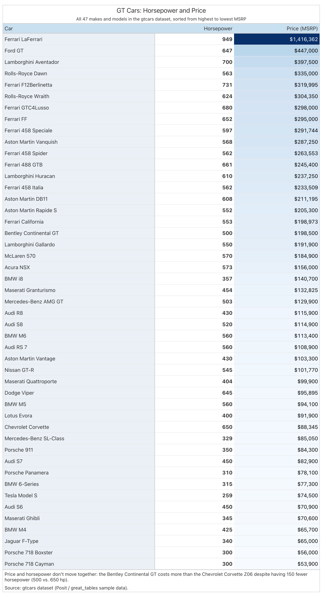
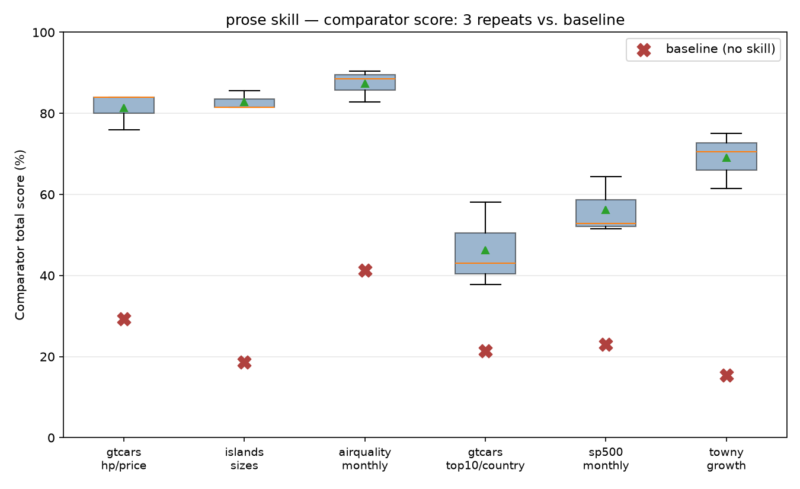
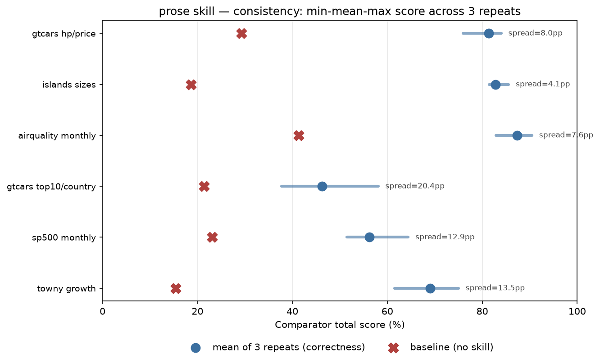
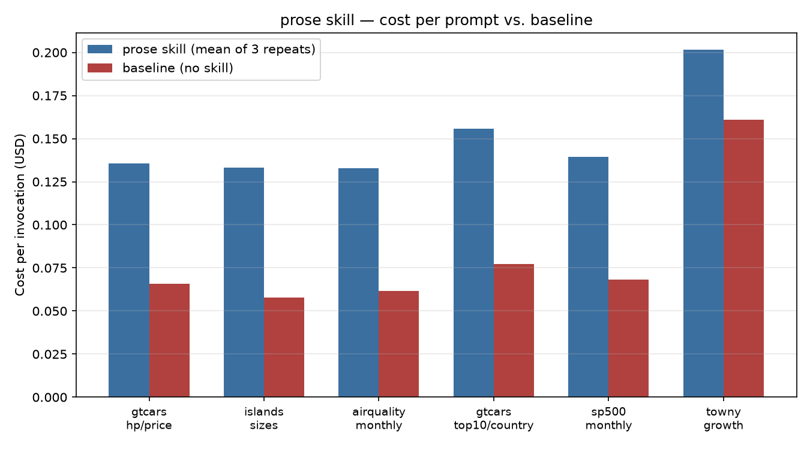
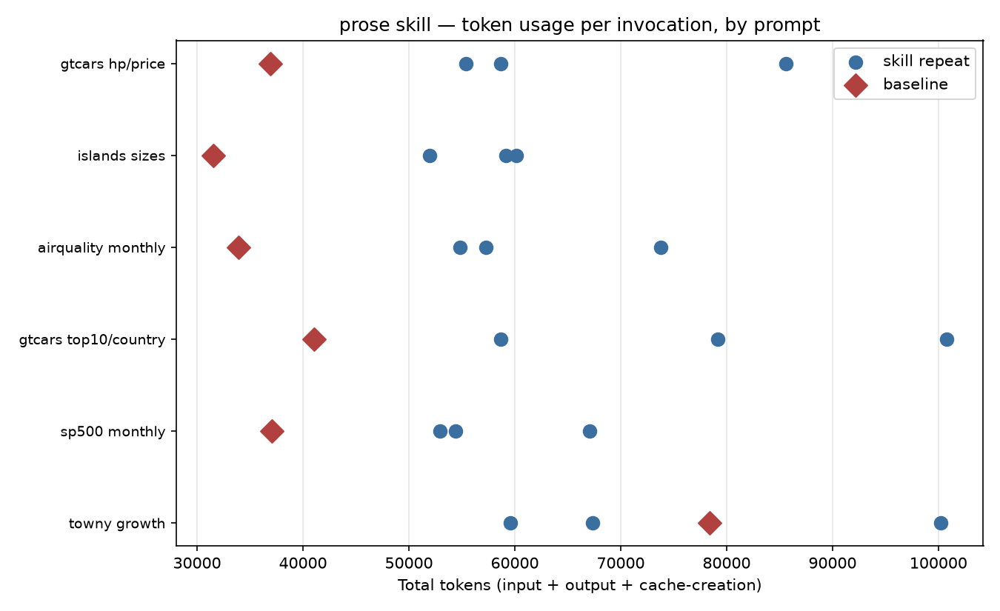

Ask an AI coding agent to turn a CSV into a [**Great Tables**][great-tables] display
table with no guidance at all, and you will get *something*, but not the same
something twice. One run colors the revenue column, the next colors margin, the one
after that colors both. One run adds a heading band, the next does not. Sometimes the
agent forgets a subtitle, or a source note, or leaves an obvious row label sitting in
the body instead of the stub. Ask the same question ten times and you can get ten
tables that do not look like they came from the same product.

### Why does that happen?

A general-purpose model's sense of what makes a table look good is not stable from one
run to the next, even against the exact same input. Left alone, it re-derives taste
every time it is asked, and taste re-derived from scratch on every run is, almost by
definition, inconsistent. So we did not try to make the model better at inventing
table design. We tried to stop asking it to invent one at all, and instead gave it an
[**Agent Skill**][great-docs-skills]: a folder of instructions and reference files
that the agent is required to read before it writes any code, so the decisions that
used to be a fresh judgment call on every run become a fixed, repeatable branch
instead.

### One flowchart, not a menu

The skill is written as a flowchart, not a menu of options. For every part of a table
there is one deterministic rule, or one explicit branch keyed off what the data
looks like, so the same input always produces the same output:

```
1. UNDERSTAND THE DATA   grain? identifiers? measures? categories? units? quality?
                         clean -> ONE correctly-typed DataFrame
                         validate request vs data (blank table if unanswerable)
2. ORGANIZE COLUMNS      show/hide, limit rows, stub (default), groups (gated),
                         spanners (column groups), name the hero column
3. BIG COLOR             at most 2 colored MEASURES (the hero if only 1); encoding
                         by data shape, gradients use sequential/diverging,
                         everything else uses a fixed solid palette
4. HEADING BAND          any Big Color? light band. none? dark saturated band
5. SMALL COLOR           fixed checklist: borders, dividers, striping, stub tint,
                         formatting per column, a grey-budget rule
6. TITLES & ANNOTATIONS  title + subtitle (both required), caption and source
                         when known, stacked footer notes
7. RENDER & VERIFY       save the table, read it back, audit every rule
```

The order is fixed on purpose. Color intent (step 3) is decided before the quiet
polish (step 5), and the heading band (step 4) can only be decided once the color
decision is already made.

### What actually happens when the model runs it

The skill is not a suggestion the model glances at once. It is a chain of files the
model is routed through, one hop at a time, before it is allowed to write a line of
table code. Here is what that looked like on a real run, prompted with "Show me a
table of the gt cars with their horsepower and price":

```
Skill({"skill": "great-tables"})
Read   references/REFERENCE.md              the router, read first, as instructed
Read   gtcars.csv                            then the data
Read   (4 reads into references/)            data-cleaning + Big-Color rules for
                                              these two numeric measures specifically
Read   references/big_color/column_label_emphasis.md   the heading-band decision
Write  table.py
```

The model's own commentary tracked the routing exactly: "Let me start by reading the
REFERENCE.md file as instructed by the skill," then, once it reached the data, "Since
we have two numeric measures (horsepower and price), I need to read the relevant
references." Nothing in that sequence is the model deciding "I like blue" in the
moment. Every file it opened was named by the router because of what the request and
the data looked like, not because it seemed like a good idea at the time.

### Does it actually work?

Take that same prompt. Forty-seven cars, two numbers. About as plain a table request
as you can write, and a good test of what a model does with no help at all.

**Before**, no skill loaded, the model doing whatever seemed reasonable in the moment:



<p style="font-size: 12px;">The baseline run: manufacturer and model kept as two
plain columns instead of one stub, no color, no frame, no subtitle.</p>

It is not a broken table. It runs, and it shows the right numbers. The title is even
good: a judge model scoring this table against a hand-authored answer key gave the
baseline's title a perfect match, word for word, against the answer key's own title.
But almost everything past the title is a default: manufacturer and model as two
plain columns rather than one combined stub, no color on either measure, no
subtitle, no source note.

**After**, the skill loaded, same prompt, same data:



<p style="font-size: 12px;">The skill's run on the identical prompt: cars as the
stub, both horsepower and price colored on sequential scales, a light heading band,
a subtitle, a caption, and a source note.</p>

**The answer key**, the project's own hand-authored ground truth for this exact
prompt, pinning which row selection, which measure gets colored, and why:



<p style="font-size: 12px;">The answer key colors only price (the measure the prompt
names as a hero), bolds horsepower instead of giving it a second fill, and
spends its caption on an actual finding in the data rather than a source citation
alone.</p>

A comparator built for this project scores each candidate against that answer key on
two buckets: Data-compliance (did it select the right rows, the right measures, the
right computed values) and Formatting-compliance (did it color, label, and structure
them the way the answer key does). The baseline table above scored 29 percent, 10 of
43 possible Data-compliance points and 19 of 56 Formatting points. The skill's table
scored 84 percent: a perfect 44 of 44 on Data-compliance, 40 of 56 on Formatting.

Most of the baseline's lost points trace back to the same handful of defaults. It
kept "Manufacturer" and "Model" as two separate value columns instead of one row-
identifying stub, so the column-overlap check only found 2 of 4 points. It never
called a coloring method at all, so every color-domain and color-mechanics check
failed outright rather than partially. It had no subtitle, so a judge model scored
that dimension 1 out of 5 against the answer key's subtitle, which states both the
row count and the sort order.

The skill's table is not a perfect match either, and the checks that cost it points
are worth naming honestly. It applied row striping to a table whose body is already
fully covered by color, a combination the checklist explicitly says to skip, costing
5 points. That same miscall carried into the stub-tint check, which is gated on
whether striping is already active, for another 5 points. And rather than coloring
one measure and bolding the other the way the answer key does, it colored both
horsepower and price, a defensible reading of the "at most 2 colored measures" rule
on its own, but not what the answer key's tighter "one hero, one bold" call was
checking for. A judge model also preferred the answer key's subtitle (it names the
row count and the real sort order) and its caption (it states an actual finding, that
the Bentley Continental GT costs more than the Corvette despite 150 fewer horsepower,
instead of just citing the data source).

### Does this hold up past one prompt?

One prompt is an anecdote. The project's own evaluation corpus runs six prompts
spanning easy, medium, and hard difficulty, and different data shapes: car listings,
monthly air-quality summaries, town population growth, and monthly S&P 500 returns.
Each prompt runs three repeats with the skill plus one baseline run with no skill,
every run scored against its own hand-authored answer key the same way as above.



<p style="font-size: 12px;">Comparator score across all three repeats and the
baseline run, for each of the six corpus prompts. The skill's repeats cluster well
above the baseline on every single prompt.</p>

Averaged across all six prompts, the skill scores 70.5 percent against a 24.8 percent
baseline, nearly three times over. It is also the most repeatable outcome we measured
on this corpus: a mean spread of only 11.1 points between the best and worst of three
repeats on the same prompt.



<p style="font-size: 12px;">Minimum, mean, and maximum comparator score across three
repeats per prompt, skill against baseline. A single baseline run has no spread to
show, since it is only run once per prompt.</p>

None of this is free, and we are not rounding that part away either. The skill's
extra reference reads show up directly in cost: a mean of $0.150 per invocation
against the baseline's $0.082, roughly 80 percent more, for the reads that happen
before a single line of table code gets written. Token use moves the same direction
for the same reason.



<p style="font-size: 12px;">Cost per invocation, skill against baseline, by
prompt.</p>



<p style="font-size: 12px;">Total tokens per invocation (input, output, and cache
creation), skill against baseline, by prompt.</p>

### How we made it good

The flowchart itself traces back to a concrete problem, not a hunch: two early
reference tables built for this project, a car-sales ranking and a town-growth
summary, looked like they came from two different products. Every rule since then,
the two-measure ceiling on color, the rule that a light band only appears alongside
Big Color, the grey-budget rule that promotes one neutral surface to a tint when too
many grey elements stack up, traces back to making tables from two different domains
still read as one.

Writing down where the values lived was not enough by itself. A forensic read of
early runs showed the model never opening a single reference file that held
a pinned value, across a dozen repeats. So the skill's instructions went through two
rewrites, not just a wording pass: the first cut the top-level instructions from 976
lines to 225 by extracting a long API reference into its own file; a second pass went
further and restructured everything around a single doorway, one router file that
names every other filename, with the top-level instructions themselves cut down to
117 lines that name decisions but hold no values of their own. A later audit of over
a hundred and fifty real run transcripts found
defects a design review alone would not have caught: none of six flagship examples
complied with the skill's own frame rule, and a summary row once rendered as raw
floating-point noise because currency formatting does not reach grand summary rows
by default. Each became a named, specific fix rather than a general rewrite.

### Where it still falls short

The striping-and-stub-tint miss above was not a one-off. The same two checks failed
for the same reason on a second, unrelated prompt in the corpus (an island-size
ranking, one colored measure, a fully covered body), which suggests it is a real,
recurring gap in the checklist's striping gate rather than a fluke of one run. We are
naming it here rather than picking a cleaner example to show instead.

There is also a structural limit worth stating plainly: inside this project's own
evaluation harness, the routing works because the skill is the only thing loaded and
the harness controls what the agent can reach. Once a skill is published for general
use, nothing stops an agent from skipping the mandated reads and writing table code
straight from memory. The flowchart is a strong default, not an enforced constraint,
outside the environment that was built to test it.

### Try it

The skill lives at `skills/great-tables/` in this repository, and installs the same
way any other skill on this site does, point an agent's skill installer at it, or
copy the folder into your own project. Reading `references/REFERENCE.md` first is the
one rule that matters most; it is the single place every other filename in the skill
lives, and it is written to be read before any data or any Python.

We are glad to talk more about any of this, the flowchart, the comparator, or where
either one should go next, over on our [Discord server](https://discord.com/invite/Ux7nrcXHVV).

[great-tables]: https://github.com/posit-dev/great-tables
[great-docs-skills]: https://posit-dev.github.io/great-docs/
