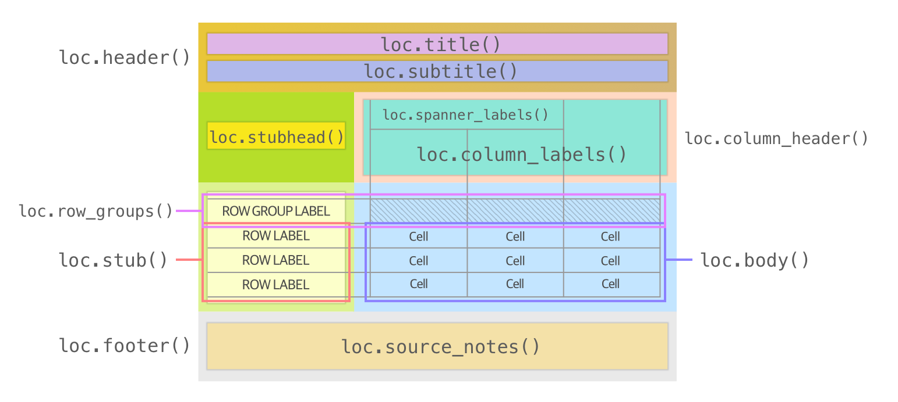

# Great Tables `v0.13.0`: Applying styles to all table locations

We did something in Great Tables (`0.13.0`) that'll make your tables that much more customizable: super *fine-grained* ways of setting styles throughout the table. Before you were largely constrained to styling through the following strategies:

1.  use a limited set of styles (e.g., background color, font weight, etc.) to different table locations like the stub, the column labels, etc., through [tab_options()](../../reference/GT.tab_options.md#great_tables.GT.tab_options)
2.  use [tab_style()](../../reference/GT.tab_style.md#great_tables.GT.tab_style) with a larger set of styling options for the table body cells (specified by [loc.body()](../../reference/loc.body.md#great_tables.loc.body))

In `v0.13.0`, we can target much more than just the table body! Here is the expanded set of `loc.*()` methods along with the locations that they can target.



This augmentation of the `loc` module to include all locations in the table means that there won't be a spot in the table to which you can't add styling. This is terrific because it gives you free rein to fully customize the look of your table.

Let's make a table and see how this new feature could be used.


## Starting things off with a big GT table

The table we'll make uses the [nuclides](../../reference/data.nuclides.md#great_tables.data.nuclides) dataset (available in the `great_tables.data` module). Through use of the `tab_*()` methods, quite a few table components (hence *locations*) will be added. We have hidden the code here because it is quite lengthy but you're encouraged to check it out to glean some interesting GT tricks.


Show the code

``` python
from great_tables import GT, md, style, loc, google_font
from great_tables.data import nuclides
import polars as pl
import polars.selectors as cs

nuclides_mini = (
    pl.from_pandas(nuclides)
    .filter(pl.col("element") == "C")
    .with_columns(pl.col("nuclide").str.replace(r"[0-9]+$", ""))
    .with_columns(mass_number=pl.col("z") + pl.col("n"))
    .with_columns(
        isotope=pl.concat_str(pl.col("element") + "-" + pl.col("mass_number").cast(pl.String))
    )
    .select(["isotope", "atomic_mass", "half_life", "isospin", "decay_1", "decay_2", "decay_3"])
)

gt_tbl = (
    GT(nuclides_mini, rowname_col="isotope")
    .tab_header(
        title="Isotopes of Carbon",
        subtitle="There are two stable isotopes of carbon and twelve that are unstable.",
    )
    .tab_spanner(label="Decay Mode", columns=cs.starts_with("decay"))
    .tab_source_note(md("Data obtained from the *nuclides* dataset."))
    .tab_stubhead(label="Isotope")
    .fmt_scientific(columns="half_life")
    .fmt_number(
        columns="atomic_mass",
        decimals=4,
        scale_by=1 / 1e6,
    )
    .sub_missing(columns="half_life", missing_text=md("**STABLE**"))
    .sub_missing(columns=cs.starts_with("decay"))
    .cols_label(
        atomic_mass="Atomic Mass",
        half_life="Half Life, s",
        isospin="Isospin",
        decay_1="1",
        decay_2="2",
        decay_3="3",
    )
    .cols_align(align="center", columns=[cs.starts_with("decay"), "isospin"])
    .opt_align_table_header(align="left")
    .opt_table_font(font=google_font(name="IBM Plex Sans"))
    .opt_vertical_padding(scale=0.5)
    .opt_horizontal_padding(scale=2)
)

gt_tbl
```


<table class="gt_table" data-quarto-disable-processing="false" data-quarto-bootstrap="false">
<thead>
<tr class="gt_heading">
<th colspan="7" class="gt_heading gt_title gt_font_normal">Isotopes of Carbon</th>
</tr>
<tr class="gt_heading">
<th colspan="7" class="gt_heading gt_subtitle gt_font_normal gt_bottom_border">There are two stable isotopes of carbon and twelve that are unstable.</th>
</tr>
<tr class="gt_col_headings gt_spanner_row">
<th rowspan="2" id="Isotope" class="gt_col_heading gt_columns_bottom_border gt_left" scope="col">Isotope</th>
<th rowspan="2" id="atomic_mass" class="gt_col_heading gt_columns_bottom_border gt_right" scope="col">Atomic Mass</th>
<th rowspan="2" id="half_life" class="gt_col_heading gt_columns_bottom_border gt_right" scope="col">Half Life, s</th>
<th rowspan="2" id="isospin" class="gt_col_heading gt_columns_bottom_border gt_center" scope="col">Isospin</th>
<th colspan="3" id="Decay-Mode" class="gt_center gt_columns_top_border gt_column_spanner_outer" scope="colgroup">Decay Mode</th>
</tr>
<tr class="gt_col_headings">
<th id="decay_1" class="gt_col_heading gt_columns_bottom_border gt_center" scope="col">1</th>
<th id="decay_2" class="gt_col_heading gt_columns_bottom_border gt_center" scope="col">2</th>
<th id="decay_3" class="gt_col_heading gt_columns_bottom_border gt_center" scope="col">3</th>
</tr>
</thead>
<tbody class="gt_table_body">
<tr>
<th class="gt_row gt_left gt_stub">C-8</th>
<td class="gt_row gt_right">8.0376</td>
<td class="gt_row gt_right">3.51 × 10<sup>−21</sup></td>
<td class="gt_row gt_center">2</td>
<td class="gt_row gt_center">2P</td>
<td class="gt_row gt_center">--</td>
<td class="gt_row gt_center">--</td>
</tr>
<tr>
<th class="gt_row gt_left gt_stub">C-9</th>
<td class="gt_row gt_right">9.0310</td>
<td class="gt_row gt_right">1.26 × 10<sup>−1</sup></td>
<td class="gt_row gt_center">3/2</td>
<td class="gt_row gt_center">EC+B+</td>
<td class="gt_row gt_center">B+P</td>
<td class="gt_row gt_center">B+A</td>
</tr>
<tr>
<th class="gt_row gt_left gt_stub">C-10</th>
<td class="gt_row gt_right">10.0169</td>
<td class="gt_row gt_right">1.93 × 10<sup>1</sup></td>
<td class="gt_row gt_center">1</td>
<td class="gt_row gt_center">EC+B+</td>
<td class="gt_row gt_center">--</td>
<td class="gt_row gt_center">--</td>
</tr>
<tr>
<th class="gt_row gt_left gt_stub">C-11</th>
<td class="gt_row gt_right">11.0114</td>
<td class="gt_row gt_right">1.22 × 10<sup>3</sup></td>
<td class="gt_row gt_center">1/2</td>
<td class="gt_row gt_center">EC+B+</td>
<td class="gt_row gt_center">--</td>
<td class="gt_row gt_center">--</td>
</tr>
<tr>
<th class="gt_row gt_left gt_stub">C-12</th>
<td class="gt_row gt_right">12.0000</td>
<td class="gt_row gt_right"><strong>STABLE</strong></td>
<td class="gt_row gt_center">0</td>
<td class="gt_row gt_center">--</td>
<td class="gt_row gt_center">--</td>
<td class="gt_row gt_center">--</td>
</tr>
<tr>
<th class="gt_row gt_left gt_stub">C-13</th>
<td class="gt_row gt_right">13.0034</td>
<td class="gt_row gt_right"><strong>STABLE</strong></td>
<td class="gt_row gt_center">1/2</td>
<td class="gt_row gt_center">--</td>
<td class="gt_row gt_center">--</td>
<td class="gt_row gt_center">--</td>
</tr>
<tr>
<th class="gt_row gt_left gt_stub">C-14</th>
<td class="gt_row gt_right">14.0032</td>
<td class="gt_row gt_right">1.80 × 10<sup>11</sup></td>
<td class="gt_row gt_center">1</td>
<td class="gt_row gt_center">B-</td>
<td class="gt_row gt_center">--</td>
<td class="gt_row gt_center">--</td>
</tr>
<tr>
<th class="gt_row gt_left gt_stub">C-15</th>
<td class="gt_row gt_right">15.0106</td>
<td class="gt_row gt_right">2.45</td>
<td class="gt_row gt_center">3/2</td>
<td class="gt_row gt_center">B-</td>
<td class="gt_row gt_center">--</td>
<td class="gt_row gt_center">--</td>
</tr>
<tr>
<th class="gt_row gt_left gt_stub">C-16</th>
<td class="gt_row gt_right">16.0147</td>
<td class="gt_row gt_right">7.47 × 10<sup>−1</sup></td>
<td class="gt_row gt_center">2</td>
<td class="gt_row gt_center">B-</td>
<td class="gt_row gt_center">B-N</td>
<td class="gt_row gt_center">--</td>
</tr>
<tr>
<th class="gt_row gt_left gt_stub">C-17</th>
<td class="gt_row gt_right">17.0226</td>
<td class="gt_row gt_right">1.93 × 10<sup>−1</sup></td>
<td class="gt_row gt_center">None</td>
<td class="gt_row gt_center">B-</td>
<td class="gt_row gt_center">B-N</td>
<td class="gt_row gt_center">--</td>
</tr>
<tr>
<th class="gt_row gt_left gt_stub">C-18</th>
<td class="gt_row gt_right">18.0268</td>
<td class="gt_row gt_right">9.20 × 10<sup>−2</sup></td>
<td class="gt_row gt_center">3</td>
<td class="gt_row gt_center">B-</td>
<td class="gt_row gt_center">B-N</td>
<td class="gt_row gt_center">--</td>
</tr>
<tr>
<th class="gt_row gt_left gt_stub">C-19</th>
<td class="gt_row gt_right">19.0348</td>
<td class="gt_row gt_right">4.63 × 10<sup>−2</sup></td>
<td class="gt_row gt_center">None</td>
<td class="gt_row gt_center">B-</td>
<td class="gt_row gt_center">B-N</td>
<td class="gt_row gt_center">B-2N</td>
</tr>
<tr>
<th class="gt_row gt_left gt_stub">C-20</th>
<td class="gt_row gt_right">20.0403</td>
<td class="gt_row gt_right">1.63 × 10<sup>−2</sup></td>
<td class="gt_row gt_center">None</td>
<td class="gt_row gt_center">B-</td>
<td class="gt_row gt_center">B-N</td>
<td class="gt_row gt_center">B-2N</td>
</tr>
<tr>
<th class="gt_row gt_left gt_stub">C-22</th>
<td class="gt_row gt_right">22.0576</td>
<td class="gt_row gt_right">6.10 × 10<sup>−3</sup></td>
<td class="gt_row gt_center">None</td>
<td class="gt_row gt_center">B-</td>
<td class="gt_row gt_center">B-N</td>
<td class="gt_row gt_center">B-2N</td>
</tr>
</tbody><tfoot>
<tr class="gt_sourcenotes">
<td colspan="7" class="gt_sourcenote">Data obtained from the <em>nuclides</em> dataset.</td>
</tr>
</tfoot>

</table>


This table will serve as a great starting point for demonstrating all the things you can now do with [tab_style()](../../reference/GT.tab_style.md#great_tables.GT.tab_style). And the following checklist will serve as a rough plan for how we will style the table:

- use [loc.body()](../../reference/loc.body.md#great_tables.loc.body) to emphasize isotope half-life values
- employ [loc.stub()](../../reference/loc.stub.md#great_tables.loc.stub) to draw attention to isotope names (and also point out the 'STABLE' rows)
- use [style.css()](../../reference/style.css.md#great_tables.style.css) for creating custom CSS styles (e.g., to indent row labels for stable isotopes)
- work with composite locations and style the whole header and footer quite simply
- set the default table body fill with [tab_options()](../../reference/GT.tab_options.md#great_tables.GT.tab_options)

Really this'll be [tab_style()](../../reference/GT.tab_style.md#great_tables.GT.tab_style) like you've never seen it before, so let's get on with it.


## Styling the body

First, we'll use [loc.body()](../../reference/loc.body.md#great_tables.loc.body) to emphasize half life values in two ways:

- Make the values in the `atomic_mass` and `half_life` use a monospace font.
- fill the background of isotopes with STABLE half lives to be PaleTurquoise.


``` python
gt_tbl = (
    gt_tbl
    .tab_style(
        style=style.text(font=google_font(name="IBM Plex Mono")),
        locations=loc.body(columns=["atomic_mass", "half_life"])
    )
    .tab_style(
        style=[style.text(color="Navy"), style.fill(color="PaleTurquoise")],
        locations=loc.body(columns="half_life", rows=pl.col("half_life").is_not_null())
    )
)

gt_tbl
```


<table class="gt_table" data-quarto-disable-processing="false" data-quarto-bootstrap="false">
<thead>
<tr class="gt_heading">
<th colspan="7" class="gt_heading gt_title gt_font_normal">Isotopes of Carbon</th>
</tr>
<tr class="gt_heading">
<th colspan="7" class="gt_heading gt_subtitle gt_font_normal gt_bottom_border">There are two stable isotopes of carbon and twelve that are unstable.</th>
</tr>
<tr class="gt_col_headings gt_spanner_row">
<th rowspan="2" id="Isotope" class="gt_col_heading gt_columns_bottom_border gt_left" scope="col">Isotope</th>
<th rowspan="2" id="atomic_mass" class="gt_col_heading gt_columns_bottom_border gt_right" scope="col">Atomic Mass</th>
<th rowspan="2" id="half_life" class="gt_col_heading gt_columns_bottom_border gt_right" scope="col">Half Life, s</th>
<th rowspan="2" id="isospin" class="gt_col_heading gt_columns_bottom_border gt_center" scope="col">Isospin</th>
<th colspan="3" id="Decay-Mode" class="gt_center gt_columns_top_border gt_column_spanner_outer" scope="colgroup">Decay Mode</th>
</tr>
<tr class="gt_col_headings">
<th id="decay_1" class="gt_col_heading gt_columns_bottom_border gt_center" scope="col">1</th>
<th id="decay_2" class="gt_col_heading gt_columns_bottom_border gt_center" scope="col">2</th>
<th id="decay_3" class="gt_col_heading gt_columns_bottom_border gt_center" scope="col">3</th>
</tr>
</thead>
<tbody class="gt_table_body">
<tr>
<th class="gt_row gt_left gt_stub">C-8</th>
<td class="gt_row gt_right" style="font-family: IBM Plex Mono">8.0376</td>
<td class="gt_row gt_right" style="font-family: IBM Plex Mono; color: Navy; background-color: PaleTurquoise">3.51 × 10<sup>−21</sup></td>
<td class="gt_row gt_center">2</td>
<td class="gt_row gt_center">2P</td>
<td class="gt_row gt_center">--</td>
<td class="gt_row gt_center">--</td>
</tr>
<tr>
<th class="gt_row gt_left gt_stub">C-9</th>
<td class="gt_row gt_right" style="font-family: IBM Plex Mono">9.0310</td>
<td class="gt_row gt_right" style="font-family: IBM Plex Mono; color: Navy; background-color: PaleTurquoise">1.26 × 10<sup>−1</sup></td>
<td class="gt_row gt_center">3/2</td>
<td class="gt_row gt_center">EC+B+</td>
<td class="gt_row gt_center">B+P</td>
<td class="gt_row gt_center">B+A</td>
</tr>
<tr>
<th class="gt_row gt_left gt_stub">C-10</th>
<td class="gt_row gt_right" style="font-family: IBM Plex Mono">10.0169</td>
<td class="gt_row gt_right" style="font-family: IBM Plex Mono; color: Navy; background-color: PaleTurquoise">1.93 × 10<sup>1</sup></td>
<td class="gt_row gt_center">1</td>
<td class="gt_row gt_center">EC+B+</td>
<td class="gt_row gt_center">--</td>
<td class="gt_row gt_center">--</td>
</tr>
<tr>
<th class="gt_row gt_left gt_stub">C-11</th>
<td class="gt_row gt_right" style="font-family: IBM Plex Mono">11.0114</td>
<td class="gt_row gt_right" style="font-family: IBM Plex Mono; color: Navy; background-color: PaleTurquoise">1.22 × 10<sup>3</sup></td>
<td class="gt_row gt_center">1/2</td>
<td class="gt_row gt_center">EC+B+</td>
<td class="gt_row gt_center">--</td>
<td class="gt_row gt_center">--</td>
</tr>
<tr>
<th class="gt_row gt_left gt_stub">C-12</th>
<td class="gt_row gt_right" style="font-family: IBM Plex Mono">12.0000</td>
<td class="gt_row gt_right" style="font-family: IBM Plex Mono"><strong>STABLE</strong></td>
<td class="gt_row gt_center">0</td>
<td class="gt_row gt_center">--</td>
<td class="gt_row gt_center">--</td>
<td class="gt_row gt_center">--</td>
</tr>
<tr>
<th class="gt_row gt_left gt_stub">C-13</th>
<td class="gt_row gt_right" style="font-family: IBM Plex Mono">13.0034</td>
<td class="gt_row gt_right" style="font-family: IBM Plex Mono"><strong>STABLE</strong></td>
<td class="gt_row gt_center">1/2</td>
<td class="gt_row gt_center">--</td>
<td class="gt_row gt_center">--</td>
<td class="gt_row gt_center">--</td>
</tr>
<tr>
<th class="gt_row gt_left gt_stub">C-14</th>
<td class="gt_row gt_right" style="font-family: IBM Plex Mono">14.0032</td>
<td class="gt_row gt_right" style="font-family: IBM Plex Mono; color: Navy; background-color: PaleTurquoise">1.80 × 10<sup>11</sup></td>
<td class="gt_row gt_center">1</td>
<td class="gt_row gt_center">B-</td>
<td class="gt_row gt_center">--</td>
<td class="gt_row gt_center">--</td>
</tr>
<tr>
<th class="gt_row gt_left gt_stub">C-15</th>
<td class="gt_row gt_right" style="font-family: IBM Plex Mono">15.0106</td>
<td class="gt_row gt_right" style="font-family: IBM Plex Mono; color: Navy; background-color: PaleTurquoise">2.45</td>
<td class="gt_row gt_center">3/2</td>
<td class="gt_row gt_center">B-</td>
<td class="gt_row gt_center">--</td>
<td class="gt_row gt_center">--</td>
</tr>
<tr>
<th class="gt_row gt_left gt_stub">C-16</th>
<td class="gt_row gt_right" style="font-family: IBM Plex Mono">16.0147</td>
<td class="gt_row gt_right" style="font-family: IBM Plex Mono; color: Navy; background-color: PaleTurquoise">7.47 × 10<sup>−1</sup></td>
<td class="gt_row gt_center">2</td>
<td class="gt_row gt_center">B-</td>
<td class="gt_row gt_center">B-N</td>
<td class="gt_row gt_center">--</td>
</tr>
<tr>
<th class="gt_row gt_left gt_stub">C-17</th>
<td class="gt_row gt_right" style="font-family: IBM Plex Mono">17.0226</td>
<td class="gt_row gt_right" style="font-family: IBM Plex Mono; color: Navy; background-color: PaleTurquoise">1.93 × 10<sup>−1</sup></td>
<td class="gt_row gt_center">None</td>
<td class="gt_row gt_center">B-</td>
<td class="gt_row gt_center">B-N</td>
<td class="gt_row gt_center">--</td>
</tr>
<tr>
<th class="gt_row gt_left gt_stub">C-18</th>
<td class="gt_row gt_right" style="font-family: IBM Plex Mono">18.0268</td>
<td class="gt_row gt_right" style="font-family: IBM Plex Mono; color: Navy; background-color: PaleTurquoise">9.20 × 10<sup>−2</sup></td>
<td class="gt_row gt_center">3</td>
<td class="gt_row gt_center">B-</td>
<td class="gt_row gt_center">B-N</td>
<td class="gt_row gt_center">--</td>
</tr>
<tr>
<th class="gt_row gt_left gt_stub">C-19</th>
<td class="gt_row gt_right" style="font-family: IBM Plex Mono">19.0348</td>
<td class="gt_row gt_right" style="font-family: IBM Plex Mono; color: Navy; background-color: PaleTurquoise">4.63 × 10<sup>−2</sup></td>
<td class="gt_row gt_center">None</td>
<td class="gt_row gt_center">B-</td>
<td class="gt_row gt_center">B-N</td>
<td class="gt_row gt_center">B-2N</td>
</tr>
<tr>
<th class="gt_row gt_left gt_stub">C-20</th>
<td class="gt_row gt_right" style="font-family: IBM Plex Mono">20.0403</td>
<td class="gt_row gt_right" style="font-family: IBM Plex Mono; color: Navy; background-color: PaleTurquoise">1.63 × 10<sup>−2</sup></td>
<td class="gt_row gt_center">None</td>
<td class="gt_row gt_center">B-</td>
<td class="gt_row gt_center">B-N</td>
<td class="gt_row gt_center">B-2N</td>
</tr>
<tr>
<th class="gt_row gt_left gt_stub">C-22</th>
<td class="gt_row gt_right" style="font-family: IBM Plex Mono">22.0576</td>
<td class="gt_row gt_right" style="font-family: IBM Plex Mono; color: Navy; background-color: PaleTurquoise">6.10 × 10<sup>−3</sup></td>
<td class="gt_row gt_center">None</td>
<td class="gt_row gt_center">B-</td>
<td class="gt_row gt_center">B-N</td>
<td class="gt_row gt_center">B-2N</td>
</tr>
</tbody><tfoot>
<tr class="gt_sourcenotes">
<td colspan="7" class="gt_sourcenote">Data obtained from the <em>nuclides</em> dataset.</td>
</tr>
</tfoot>

</table>


Note these important pieces in the code:

- setting monospace font: we used [`google_font()`](../../reference/google_font.md) (added in the previous release) to apply the monospaced font IBM Plex Mono.
- filling unstable half lives to turquoise: because the half life cells with the value STABLE are actually missing in the underlying data, and filled in using [GT.sub_missing()](../../reference/GT.sub_missing.md#great_tables.GT.sub_missing), we used the polars expression `pl.col("half_life").is_not_null()` to target everything that isn't STABLE.

This is mainly a reminder that Polars expressions are quite something. And targeting cells in the body with `loc.body(rows=...)` can be powerful by extension.


## Don't forget the stub!

We mustn't forget the stub. It's a totally separate location, being off to the side and having the important responsibility of holding the row labels. Here, we are going to do two things:

1.  Change the fill color (to 'Linen') and make the text bold for the *entire stub*
2.  Highlight the rows where we have stable isotopes (the extent is both for the stub and the body cells)


``` python
gt_tbl = (
    gt_tbl
    .tab_style(
        style=[style.fill(color="Linen"), style.text(weight="bold")],
        locations=loc.stub()
    )
    .tab_style(
        style=style.fill(color="LightCyan"),
        locations=[
            loc.body(rows=pl.col("half_life").is_null()),
            loc.stub(rows=pl.col("half_life").is_null())
        ]
    )
 )

gt_tbl
```


<table class="gt_table" data-quarto-disable-processing="false" data-quarto-bootstrap="false">
<thead>
<tr class="gt_heading">
<th colspan="7" class="gt_heading gt_title gt_font_normal">Isotopes of Carbon</th>
</tr>
<tr class="gt_heading">
<th colspan="7" class="gt_heading gt_subtitle gt_font_normal gt_bottom_border">There are two stable isotopes of carbon and twelve that are unstable.</th>
</tr>
<tr class="gt_col_headings gt_spanner_row">
<th rowspan="2" id="Isotope" class="gt_col_heading gt_columns_bottom_border gt_left" scope="col">Isotope</th>
<th rowspan="2" id="atomic_mass" class="gt_col_heading gt_columns_bottom_border gt_right" scope="col">Atomic Mass</th>
<th rowspan="2" id="half_life" class="gt_col_heading gt_columns_bottom_border gt_right" scope="col">Half Life, s</th>
<th rowspan="2" id="isospin" class="gt_col_heading gt_columns_bottom_border gt_center" scope="col">Isospin</th>
<th colspan="3" id="Decay-Mode" class="gt_center gt_columns_top_border gt_column_spanner_outer" scope="colgroup">Decay Mode</th>
</tr>
<tr class="gt_col_headings">
<th id="decay_1" class="gt_col_heading gt_columns_bottom_border gt_center" scope="col">1</th>
<th id="decay_2" class="gt_col_heading gt_columns_bottom_border gt_center" scope="col">2</th>
<th id="decay_3" class="gt_col_heading gt_columns_bottom_border gt_center" scope="col">3</th>
</tr>
</thead>
<tbody class="gt_table_body">
<tr>
<th class="gt_row gt_left gt_stub" style="background-color: Linen; font-weight: bold">C-8</th>
<td class="gt_row gt_right" style="font-family: IBM Plex Mono">8.0376</td>
<td class="gt_row gt_right" style="font-family: IBM Plex Mono; color: Navy; background-color: PaleTurquoise">3.51 × 10<sup>−21</sup></td>
<td class="gt_row gt_center">2</td>
<td class="gt_row gt_center">2P</td>
<td class="gt_row gt_center">--</td>
<td class="gt_row gt_center">--</td>
</tr>
<tr>
<th class="gt_row gt_left gt_stub" style="background-color: Linen; font-weight: bold">C-9</th>
<td class="gt_row gt_right" style="font-family: IBM Plex Mono">9.0310</td>
<td class="gt_row gt_right" style="font-family: IBM Plex Mono; color: Navy; background-color: PaleTurquoise">1.26 × 10<sup>−1</sup></td>
<td class="gt_row gt_center">3/2</td>
<td class="gt_row gt_center">EC+B+</td>
<td class="gt_row gt_center">B+P</td>
<td class="gt_row gt_center">B+A</td>
</tr>
<tr>
<th class="gt_row gt_left gt_stub" style="background-color: Linen; font-weight: bold">C-10</th>
<td class="gt_row gt_right" style="font-family: IBM Plex Mono">10.0169</td>
<td class="gt_row gt_right" style="font-family: IBM Plex Mono; color: Navy; background-color: PaleTurquoise">1.93 × 10<sup>1</sup></td>
<td class="gt_row gt_center">1</td>
<td class="gt_row gt_center">EC+B+</td>
<td class="gt_row gt_center">--</td>
<td class="gt_row gt_center">--</td>
</tr>
<tr>
<th class="gt_row gt_left gt_stub" style="background-color: Linen; font-weight: bold">C-11</th>
<td class="gt_row gt_right" style="font-family: IBM Plex Mono">11.0114</td>
<td class="gt_row gt_right" style="font-family: IBM Plex Mono; color: Navy; background-color: PaleTurquoise">1.22 × 10<sup>3</sup></td>
<td class="gt_row gt_center">1/2</td>
<td class="gt_row gt_center">EC+B+</td>
<td class="gt_row gt_center">--</td>
<td class="gt_row gt_center">--</td>
</tr>
<tr>
<th class="gt_row gt_left gt_stub" style="background-color: Linen; font-weight: bold; background-color: LightCyan">C-12</th>
<td class="gt_row gt_right" style="font-family: IBM Plex Mono; background-color: LightCyan">12.0000</td>
<td class="gt_row gt_right" style="font-family: IBM Plex Mono; background-color: LightCyan"><strong>STABLE</strong></td>
<td class="gt_row gt_center" style="background-color: LightCyan">0</td>
<td class="gt_row gt_center" style="background-color: LightCyan">--</td>
<td class="gt_row gt_center" style="background-color: LightCyan">--</td>
<td class="gt_row gt_center" style="background-color: LightCyan">--</td>
</tr>
<tr>
<th class="gt_row gt_left gt_stub" style="background-color: Linen; font-weight: bold; background-color: LightCyan">C-13</th>
<td class="gt_row gt_right" style="font-family: IBM Plex Mono; background-color: LightCyan">13.0034</td>
<td class="gt_row gt_right" style="font-family: IBM Plex Mono; background-color: LightCyan"><strong>STABLE</strong></td>
<td class="gt_row gt_center" style="background-color: LightCyan">1/2</td>
<td class="gt_row gt_center" style="background-color: LightCyan">--</td>
<td class="gt_row gt_center" style="background-color: LightCyan">--</td>
<td class="gt_row gt_center" style="background-color: LightCyan">--</td>
</tr>
<tr>
<th class="gt_row gt_left gt_stub" style="background-color: Linen; font-weight: bold">C-14</th>
<td class="gt_row gt_right" style="font-family: IBM Plex Mono">14.0032</td>
<td class="gt_row gt_right" style="font-family: IBM Plex Mono; color: Navy; background-color: PaleTurquoise">1.80 × 10<sup>11</sup></td>
<td class="gt_row gt_center">1</td>
<td class="gt_row gt_center">B-</td>
<td class="gt_row gt_center">--</td>
<td class="gt_row gt_center">--</td>
</tr>
<tr>
<th class="gt_row gt_left gt_stub" style="background-color: Linen; font-weight: bold">C-15</th>
<td class="gt_row gt_right" style="font-family: IBM Plex Mono">15.0106</td>
<td class="gt_row gt_right" style="font-family: IBM Plex Mono; color: Navy; background-color: PaleTurquoise">2.45</td>
<td class="gt_row gt_center">3/2</td>
<td class="gt_row gt_center">B-</td>
<td class="gt_row gt_center">--</td>
<td class="gt_row gt_center">--</td>
</tr>
<tr>
<th class="gt_row gt_left gt_stub" style="background-color: Linen; font-weight: bold">C-16</th>
<td class="gt_row gt_right" style="font-family: IBM Plex Mono">16.0147</td>
<td class="gt_row gt_right" style="font-family: IBM Plex Mono; color: Navy; background-color: PaleTurquoise">7.47 × 10<sup>−1</sup></td>
<td class="gt_row gt_center">2</td>
<td class="gt_row gt_center">B-</td>
<td class="gt_row gt_center">B-N</td>
<td class="gt_row gt_center">--</td>
</tr>
<tr>
<th class="gt_row gt_left gt_stub" style="background-color: Linen; font-weight: bold">C-17</th>
<td class="gt_row gt_right" style="font-family: IBM Plex Mono">17.0226</td>
<td class="gt_row gt_right" style="font-family: IBM Plex Mono; color: Navy; background-color: PaleTurquoise">1.93 × 10<sup>−1</sup></td>
<td class="gt_row gt_center">None</td>
<td class="gt_row gt_center">B-</td>
<td class="gt_row gt_center">B-N</td>
<td class="gt_row gt_center">--</td>
</tr>
<tr>
<th class="gt_row gt_left gt_stub" style="background-color: Linen; font-weight: bold">C-18</th>
<td class="gt_row gt_right" style="font-family: IBM Plex Mono">18.0268</td>
<td class="gt_row gt_right" style="font-family: IBM Plex Mono; color: Navy; background-color: PaleTurquoise">9.20 × 10<sup>−2</sup></td>
<td class="gt_row gt_center">3</td>
<td class="gt_row gt_center">B-</td>
<td class="gt_row gt_center">B-N</td>
<td class="gt_row gt_center">--</td>
</tr>
<tr>
<th class="gt_row gt_left gt_stub" style="background-color: Linen; font-weight: bold">C-19</th>
<td class="gt_row gt_right" style="font-family: IBM Plex Mono">19.0348</td>
<td class="gt_row gt_right" style="font-family: IBM Plex Mono; color: Navy; background-color: PaleTurquoise">4.63 × 10<sup>−2</sup></td>
<td class="gt_row gt_center">None</td>
<td class="gt_row gt_center">B-</td>
<td class="gt_row gt_center">B-N</td>
<td class="gt_row gt_center">B-2N</td>
</tr>
<tr>
<th class="gt_row gt_left gt_stub" style="background-color: Linen; font-weight: bold">C-20</th>
<td class="gt_row gt_right" style="font-family: IBM Plex Mono">20.0403</td>
<td class="gt_row gt_right" style="font-family: IBM Plex Mono; color: Navy; background-color: PaleTurquoise">1.63 × 10<sup>−2</sup></td>
<td class="gt_row gt_center">None</td>
<td class="gt_row gt_center">B-</td>
<td class="gt_row gt_center">B-N</td>
<td class="gt_row gt_center">B-2N</td>
</tr>
<tr>
<th class="gt_row gt_left gt_stub" style="background-color: Linen; font-weight: bold">C-22</th>
<td class="gt_row gt_right" style="font-family: IBM Plex Mono">22.0576</td>
<td class="gt_row gt_right" style="font-family: IBM Plex Mono; color: Navy; background-color: PaleTurquoise">6.10 × 10<sup>−3</sup></td>
<td class="gt_row gt_center">None</td>
<td class="gt_row gt_center">B-</td>
<td class="gt_row gt_center">B-N</td>
<td class="gt_row gt_center">B-2N</td>
</tr>
</tbody><tfoot>
<tr class="gt_sourcenotes">
<td colspan="7" class="gt_sourcenote">Data obtained from the <em>nuclides</em> dataset.</td>
</tr>
</tfoot>

</table>


For task \#1, a simple `.tab_style(..., locations=loc.stub())` targeted the entire stub.

Task \#2 is more interesting. Like [loc.body()](../../reference/loc.body.md#great_tables.loc.body), [loc.stub()](../../reference/loc.stub.md#great_tables.loc.stub) has a `rows=` argument that can target specific rows with Polars expressions. We used the same Polars expression as in the previous section to target those rows that belong to the stable isotopes.

We've dressed up the stub so that it is that much more prominent. And that linen-colored stub goes so well with the light-cyan rows, representative of carbon-12 and carbon-13!


## Using custom style rules with the new [style.css()](../../reference/style.css.md#great_tables.style.css)

Aside from decking out the `loc` module with all manner of location methods, we've added a little something to the [style](../../reference/style.text.md#great_tables.style.text.style) module: [style.css()](../../reference/style.css.md#great_tables.style.css)! What's it for? It lets you supply style declarations to its single `rule=` argument.

As an example, I might want to indent some text in one or more table cells. You can't really do that with the [style.text()](../../reference/style.text.md#great_tables.style.text) method since it doesn't have an `indent=` argument. So, in Great Tables `0.13.0` you can manually indent the row label text for the 'STABLE' rows using a CSS style rule:


``` python
gt_tbl = (
    gt_tbl
    .tab_style(
        style=style.css(rule="text-indent: 4px;"),
        locations=loc.stub(rows=pl.col("half_life").is_null())
    )
)

gt_tbl
```


<table class="gt_table" data-quarto-disable-processing="false" data-quarto-bootstrap="false">
<thead>
<tr class="gt_heading">
<th colspan="7" class="gt_heading gt_title gt_font_normal">Isotopes of Carbon</th>
</tr>
<tr class="gt_heading">
<th colspan="7" class="gt_heading gt_subtitle gt_font_normal gt_bottom_border">There are two stable isotopes of carbon and twelve that are unstable.</th>
</tr>
<tr class="gt_col_headings gt_spanner_row">
<th rowspan="2" id="Isotope" class="gt_col_heading gt_columns_bottom_border gt_left" scope="col">Isotope</th>
<th rowspan="2" id="atomic_mass" class="gt_col_heading gt_columns_bottom_border gt_right" scope="col">Atomic Mass</th>
<th rowspan="2" id="half_life" class="gt_col_heading gt_columns_bottom_border gt_right" scope="col">Half Life, s</th>
<th rowspan="2" id="isospin" class="gt_col_heading gt_columns_bottom_border gt_center" scope="col">Isospin</th>
<th colspan="3" id="Decay-Mode" class="gt_center gt_columns_top_border gt_column_spanner_outer" scope="colgroup">Decay Mode</th>
</tr>
<tr class="gt_col_headings">
<th id="decay_1" class="gt_col_heading gt_columns_bottom_border gt_center" scope="col">1</th>
<th id="decay_2" class="gt_col_heading gt_columns_bottom_border gt_center" scope="col">2</th>
<th id="decay_3" class="gt_col_heading gt_columns_bottom_border gt_center" scope="col">3</th>
</tr>
</thead>
<tbody class="gt_table_body">
<tr>
<th class="gt_row gt_left gt_stub" style="background-color: Linen; font-weight: bold">C-8</th>
<td class="gt_row gt_right" style="font-family: IBM Plex Mono">8.0376</td>
<td class="gt_row gt_right" style="font-family: IBM Plex Mono; color: Navy; background-color: PaleTurquoise">3.51 × 10<sup>−21</sup></td>
<td class="gt_row gt_center">2</td>
<td class="gt_row gt_center">2P</td>
<td class="gt_row gt_center">--</td>
<td class="gt_row gt_center">--</td>
</tr>
<tr>
<th class="gt_row gt_left gt_stub" style="background-color: Linen; font-weight: bold">C-9</th>
<td class="gt_row gt_right" style="font-family: IBM Plex Mono">9.0310</td>
<td class="gt_row gt_right" style="font-family: IBM Plex Mono; color: Navy; background-color: PaleTurquoise">1.26 × 10<sup>−1</sup></td>
<td class="gt_row gt_center">3/2</td>
<td class="gt_row gt_center">EC+B+</td>
<td class="gt_row gt_center">B+P</td>
<td class="gt_row gt_center">B+A</td>
</tr>
<tr>
<th class="gt_row gt_left gt_stub" style="background-color: Linen; font-weight: bold">C-10</th>
<td class="gt_row gt_right" style="font-family: IBM Plex Mono">10.0169</td>
<td class="gt_row gt_right" style="font-family: IBM Plex Mono; color: Navy; background-color: PaleTurquoise">1.93 × 10<sup>1</sup></td>
<td class="gt_row gt_center">1</td>
<td class="gt_row gt_center">EC+B+</td>
<td class="gt_row gt_center">--</td>
<td class="gt_row gt_center">--</td>
</tr>
<tr>
<th class="gt_row gt_left gt_stub" style="background-color: Linen; font-weight: bold">C-11</th>
<td class="gt_row gt_right" style="font-family: IBM Plex Mono">11.0114</td>
<td class="gt_row gt_right" style="font-family: IBM Plex Mono; color: Navy; background-color: PaleTurquoise">1.22 × 10<sup>3</sup></td>
<td class="gt_row gt_center">1/2</td>
<td class="gt_row gt_center">EC+B+</td>
<td class="gt_row gt_center">--</td>
<td class="gt_row gt_center">--</td>
</tr>
<tr>
<th class="gt_row gt_left gt_stub" style="background-color: Linen; font-weight: bold; background-color: LightCyan; text-indent: 4px">C-12</th>
<td class="gt_row gt_right" style="font-family: IBM Plex Mono; background-color: LightCyan">12.0000</td>
<td class="gt_row gt_right" style="font-family: IBM Plex Mono; background-color: LightCyan"><strong>STABLE</strong></td>
<td class="gt_row gt_center" style="background-color: LightCyan">0</td>
<td class="gt_row gt_center" style="background-color: LightCyan">--</td>
<td class="gt_row gt_center" style="background-color: LightCyan">--</td>
<td class="gt_row gt_center" style="background-color: LightCyan">--</td>
</tr>
<tr>
<th class="gt_row gt_left gt_stub" style="background-color: Linen; font-weight: bold; background-color: LightCyan; text-indent: 4px">C-13</th>
<td class="gt_row gt_right" style="font-family: IBM Plex Mono; background-color: LightCyan">13.0034</td>
<td class="gt_row gt_right" style="font-family: IBM Plex Mono; background-color: LightCyan"><strong>STABLE</strong></td>
<td class="gt_row gt_center" style="background-color: LightCyan">1/2</td>
<td class="gt_row gt_center" style="background-color: LightCyan">--</td>
<td class="gt_row gt_center" style="background-color: LightCyan">--</td>
<td class="gt_row gt_center" style="background-color: LightCyan">--</td>
</tr>
<tr>
<th class="gt_row gt_left gt_stub" style="background-color: Linen; font-weight: bold">C-14</th>
<td class="gt_row gt_right" style="font-family: IBM Plex Mono">14.0032</td>
<td class="gt_row gt_right" style="font-family: IBM Plex Mono; color: Navy; background-color: PaleTurquoise">1.80 × 10<sup>11</sup></td>
<td class="gt_row gt_center">1</td>
<td class="gt_row gt_center">B-</td>
<td class="gt_row gt_center">--</td>
<td class="gt_row gt_center">--</td>
</tr>
<tr>
<th class="gt_row gt_left gt_stub" style="background-color: Linen; font-weight: bold">C-15</th>
<td class="gt_row gt_right" style="font-family: IBM Plex Mono">15.0106</td>
<td class="gt_row gt_right" style="font-family: IBM Plex Mono; color: Navy; background-color: PaleTurquoise">2.45</td>
<td class="gt_row gt_center">3/2</td>
<td class="gt_row gt_center">B-</td>
<td class="gt_row gt_center">--</td>
<td class="gt_row gt_center">--</td>
</tr>
<tr>
<th class="gt_row gt_left gt_stub" style="background-color: Linen; font-weight: bold">C-16</th>
<td class="gt_row gt_right" style="font-family: IBM Plex Mono">16.0147</td>
<td class="gt_row gt_right" style="font-family: IBM Plex Mono; color: Navy; background-color: PaleTurquoise">7.47 × 10<sup>−1</sup></td>
<td class="gt_row gt_center">2</td>
<td class="gt_row gt_center">B-</td>
<td class="gt_row gt_center">B-N</td>
<td class="gt_row gt_center">--</td>
</tr>
<tr>
<th class="gt_row gt_left gt_stub" style="background-color: Linen; font-weight: bold">C-17</th>
<td class="gt_row gt_right" style="font-family: IBM Plex Mono">17.0226</td>
<td class="gt_row gt_right" style="font-family: IBM Plex Mono; color: Navy; background-color: PaleTurquoise">1.93 × 10<sup>−1</sup></td>
<td class="gt_row gt_center">None</td>
<td class="gt_row gt_center">B-</td>
<td class="gt_row gt_center">B-N</td>
<td class="gt_row gt_center">--</td>
</tr>
<tr>
<th class="gt_row gt_left gt_stub" style="background-color: Linen; font-weight: bold">C-18</th>
<td class="gt_row gt_right" style="font-family: IBM Plex Mono">18.0268</td>
<td class="gt_row gt_right" style="font-family: IBM Plex Mono; color: Navy; background-color: PaleTurquoise">9.20 × 10<sup>−2</sup></td>
<td class="gt_row gt_center">3</td>
<td class="gt_row gt_center">B-</td>
<td class="gt_row gt_center">B-N</td>
<td class="gt_row gt_center">--</td>
</tr>
<tr>
<th class="gt_row gt_left gt_stub" style="background-color: Linen; font-weight: bold">C-19</th>
<td class="gt_row gt_right" style="font-family: IBM Plex Mono">19.0348</td>
<td class="gt_row gt_right" style="font-family: IBM Plex Mono; color: Navy; background-color: PaleTurquoise">4.63 × 10<sup>−2</sup></td>
<td class="gt_row gt_center">None</td>
<td class="gt_row gt_center">B-</td>
<td class="gt_row gt_center">B-N</td>
<td class="gt_row gt_center">B-2N</td>
</tr>
<tr>
<th class="gt_row gt_left gt_stub" style="background-color: Linen; font-weight: bold">C-20</th>
<td class="gt_row gt_right" style="font-family: IBM Plex Mono">20.0403</td>
<td class="gt_row gt_right" style="font-family: IBM Plex Mono; color: Navy; background-color: PaleTurquoise">1.63 × 10<sup>−2</sup></td>
<td class="gt_row gt_center">None</td>
<td class="gt_row gt_center">B-</td>
<td class="gt_row gt_center">B-N</td>
<td class="gt_row gt_center">B-2N</td>
</tr>
<tr>
<th class="gt_row gt_left gt_stub" style="background-color: Linen; font-weight: bold">C-22</th>
<td class="gt_row gt_right" style="font-family: IBM Plex Mono">22.0576</td>
<td class="gt_row gt_right" style="font-family: IBM Plex Mono; color: Navy; background-color: PaleTurquoise">6.10 × 10<sup>−3</sup></td>
<td class="gt_row gt_center">None</td>
<td class="gt_row gt_center">B-</td>
<td class="gt_row gt_center">B-N</td>
<td class="gt_row gt_center">B-2N</td>
</tr>
</tbody><tfoot>
<tr class="gt_sourcenotes">
<td colspan="7" class="gt_sourcenote">Data obtained from the <em>nuclides</em> dataset.</td>
</tr>
</tfoot>

</table>


We targeted the cells in the stub that corresponded to the stable isotopes (carbon-12 and -13) with a Polars expression (same one as in the previous code cell) and now we have a 4px indentation of the 'C-12' and 'C-13' text! This new bonus functionality really allows almost any type of styling possible, provided you have those CSS skillz.


## The *combined* location helpers: [loc.column_header()](../../reference/loc.column_header.md#great_tables.loc.column_header) and [loc.footer()](../../reference/loc.footer.md#great_tables.loc.footer)

Look, I know we brought up the expression *fine-grained* before--right in the first paragraph--but sometimes you need just the opposite. There are lots of little locations in a GT table and some make for logical groupings. To that end, we have the concept of *combined* location helpers.

Let's set a grey background fill on the stubhead, column header, and footer:


``` python
gt_tbl = (
    gt_tbl
    .tab_style(
        style=[style.text(v_align="middle"), style.fill(color="#EEEEEE")],
        locations=[loc.stubhead(), loc.column_header(), loc.footer()]
    )
)

gt_tbl
```


<table class="gt_table" data-quarto-disable-processing="false" data-quarto-bootstrap="false">
<thead>
<tr class="gt_heading">
<th colspan="7" class="gt_heading gt_title gt_font_normal">Isotopes of Carbon</th>
</tr>
<tr class="gt_heading">
<th colspan="7" class="gt_heading gt_subtitle gt_font_normal gt_bottom_border">There are two stable isotopes of carbon and twelve that are unstable.</th>
</tr>
<tr class="gt_col_headings gt_spanner_row">
<th rowspan="2" id="Isotope" class="gt_col_heading gt_columns_bottom_border gt_left" style="vertical-align: middle; background-color: #EEEEEE" scope="col">Isotope</th>
<th rowspan="2" id="atomic_mass" class="gt_col_heading gt_columns_bottom_border gt_right" style="vertical-align: middle; background-color: #EEEEEE" scope="col">Atomic Mass</th>
<th rowspan="2" id="half_life" class="gt_col_heading gt_columns_bottom_border gt_right" style="vertical-align: middle; background-color: #EEEEEE" scope="col">Half Life, s</th>
<th rowspan="2" id="isospin" class="gt_col_heading gt_columns_bottom_border gt_center" style="vertical-align: middle; background-color: #EEEEEE" scope="col">Isospin</th>
<th colspan="3" id="Decay-Mode" class="gt_center gt_columns_top_border gt_column_spanner_outer" style="vertical-align: middle; background-color: #EEEEEE" scope="colgroup">Decay Mode</th>
</tr>
<tr class="gt_col_headings">
<th id="decay_1" class="gt_col_heading gt_columns_bottom_border gt_center" style="vertical-align: middle; background-color: #EEEEEE" scope="col">1</th>
<th id="decay_2" class="gt_col_heading gt_columns_bottom_border gt_center" style="vertical-align: middle; background-color: #EEEEEE" scope="col">2</th>
<th id="decay_3" class="gt_col_heading gt_columns_bottom_border gt_center" style="vertical-align: middle; background-color: #EEEEEE" scope="col">3</th>
</tr>
</thead>
<tbody class="gt_table_body">
<tr>
<th class="gt_row gt_left gt_stub" style="background-color: Linen; font-weight: bold">C-8</th>
<td class="gt_row gt_right" style="font-family: IBM Plex Mono">8.0376</td>
<td class="gt_row gt_right" style="font-family: IBM Plex Mono; color: Navy; background-color: PaleTurquoise">3.51 × 10<sup>−21</sup></td>
<td class="gt_row gt_center">2</td>
<td class="gt_row gt_center">2P</td>
<td class="gt_row gt_center">--</td>
<td class="gt_row gt_center">--</td>
</tr>
<tr>
<th class="gt_row gt_left gt_stub" style="background-color: Linen; font-weight: bold">C-9</th>
<td class="gt_row gt_right" style="font-family: IBM Plex Mono">9.0310</td>
<td class="gt_row gt_right" style="font-family: IBM Plex Mono; color: Navy; background-color: PaleTurquoise">1.26 × 10<sup>−1</sup></td>
<td class="gt_row gt_center">3/2</td>
<td class="gt_row gt_center">EC+B+</td>
<td class="gt_row gt_center">B+P</td>
<td class="gt_row gt_center">B+A</td>
</tr>
<tr>
<th class="gt_row gt_left gt_stub" style="background-color: Linen; font-weight: bold">C-10</th>
<td class="gt_row gt_right" style="font-family: IBM Plex Mono">10.0169</td>
<td class="gt_row gt_right" style="font-family: IBM Plex Mono; color: Navy; background-color: PaleTurquoise">1.93 × 10<sup>1</sup></td>
<td class="gt_row gt_center">1</td>
<td class="gt_row gt_center">EC+B+</td>
<td class="gt_row gt_center">--</td>
<td class="gt_row gt_center">--</td>
</tr>
<tr>
<th class="gt_row gt_left gt_stub" style="background-color: Linen; font-weight: bold">C-11</th>
<td class="gt_row gt_right" style="font-family: IBM Plex Mono">11.0114</td>
<td class="gt_row gt_right" style="font-family: IBM Plex Mono; color: Navy; background-color: PaleTurquoise">1.22 × 10<sup>3</sup></td>
<td class="gt_row gt_center">1/2</td>
<td class="gt_row gt_center">EC+B+</td>
<td class="gt_row gt_center">--</td>
<td class="gt_row gt_center">--</td>
</tr>
<tr>
<th class="gt_row gt_left gt_stub" style="background-color: Linen; font-weight: bold; background-color: LightCyan; text-indent: 4px">C-12</th>
<td class="gt_row gt_right" style="font-family: IBM Plex Mono; background-color: LightCyan">12.0000</td>
<td class="gt_row gt_right" style="font-family: IBM Plex Mono; background-color: LightCyan"><strong>STABLE</strong></td>
<td class="gt_row gt_center" style="background-color: LightCyan">0</td>
<td class="gt_row gt_center" style="background-color: LightCyan">--</td>
<td class="gt_row gt_center" style="background-color: LightCyan">--</td>
<td class="gt_row gt_center" style="background-color: LightCyan">--</td>
</tr>
<tr>
<th class="gt_row gt_left gt_stub" style="background-color: Linen; font-weight: bold; background-color: LightCyan; text-indent: 4px">C-13</th>
<td class="gt_row gt_right" style="font-family: IBM Plex Mono; background-color: LightCyan">13.0034</td>
<td class="gt_row gt_right" style="font-family: IBM Plex Mono; background-color: LightCyan"><strong>STABLE</strong></td>
<td class="gt_row gt_center" style="background-color: LightCyan">1/2</td>
<td class="gt_row gt_center" style="background-color: LightCyan">--</td>
<td class="gt_row gt_center" style="background-color: LightCyan">--</td>
<td class="gt_row gt_center" style="background-color: LightCyan">--</td>
</tr>
<tr>
<th class="gt_row gt_left gt_stub" style="background-color: Linen; font-weight: bold">C-14</th>
<td class="gt_row gt_right" style="font-family: IBM Plex Mono">14.0032</td>
<td class="gt_row gt_right" style="font-family: IBM Plex Mono; color: Navy; background-color: PaleTurquoise">1.80 × 10<sup>11</sup></td>
<td class="gt_row gt_center">1</td>
<td class="gt_row gt_center">B-</td>
<td class="gt_row gt_center">--</td>
<td class="gt_row gt_center">--</td>
</tr>
<tr>
<th class="gt_row gt_left gt_stub" style="background-color: Linen; font-weight: bold">C-15</th>
<td class="gt_row gt_right" style="font-family: IBM Plex Mono">15.0106</td>
<td class="gt_row gt_right" style="font-family: IBM Plex Mono; color: Navy; background-color: PaleTurquoise">2.45</td>
<td class="gt_row gt_center">3/2</td>
<td class="gt_row gt_center">B-</td>
<td class="gt_row gt_center">--</td>
<td class="gt_row gt_center">--</td>
</tr>
<tr>
<th class="gt_row gt_left gt_stub" style="background-color: Linen; font-weight: bold">C-16</th>
<td class="gt_row gt_right" style="font-family: IBM Plex Mono">16.0147</td>
<td class="gt_row gt_right" style="font-family: IBM Plex Mono; color: Navy; background-color: PaleTurquoise">7.47 × 10<sup>−1</sup></td>
<td class="gt_row gt_center">2</td>
<td class="gt_row gt_center">B-</td>
<td class="gt_row gt_center">B-N</td>
<td class="gt_row gt_center">--</td>
</tr>
<tr>
<th class="gt_row gt_left gt_stub" style="background-color: Linen; font-weight: bold">C-17</th>
<td class="gt_row gt_right" style="font-family: IBM Plex Mono">17.0226</td>
<td class="gt_row gt_right" style="font-family: IBM Plex Mono; color: Navy; background-color: PaleTurquoise">1.93 × 10<sup>−1</sup></td>
<td class="gt_row gt_center">None</td>
<td class="gt_row gt_center">B-</td>
<td class="gt_row gt_center">B-N</td>
<td class="gt_row gt_center">--</td>
</tr>
<tr>
<th class="gt_row gt_left gt_stub" style="background-color: Linen; font-weight: bold">C-18</th>
<td class="gt_row gt_right" style="font-family: IBM Plex Mono">18.0268</td>
<td class="gt_row gt_right" style="font-family: IBM Plex Mono; color: Navy; background-color: PaleTurquoise">9.20 × 10<sup>−2</sup></td>
<td class="gt_row gt_center">3</td>
<td class="gt_row gt_center">B-</td>
<td class="gt_row gt_center">B-N</td>
<td class="gt_row gt_center">--</td>
</tr>
<tr>
<th class="gt_row gt_left gt_stub" style="background-color: Linen; font-weight: bold">C-19</th>
<td class="gt_row gt_right" style="font-family: IBM Plex Mono">19.0348</td>
<td class="gt_row gt_right" style="font-family: IBM Plex Mono; color: Navy; background-color: PaleTurquoise">4.63 × 10<sup>−2</sup></td>
<td class="gt_row gt_center">None</td>
<td class="gt_row gt_center">B-</td>
<td class="gt_row gt_center">B-N</td>
<td class="gt_row gt_center">B-2N</td>
</tr>
<tr>
<th class="gt_row gt_left gt_stub" style="background-color: Linen; font-weight: bold">C-20</th>
<td class="gt_row gt_right" style="font-family: IBM Plex Mono">20.0403</td>
<td class="gt_row gt_right" style="font-family: IBM Plex Mono; color: Navy; background-color: PaleTurquoise">1.63 × 10<sup>−2</sup></td>
<td class="gt_row gt_center">None</td>
<td class="gt_row gt_center">B-</td>
<td class="gt_row gt_center">B-N</td>
<td class="gt_row gt_center">B-2N</td>
</tr>
<tr>
<th class="gt_row gt_left gt_stub" style="background-color: Linen; font-weight: bold">C-22</th>
<td class="gt_row gt_right" style="font-family: IBM Plex Mono">22.0576</td>
<td class="gt_row gt_right" style="font-family: IBM Plex Mono; color: Navy; background-color: PaleTurquoise">6.10 × 10<sup>−3</sup></td>
<td class="gt_row gt_center">None</td>
<td class="gt_row gt_center">B-</td>
<td class="gt_row gt_center">B-N</td>
<td class="gt_row gt_center">B-2N</td>
</tr>
</tbody><tfoot>
<tr class="gt_sourcenotes">
<td colspan="7" class="gt_sourcenote" style="vertical-align: middle; background-color: #EEEEEE">Data obtained from the <em>nuclides</em> dataset.</td>
</tr>
</tfoot>

</table>


The [`loc.column_header()`](../../reference/loc.column_header.md) location always targets both [loc.column_labels()](../../reference/loc.column_labels.md#great_tables.loc.column_labels) and [loc.spanner_labels()](../../reference/loc.spanner_labels.md#great_tables.loc.spanner_labels).

A good strategy for your tables would be to style with combined location helpers first and then drill into the specific cells of those super locations with more fine-grained styles in a later [tab_style()](../../reference/GT.tab_style.md#great_tables.GT.tab_style) call.


## Styling the title and the subtitle

Although it really doesn't appear to have separate locations, the table header (produced by way of [tab_header()](../../reference/GT.tab_header.md#great_tables.GT.tab_header)) can have two of them: the title and the subtitle (the latter is optional). These can be targeted via [loc.title()](../../reference/loc.title.md#great_tables.loc.title) and [loc.subtitle()](../../reference/loc.subtitle.md#great_tables.loc.subtitle). Let's focus in on the title location and set an aliceblue background fill on the title, along with some font and border adjustments.


``` python
gt_tbl = (
    gt_tbl
    .tab_style(
        style=[
            style.text(size="24px"),
            style.fill(color="aliceblue"),
            style.borders(sides="bottom", color="#BFDFF6", weight="2px")
        ],
        locations=loc.title()
    )
)

gt_tbl
```


<table class="gt_table" data-quarto-disable-processing="false" data-quarto-bootstrap="false">
<thead>
<tr class="gt_heading">
<th colspan="7" class="gt_heading gt_title gt_font_normal" style="font-size: 24px; background-color: aliceblue; border-bottom: 2px solid #BFDFF6">Isotopes of Carbon</th>
</tr>
<tr class="gt_heading">
<th colspan="7" class="gt_heading gt_subtitle gt_font_normal gt_bottom_border">There are two stable isotopes of carbon and twelve that are unstable.</th>
</tr>
<tr class="gt_col_headings gt_spanner_row">
<th rowspan="2" id="Isotope" class="gt_col_heading gt_columns_bottom_border gt_left" style="vertical-align: middle; background-color: #EEEEEE" scope="col">Isotope</th>
<th rowspan="2" id="atomic_mass" class="gt_col_heading gt_columns_bottom_border gt_right" style="vertical-align: middle; background-color: #EEEEEE" scope="col">Atomic Mass</th>
<th rowspan="2" id="half_life" class="gt_col_heading gt_columns_bottom_border gt_right" style="vertical-align: middle; background-color: #EEEEEE" scope="col">Half Life, s</th>
<th rowspan="2" id="isospin" class="gt_col_heading gt_columns_bottom_border gt_center" style="vertical-align: middle; background-color: #EEEEEE" scope="col">Isospin</th>
<th colspan="3" id="Decay-Mode" class="gt_center gt_columns_top_border gt_column_spanner_outer" style="vertical-align: middle; background-color: #EEEEEE" scope="colgroup">Decay Mode</th>
</tr>
<tr class="gt_col_headings">
<th id="decay_1" class="gt_col_heading gt_columns_bottom_border gt_center" style="vertical-align: middle; background-color: #EEEEEE" scope="col">1</th>
<th id="decay_2" class="gt_col_heading gt_columns_bottom_border gt_center" style="vertical-align: middle; background-color: #EEEEEE" scope="col">2</th>
<th id="decay_3" class="gt_col_heading gt_columns_bottom_border gt_center" style="vertical-align: middle; background-color: #EEEEEE" scope="col">3</th>
</tr>
</thead>
<tbody class="gt_table_body">
<tr>
<th class="gt_row gt_left gt_stub" style="background-color: Linen; font-weight: bold">C-8</th>
<td class="gt_row gt_right" style="font-family: IBM Plex Mono">8.0376</td>
<td class="gt_row gt_right" style="font-family: IBM Plex Mono; color: Navy; background-color: PaleTurquoise">3.51 × 10<sup>−21</sup></td>
<td class="gt_row gt_center">2</td>
<td class="gt_row gt_center">2P</td>
<td class="gt_row gt_center">--</td>
<td class="gt_row gt_center">--</td>
</tr>
<tr>
<th class="gt_row gt_left gt_stub" style="background-color: Linen; font-weight: bold">C-9</th>
<td class="gt_row gt_right" style="font-family: IBM Plex Mono">9.0310</td>
<td class="gt_row gt_right" style="font-family: IBM Plex Mono; color: Navy; background-color: PaleTurquoise">1.26 × 10<sup>−1</sup></td>
<td class="gt_row gt_center">3/2</td>
<td class="gt_row gt_center">EC+B+</td>
<td class="gt_row gt_center">B+P</td>
<td class="gt_row gt_center">B+A</td>
</tr>
<tr>
<th class="gt_row gt_left gt_stub" style="background-color: Linen; font-weight: bold">C-10</th>
<td class="gt_row gt_right" style="font-family: IBM Plex Mono">10.0169</td>
<td class="gt_row gt_right" style="font-family: IBM Plex Mono; color: Navy; background-color: PaleTurquoise">1.93 × 10<sup>1</sup></td>
<td class="gt_row gt_center">1</td>
<td class="gt_row gt_center">EC+B+</td>
<td class="gt_row gt_center">--</td>
<td class="gt_row gt_center">--</td>
</tr>
<tr>
<th class="gt_row gt_left gt_stub" style="background-color: Linen; font-weight: bold">C-11</th>
<td class="gt_row gt_right" style="font-family: IBM Plex Mono">11.0114</td>
<td class="gt_row gt_right" style="font-family: IBM Plex Mono; color: Navy; background-color: PaleTurquoise">1.22 × 10<sup>3</sup></td>
<td class="gt_row gt_center">1/2</td>
<td class="gt_row gt_center">EC+B+</td>
<td class="gt_row gt_center">--</td>
<td class="gt_row gt_center">--</td>
</tr>
<tr>
<th class="gt_row gt_left gt_stub" style="background-color: Linen; font-weight: bold; background-color: LightCyan; text-indent: 4px">C-12</th>
<td class="gt_row gt_right" style="font-family: IBM Plex Mono; background-color: LightCyan">12.0000</td>
<td class="gt_row gt_right" style="font-family: IBM Plex Mono; background-color: LightCyan"><strong>STABLE</strong></td>
<td class="gt_row gt_center" style="background-color: LightCyan">0</td>
<td class="gt_row gt_center" style="background-color: LightCyan">--</td>
<td class="gt_row gt_center" style="background-color: LightCyan">--</td>
<td class="gt_row gt_center" style="background-color: LightCyan">--</td>
</tr>
<tr>
<th class="gt_row gt_left gt_stub" style="background-color: Linen; font-weight: bold; background-color: LightCyan; text-indent: 4px">C-13</th>
<td class="gt_row gt_right" style="font-family: IBM Plex Mono; background-color: LightCyan">13.0034</td>
<td class="gt_row gt_right" style="font-family: IBM Plex Mono; background-color: LightCyan"><strong>STABLE</strong></td>
<td class="gt_row gt_center" style="background-color: LightCyan">1/2</td>
<td class="gt_row gt_center" style="background-color: LightCyan">--</td>
<td class="gt_row gt_center" style="background-color: LightCyan">--</td>
<td class="gt_row gt_center" style="background-color: LightCyan">--</td>
</tr>
<tr>
<th class="gt_row gt_left gt_stub" style="background-color: Linen; font-weight: bold">C-14</th>
<td class="gt_row gt_right" style="font-family: IBM Plex Mono">14.0032</td>
<td class="gt_row gt_right" style="font-family: IBM Plex Mono; color: Navy; background-color: PaleTurquoise">1.80 × 10<sup>11</sup></td>
<td class="gt_row gt_center">1</td>
<td class="gt_row gt_center">B-</td>
<td class="gt_row gt_center">--</td>
<td class="gt_row gt_center">--</td>
</tr>
<tr>
<th class="gt_row gt_left gt_stub" style="background-color: Linen; font-weight: bold">C-15</th>
<td class="gt_row gt_right" style="font-family: IBM Plex Mono">15.0106</td>
<td class="gt_row gt_right" style="font-family: IBM Plex Mono; color: Navy; background-color: PaleTurquoise">2.45</td>
<td class="gt_row gt_center">3/2</td>
<td class="gt_row gt_center">B-</td>
<td class="gt_row gt_center">--</td>
<td class="gt_row gt_center">--</td>
</tr>
<tr>
<th class="gt_row gt_left gt_stub" style="background-color: Linen; font-weight: bold">C-16</th>
<td class="gt_row gt_right" style="font-family: IBM Plex Mono">16.0147</td>
<td class="gt_row gt_right" style="font-family: IBM Plex Mono; color: Navy; background-color: PaleTurquoise">7.47 × 10<sup>−1</sup></td>
<td class="gt_row gt_center">2</td>
<td class="gt_row gt_center">B-</td>
<td class="gt_row gt_center">B-N</td>
<td class="gt_row gt_center">--</td>
</tr>
<tr>
<th class="gt_row gt_left gt_stub" style="background-color: Linen; font-weight: bold">C-17</th>
<td class="gt_row gt_right" style="font-family: IBM Plex Mono">17.0226</td>
<td class="gt_row gt_right" style="font-family: IBM Plex Mono; color: Navy; background-color: PaleTurquoise">1.93 × 10<sup>−1</sup></td>
<td class="gt_row gt_center">None</td>
<td class="gt_row gt_center">B-</td>
<td class="gt_row gt_center">B-N</td>
<td class="gt_row gt_center">--</td>
</tr>
<tr>
<th class="gt_row gt_left gt_stub" style="background-color: Linen; font-weight: bold">C-18</th>
<td class="gt_row gt_right" style="font-family: IBM Plex Mono">18.0268</td>
<td class="gt_row gt_right" style="font-family: IBM Plex Mono; color: Navy; background-color: PaleTurquoise">9.20 × 10<sup>−2</sup></td>
<td class="gt_row gt_center">3</td>
<td class="gt_row gt_center">B-</td>
<td class="gt_row gt_center">B-N</td>
<td class="gt_row gt_center">--</td>
</tr>
<tr>
<th class="gt_row gt_left gt_stub" style="background-color: Linen; font-weight: bold">C-19</th>
<td class="gt_row gt_right" style="font-family: IBM Plex Mono">19.0348</td>
<td class="gt_row gt_right" style="font-family: IBM Plex Mono; color: Navy; background-color: PaleTurquoise">4.63 × 10<sup>−2</sup></td>
<td class="gt_row gt_center">None</td>
<td class="gt_row gt_center">B-</td>
<td class="gt_row gt_center">B-N</td>
<td class="gt_row gt_center">B-2N</td>
</tr>
<tr>
<th class="gt_row gt_left gt_stub" style="background-color: Linen; font-weight: bold">C-20</th>
<td class="gt_row gt_right" style="font-family: IBM Plex Mono">20.0403</td>
<td class="gt_row gt_right" style="font-family: IBM Plex Mono; color: Navy; background-color: PaleTurquoise">1.63 × 10<sup>−2</sup></td>
<td class="gt_row gt_center">None</td>
<td class="gt_row gt_center">B-</td>
<td class="gt_row gt_center">B-N</td>
<td class="gt_row gt_center">B-2N</td>
</tr>
<tr>
<th class="gt_row gt_left gt_stub" style="background-color: Linen; font-weight: bold">C-22</th>
<td class="gt_row gt_right" style="font-family: IBM Plex Mono">22.0576</td>
<td class="gt_row gt_right" style="font-family: IBM Plex Mono; color: Navy; background-color: PaleTurquoise">6.10 × 10<sup>−3</sup></td>
<td class="gt_row gt_center">None</td>
<td class="gt_row gt_center">B-</td>
<td class="gt_row gt_center">B-N</td>
<td class="gt_row gt_center">B-2N</td>
</tr>
</tbody><tfoot>
<tr class="gt_sourcenotes">
<td colspan="7" class="gt_sourcenote" style="vertical-align: middle; background-color: #EEEEEE">Data obtained from the <em>nuclides</em> dataset.</td>
</tr>
</tfoot>

</table>


Looks good. Notice that the title location is separate from the subtitle one, the background fill reveals the extent of its area.

A subtitle is an optional part of the header. We do have one in our table example, so let's style that as well. The [style.css()](../../reference/style.css.md#great_tables.style.css) method will be used to give the subtitle text some additional top and bottom padding, and, we'll put in a fancy background involving a linear gradient.


``` python
gt_tbl = (
    gt_tbl
    .tab_style(
        style=style.css(rule="padding-top: 5px;"
            "padding-bottom: 5px;"
            "background-image: linear-gradient(120deg, #d4fc79 0%, #96f6a1 100%);"
        ),
        locations=loc.subtitle()
    )
)

gt_tbl
```


<table class="gt_table" data-quarto-disable-processing="false" data-quarto-bootstrap="false">
<thead>
<tr class="gt_heading">
<th colspan="7" class="gt_heading gt_title gt_font_normal" style="font-size: 24px; background-color: aliceblue; border-bottom: 2px solid #BFDFF6">Isotopes of Carbon</th>
</tr>
<tr class="gt_heading">
<th colspan="7" class="gt_heading gt_subtitle gt_font_normal gt_bottom_border" style="padding-top: 5px; padding-bottom: 5px; background-image: linear-gradient(120deg, #d4fc79 0%, #96f6a1 100%)">There are two stable isotopes of carbon and twelve that are unstable.</th>
</tr>
<tr class="gt_col_headings gt_spanner_row">
<th rowspan="2" id="Isotope" class="gt_col_heading gt_columns_bottom_border gt_left" style="vertical-align: middle; background-color: #EEEEEE" scope="col">Isotope</th>
<th rowspan="2" id="atomic_mass" class="gt_col_heading gt_columns_bottom_border gt_right" style="vertical-align: middle; background-color: #EEEEEE" scope="col">Atomic Mass</th>
<th rowspan="2" id="half_life" class="gt_col_heading gt_columns_bottom_border gt_right" style="vertical-align: middle; background-color: #EEEEEE" scope="col">Half Life, s</th>
<th rowspan="2" id="isospin" class="gt_col_heading gt_columns_bottom_border gt_center" style="vertical-align: middle; background-color: #EEEEEE" scope="col">Isospin</th>
<th colspan="3" id="Decay-Mode" class="gt_center gt_columns_top_border gt_column_spanner_outer" style="vertical-align: middle; background-color: #EEEEEE" scope="colgroup">Decay Mode</th>
</tr>
<tr class="gt_col_headings">
<th id="decay_1" class="gt_col_heading gt_columns_bottom_border gt_center" style="vertical-align: middle; background-color: #EEEEEE" scope="col">1</th>
<th id="decay_2" class="gt_col_heading gt_columns_bottom_border gt_center" style="vertical-align: middle; background-color: #EEEEEE" scope="col">2</th>
<th id="decay_3" class="gt_col_heading gt_columns_bottom_border gt_center" style="vertical-align: middle; background-color: #EEEEEE" scope="col">3</th>
</tr>
</thead>
<tbody class="gt_table_body">
<tr>
<th class="gt_row gt_left gt_stub" style="background-color: Linen; font-weight: bold">C-8</th>
<td class="gt_row gt_right" style="font-family: IBM Plex Mono">8.0376</td>
<td class="gt_row gt_right" style="font-family: IBM Plex Mono; color: Navy; background-color: PaleTurquoise">3.51 × 10<sup>−21</sup></td>
<td class="gt_row gt_center">2</td>
<td class="gt_row gt_center">2P</td>
<td class="gt_row gt_center">--</td>
<td class="gt_row gt_center">--</td>
</tr>
<tr>
<th class="gt_row gt_left gt_stub" style="background-color: Linen; font-weight: bold">C-9</th>
<td class="gt_row gt_right" style="font-family: IBM Plex Mono">9.0310</td>
<td class="gt_row gt_right" style="font-family: IBM Plex Mono; color: Navy; background-color: PaleTurquoise">1.26 × 10<sup>−1</sup></td>
<td class="gt_row gt_center">3/2</td>
<td class="gt_row gt_center">EC+B+</td>
<td class="gt_row gt_center">B+P</td>
<td class="gt_row gt_center">B+A</td>
</tr>
<tr>
<th class="gt_row gt_left gt_stub" style="background-color: Linen; font-weight: bold">C-10</th>
<td class="gt_row gt_right" style="font-family: IBM Plex Mono">10.0169</td>
<td class="gt_row gt_right" style="font-family: IBM Plex Mono; color: Navy; background-color: PaleTurquoise">1.93 × 10<sup>1</sup></td>
<td class="gt_row gt_center">1</td>
<td class="gt_row gt_center">EC+B+</td>
<td class="gt_row gt_center">--</td>
<td class="gt_row gt_center">--</td>
</tr>
<tr>
<th class="gt_row gt_left gt_stub" style="background-color: Linen; font-weight: bold">C-11</th>
<td class="gt_row gt_right" style="font-family: IBM Plex Mono">11.0114</td>
<td class="gt_row gt_right" style="font-family: IBM Plex Mono; color: Navy; background-color: PaleTurquoise">1.22 × 10<sup>3</sup></td>
<td class="gt_row gt_center">1/2</td>
<td class="gt_row gt_center">EC+B+</td>
<td class="gt_row gt_center">--</td>
<td class="gt_row gt_center">--</td>
</tr>
<tr>
<th class="gt_row gt_left gt_stub" style="background-color: Linen; font-weight: bold; background-color: LightCyan; text-indent: 4px">C-12</th>
<td class="gt_row gt_right" style="font-family: IBM Plex Mono; background-color: LightCyan">12.0000</td>
<td class="gt_row gt_right" style="font-family: IBM Plex Mono; background-color: LightCyan"><strong>STABLE</strong></td>
<td class="gt_row gt_center" style="background-color: LightCyan">0</td>
<td class="gt_row gt_center" style="background-color: LightCyan">--</td>
<td class="gt_row gt_center" style="background-color: LightCyan">--</td>
<td class="gt_row gt_center" style="background-color: LightCyan">--</td>
</tr>
<tr>
<th class="gt_row gt_left gt_stub" style="background-color: Linen; font-weight: bold; background-color: LightCyan; text-indent: 4px">C-13</th>
<td class="gt_row gt_right" style="font-family: IBM Plex Mono; background-color: LightCyan">13.0034</td>
<td class="gt_row gt_right" style="font-family: IBM Plex Mono; background-color: LightCyan"><strong>STABLE</strong></td>
<td class="gt_row gt_center" style="background-color: LightCyan">1/2</td>
<td class="gt_row gt_center" style="background-color: LightCyan">--</td>
<td class="gt_row gt_center" style="background-color: LightCyan">--</td>
<td class="gt_row gt_center" style="background-color: LightCyan">--</td>
</tr>
<tr>
<th class="gt_row gt_left gt_stub" style="background-color: Linen; font-weight: bold">C-14</th>
<td class="gt_row gt_right" style="font-family: IBM Plex Mono">14.0032</td>
<td class="gt_row gt_right" style="font-family: IBM Plex Mono; color: Navy; background-color: PaleTurquoise">1.80 × 10<sup>11</sup></td>
<td class="gt_row gt_center">1</td>
<td class="gt_row gt_center">B-</td>
<td class="gt_row gt_center">--</td>
<td class="gt_row gt_center">--</td>
</tr>
<tr>
<th class="gt_row gt_left gt_stub" style="background-color: Linen; font-weight: bold">C-15</th>
<td class="gt_row gt_right" style="font-family: IBM Plex Mono">15.0106</td>
<td class="gt_row gt_right" style="font-family: IBM Plex Mono; color: Navy; background-color: PaleTurquoise">2.45</td>
<td class="gt_row gt_center">3/2</td>
<td class="gt_row gt_center">B-</td>
<td class="gt_row gt_center">--</td>
<td class="gt_row gt_center">--</td>
</tr>
<tr>
<th class="gt_row gt_left gt_stub" style="background-color: Linen; font-weight: bold">C-16</th>
<td class="gt_row gt_right" style="font-family: IBM Plex Mono">16.0147</td>
<td class="gt_row gt_right" style="font-family: IBM Plex Mono; color: Navy; background-color: PaleTurquoise">7.47 × 10<sup>−1</sup></td>
<td class="gt_row gt_center">2</td>
<td class="gt_row gt_center">B-</td>
<td class="gt_row gt_center">B-N</td>
<td class="gt_row gt_center">--</td>
</tr>
<tr>
<th class="gt_row gt_left gt_stub" style="background-color: Linen; font-weight: bold">C-17</th>
<td class="gt_row gt_right" style="font-family: IBM Plex Mono">17.0226</td>
<td class="gt_row gt_right" style="font-family: IBM Plex Mono; color: Navy; background-color: PaleTurquoise">1.93 × 10<sup>−1</sup></td>
<td class="gt_row gt_center">None</td>
<td class="gt_row gt_center">B-</td>
<td class="gt_row gt_center">B-N</td>
<td class="gt_row gt_center">--</td>
</tr>
<tr>
<th class="gt_row gt_left gt_stub" style="background-color: Linen; font-weight: bold">C-18</th>
<td class="gt_row gt_right" style="font-family: IBM Plex Mono">18.0268</td>
<td class="gt_row gt_right" style="font-family: IBM Plex Mono; color: Navy; background-color: PaleTurquoise">9.20 × 10<sup>−2</sup></td>
<td class="gt_row gt_center">3</td>
<td class="gt_row gt_center">B-</td>
<td class="gt_row gt_center">B-N</td>
<td class="gt_row gt_center">--</td>
</tr>
<tr>
<th class="gt_row gt_left gt_stub" style="background-color: Linen; font-weight: bold">C-19</th>
<td class="gt_row gt_right" style="font-family: IBM Plex Mono">19.0348</td>
<td class="gt_row gt_right" style="font-family: IBM Plex Mono; color: Navy; background-color: PaleTurquoise">4.63 × 10<sup>−2</sup></td>
<td class="gt_row gt_center">None</td>
<td class="gt_row gt_center">B-</td>
<td class="gt_row gt_center">B-N</td>
<td class="gt_row gt_center">B-2N</td>
</tr>
<tr>
<th class="gt_row gt_left gt_stub" style="background-color: Linen; font-weight: bold">C-20</th>
<td class="gt_row gt_right" style="font-family: IBM Plex Mono">20.0403</td>
<td class="gt_row gt_right" style="font-family: IBM Plex Mono; color: Navy; background-color: PaleTurquoise">1.63 × 10<sup>−2</sup></td>
<td class="gt_row gt_center">None</td>
<td class="gt_row gt_center">B-</td>
<td class="gt_row gt_center">B-N</td>
<td class="gt_row gt_center">B-2N</td>
</tr>
<tr>
<th class="gt_row gt_left gt_stub" style="background-color: Linen; font-weight: bold">C-22</th>
<td class="gt_row gt_right" style="font-family: IBM Plex Mono">22.0576</td>
<td class="gt_row gt_right" style="font-family: IBM Plex Mono; color: Navy; background-color: PaleTurquoise">6.10 × 10<sup>−3</sup></td>
<td class="gt_row gt_center">None</td>
<td class="gt_row gt_center">B-</td>
<td class="gt_row gt_center">B-N</td>
<td class="gt_row gt_center">B-2N</td>
</tr>
</tbody><tfoot>
<tr class="gt_sourcenotes">
<td colspan="7" class="gt_sourcenote" style="vertical-align: middle; background-color: #EEEEEE">Data obtained from the <em>nuclides</em> dataset.</td>
</tr>
</tfoot>

</table>


None of what was done above could be done prior to `v0.13.0`. The [style.css()](../../reference/style.css.md#great_tables.style.css) method makes this all possible.

The combined location helper for the title and the subtitle locations is [loc.header()](../../reference/loc.header.md#great_tables.loc.header). As mentioned before, it can be used as a shorthand for `locations=[loc.title(), loc_subtitle()]` and it's useful here where we want to change the font for the title and subtitle text.


``` python
gt_tbl = (
    gt_tbl
    .tab_style(
        style=style.text(font=google_font("IBM Plex Serif")),
        locations=loc.header()
    )
)

gt_tbl
```


<table class="gt_table" data-quarto-disable-processing="false" data-quarto-bootstrap="false">
<thead>
<tr class="gt_heading">
<th colspan="7" class="gt_heading gt_title gt_font_normal" style="font-family: IBM Plex Serif; font-size: 24px; background-color: aliceblue; border-bottom: 2px solid #BFDFF6">Isotopes of Carbon</th>
</tr>
<tr class="gt_heading">
<th colspan="7" class="gt_heading gt_subtitle gt_font_normal gt_bottom_border" style="font-family: IBM Plex Serif; padding-top: 5px; padding-bottom: 5px; background-image: linear-gradient(120deg, #d4fc79 0%, #96f6a1 100%)">There are two stable isotopes of carbon and twelve that are unstable.</th>
</tr>
<tr class="gt_col_headings gt_spanner_row">
<th rowspan="2" id="Isotope" class="gt_col_heading gt_columns_bottom_border gt_left" style="vertical-align: middle; background-color: #EEEEEE" scope="col">Isotope</th>
<th rowspan="2" id="atomic_mass" class="gt_col_heading gt_columns_bottom_border gt_right" style="vertical-align: middle; background-color: #EEEEEE" scope="col">Atomic Mass</th>
<th rowspan="2" id="half_life" class="gt_col_heading gt_columns_bottom_border gt_right" style="vertical-align: middle; background-color: #EEEEEE" scope="col">Half Life, s</th>
<th rowspan="2" id="isospin" class="gt_col_heading gt_columns_bottom_border gt_center" style="vertical-align: middle; background-color: #EEEEEE" scope="col">Isospin</th>
<th colspan="3" id="Decay-Mode" class="gt_center gt_columns_top_border gt_column_spanner_outer" style="vertical-align: middle; background-color: #EEEEEE" scope="colgroup">Decay Mode</th>
</tr>
<tr class="gt_col_headings">
<th id="decay_1" class="gt_col_heading gt_columns_bottom_border gt_center" style="vertical-align: middle; background-color: #EEEEEE" scope="col">1</th>
<th id="decay_2" class="gt_col_heading gt_columns_bottom_border gt_center" style="vertical-align: middle; background-color: #EEEEEE" scope="col">2</th>
<th id="decay_3" class="gt_col_heading gt_columns_bottom_border gt_center" style="vertical-align: middle; background-color: #EEEEEE" scope="col">3</th>
</tr>
</thead>
<tbody class="gt_table_body">
<tr>
<th class="gt_row gt_left gt_stub" style="background-color: Linen; font-weight: bold">C-8</th>
<td class="gt_row gt_right" style="font-family: IBM Plex Mono">8.0376</td>
<td class="gt_row gt_right" style="font-family: IBM Plex Mono; color: Navy; background-color: PaleTurquoise">3.51 × 10<sup>−21</sup></td>
<td class="gt_row gt_center">2</td>
<td class="gt_row gt_center">2P</td>
<td class="gt_row gt_center">--</td>
<td class="gt_row gt_center">--</td>
</tr>
<tr>
<th class="gt_row gt_left gt_stub" style="background-color: Linen; font-weight: bold">C-9</th>
<td class="gt_row gt_right" style="font-family: IBM Plex Mono">9.0310</td>
<td class="gt_row gt_right" style="font-family: IBM Plex Mono; color: Navy; background-color: PaleTurquoise">1.26 × 10<sup>−1</sup></td>
<td class="gt_row gt_center">3/2</td>
<td class="gt_row gt_center">EC+B+</td>
<td class="gt_row gt_center">B+P</td>
<td class="gt_row gt_center">B+A</td>
</tr>
<tr>
<th class="gt_row gt_left gt_stub" style="background-color: Linen; font-weight: bold">C-10</th>
<td class="gt_row gt_right" style="font-family: IBM Plex Mono">10.0169</td>
<td class="gt_row gt_right" style="font-family: IBM Plex Mono; color: Navy; background-color: PaleTurquoise">1.93 × 10<sup>1</sup></td>
<td class="gt_row gt_center">1</td>
<td class="gt_row gt_center">EC+B+</td>
<td class="gt_row gt_center">--</td>
<td class="gt_row gt_center">--</td>
</tr>
<tr>
<th class="gt_row gt_left gt_stub" style="background-color: Linen; font-weight: bold">C-11</th>
<td class="gt_row gt_right" style="font-family: IBM Plex Mono">11.0114</td>
<td class="gt_row gt_right" style="font-family: IBM Plex Mono; color: Navy; background-color: PaleTurquoise">1.22 × 10<sup>3</sup></td>
<td class="gt_row gt_center">1/2</td>
<td class="gt_row gt_center">EC+B+</td>
<td class="gt_row gt_center">--</td>
<td class="gt_row gt_center">--</td>
</tr>
<tr>
<th class="gt_row gt_left gt_stub" style="background-color: Linen; font-weight: bold; background-color: LightCyan; text-indent: 4px">C-12</th>
<td class="gt_row gt_right" style="font-family: IBM Plex Mono; background-color: LightCyan">12.0000</td>
<td class="gt_row gt_right" style="font-family: IBM Plex Mono; background-color: LightCyan"><strong>STABLE</strong></td>
<td class="gt_row gt_center" style="background-color: LightCyan">0</td>
<td class="gt_row gt_center" style="background-color: LightCyan">--</td>
<td class="gt_row gt_center" style="background-color: LightCyan">--</td>
<td class="gt_row gt_center" style="background-color: LightCyan">--</td>
</tr>
<tr>
<th class="gt_row gt_left gt_stub" style="background-color: Linen; font-weight: bold; background-color: LightCyan; text-indent: 4px">C-13</th>
<td class="gt_row gt_right" style="font-family: IBM Plex Mono; background-color: LightCyan">13.0034</td>
<td class="gt_row gt_right" style="font-family: IBM Plex Mono; background-color: LightCyan"><strong>STABLE</strong></td>
<td class="gt_row gt_center" style="background-color: LightCyan">1/2</td>
<td class="gt_row gt_center" style="background-color: LightCyan">--</td>
<td class="gt_row gt_center" style="background-color: LightCyan">--</td>
<td class="gt_row gt_center" style="background-color: LightCyan">--</td>
</tr>
<tr>
<th class="gt_row gt_left gt_stub" style="background-color: Linen; font-weight: bold">C-14</th>
<td class="gt_row gt_right" style="font-family: IBM Plex Mono">14.0032</td>
<td class="gt_row gt_right" style="font-family: IBM Plex Mono; color: Navy; background-color: PaleTurquoise">1.80 × 10<sup>11</sup></td>
<td class="gt_row gt_center">1</td>
<td class="gt_row gt_center">B-</td>
<td class="gt_row gt_center">--</td>
<td class="gt_row gt_center">--</td>
</tr>
<tr>
<th class="gt_row gt_left gt_stub" style="background-color: Linen; font-weight: bold">C-15</th>
<td class="gt_row gt_right" style="font-family: IBM Plex Mono">15.0106</td>
<td class="gt_row gt_right" style="font-family: IBM Plex Mono; color: Navy; background-color: PaleTurquoise">2.45</td>
<td class="gt_row gt_center">3/2</td>
<td class="gt_row gt_center">B-</td>
<td class="gt_row gt_center">--</td>
<td class="gt_row gt_center">--</td>
</tr>
<tr>
<th class="gt_row gt_left gt_stub" style="background-color: Linen; font-weight: bold">C-16</th>
<td class="gt_row gt_right" style="font-family: IBM Plex Mono">16.0147</td>
<td class="gt_row gt_right" style="font-family: IBM Plex Mono; color: Navy; background-color: PaleTurquoise">7.47 × 10<sup>−1</sup></td>
<td class="gt_row gt_center">2</td>
<td class="gt_row gt_center">B-</td>
<td class="gt_row gt_center">B-N</td>
<td class="gt_row gt_center">--</td>
</tr>
<tr>
<th class="gt_row gt_left gt_stub" style="background-color: Linen; font-weight: bold">C-17</th>
<td class="gt_row gt_right" style="font-family: IBM Plex Mono">17.0226</td>
<td class="gt_row gt_right" style="font-family: IBM Plex Mono; color: Navy; background-color: PaleTurquoise">1.93 × 10<sup>−1</sup></td>
<td class="gt_row gt_center">None</td>
<td class="gt_row gt_center">B-</td>
<td class="gt_row gt_center">B-N</td>
<td class="gt_row gt_center">--</td>
</tr>
<tr>
<th class="gt_row gt_left gt_stub" style="background-color: Linen; font-weight: bold">C-18</th>
<td class="gt_row gt_right" style="font-family: IBM Plex Mono">18.0268</td>
<td class="gt_row gt_right" style="font-family: IBM Plex Mono; color: Navy; background-color: PaleTurquoise">9.20 × 10<sup>−2</sup></td>
<td class="gt_row gt_center">3</td>
<td class="gt_row gt_center">B-</td>
<td class="gt_row gt_center">B-N</td>
<td class="gt_row gt_center">--</td>
</tr>
<tr>
<th class="gt_row gt_left gt_stub" style="background-color: Linen; font-weight: bold">C-19</th>
<td class="gt_row gt_right" style="font-family: IBM Plex Mono">19.0348</td>
<td class="gt_row gt_right" style="font-family: IBM Plex Mono; color: Navy; background-color: PaleTurquoise">4.63 × 10<sup>−2</sup></td>
<td class="gt_row gt_center">None</td>
<td class="gt_row gt_center">B-</td>
<td class="gt_row gt_center">B-N</td>
<td class="gt_row gt_center">B-2N</td>
</tr>
<tr>
<th class="gt_row gt_left gt_stub" style="background-color: Linen; font-weight: bold">C-20</th>
<td class="gt_row gt_right" style="font-family: IBM Plex Mono">20.0403</td>
<td class="gt_row gt_right" style="font-family: IBM Plex Mono; color: Navy; background-color: PaleTurquoise">1.63 × 10<sup>−2</sup></td>
<td class="gt_row gt_center">None</td>
<td class="gt_row gt_center">B-</td>
<td class="gt_row gt_center">B-N</td>
<td class="gt_row gt_center">B-2N</td>
</tr>
<tr>
<th class="gt_row gt_left gt_stub" style="background-color: Linen; font-weight: bold">C-22</th>
<td class="gt_row gt_right" style="font-family: IBM Plex Mono">22.0576</td>
<td class="gt_row gt_right" style="font-family: IBM Plex Mono; color: Navy; background-color: PaleTurquoise">6.10 × 10<sup>−3</sup></td>
<td class="gt_row gt_center">None</td>
<td class="gt_row gt_center">B-</td>
<td class="gt_row gt_center">B-N</td>
<td class="gt_row gt_center">B-2N</td>
</tr>
</tbody><tfoot>
<tr class="gt_sourcenotes">
<td colspan="7" class="gt_sourcenote" style="vertical-align: middle; background-color: #EEEEEE">Data obtained from the <em>nuclides</em> dataset.</td>
</tr>
</tfoot>

</table>


Though the order of things matters when setting styles via [tab_style()](../../reference/GT.tab_style.md#great_tables.GT.tab_style), it's not a problem here to set a style for the combined 'header' location after doing so for the 'title' and 'subtitle' locations because the 'font' attribute *wasn't* set by [tab_style()](../../reference/GT.tab_style.md#great_tables.GT.tab_style) for those smaller locations.


## How [tab_style()](../../reference/GT.tab_style.md#great_tables.GT.tab_style) fits in with [tab_options()](../../reference/GT.tab_options.md#great_tables.GT.tab_options)

When it comes to styling, you can use [tab_options()](../../reference/GT.tab_options.md#great_tables.GT.tab_options) for some of the basics and use [tab_style()](../../reference/GT.tab_style.md#great_tables.GT.tab_style) for the more demanding styling tasks. And you could combine the usage of both in your table. Let's set a default honeydew background fill on the body values:


``` python
gt_tbl = gt_tbl.tab_options(table_background_color="HoneyDew")

gt_tbl
```


<table class="gt_table" data-quarto-disable-processing="false" data-quarto-bootstrap="false">
<thead>
<tr class="gt_heading">
<th colspan="7" class="gt_heading gt_title gt_font_normal" style="font-family: IBM Plex Serif; font-size: 24px; background-color: aliceblue; border-bottom: 2px solid #BFDFF6">Isotopes of Carbon</th>
</tr>
<tr class="gt_heading">
<th colspan="7" class="gt_heading gt_subtitle gt_font_normal gt_bottom_border" style="font-family: IBM Plex Serif; padding-top: 5px; padding-bottom: 5px; background-image: linear-gradient(120deg, #d4fc79 0%, #96f6a1 100%)">There are two stable isotopes of carbon and twelve that are unstable.</th>
</tr>
<tr class="gt_col_headings gt_spanner_row">
<th rowspan="2" id="Isotope" class="gt_col_heading gt_columns_bottom_border gt_left" style="vertical-align: middle; background-color: #EEEEEE" scope="col">Isotope</th>
<th rowspan="2" id="atomic_mass" class="gt_col_heading gt_columns_bottom_border gt_right" style="vertical-align: middle; background-color: #EEEEEE" scope="col">Atomic Mass</th>
<th rowspan="2" id="half_life" class="gt_col_heading gt_columns_bottom_border gt_right" style="vertical-align: middle; background-color: #EEEEEE" scope="col">Half Life, s</th>
<th rowspan="2" id="isospin" class="gt_col_heading gt_columns_bottom_border gt_center" style="vertical-align: middle; background-color: #EEEEEE" scope="col">Isospin</th>
<th colspan="3" id="Decay-Mode" class="gt_center gt_columns_top_border gt_column_spanner_outer" style="vertical-align: middle; background-color: #EEEEEE" scope="colgroup">Decay Mode</th>
</tr>
<tr class="gt_col_headings">
<th id="decay_1" class="gt_col_heading gt_columns_bottom_border gt_center" style="vertical-align: middle; background-color: #EEEEEE" scope="col">1</th>
<th id="decay_2" class="gt_col_heading gt_columns_bottom_border gt_center" style="vertical-align: middle; background-color: #EEEEEE" scope="col">2</th>
<th id="decay_3" class="gt_col_heading gt_columns_bottom_border gt_center" style="vertical-align: middle; background-color: #EEEEEE" scope="col">3</th>
</tr>
</thead>
<tbody class="gt_table_body">
<tr>
<th class="gt_row gt_left gt_stub" style="background-color: Linen; font-weight: bold">C-8</th>
<td class="gt_row gt_right" style="font-family: IBM Plex Mono">8.0376</td>
<td class="gt_row gt_right" style="font-family: IBM Plex Mono; color: Navy; background-color: PaleTurquoise">3.51 × 10<sup>−21</sup></td>
<td class="gt_row gt_center">2</td>
<td class="gt_row gt_center">2P</td>
<td class="gt_row gt_center">--</td>
<td class="gt_row gt_center">--</td>
</tr>
<tr>
<th class="gt_row gt_left gt_stub" style="background-color: Linen; font-weight: bold">C-9</th>
<td class="gt_row gt_right" style="font-family: IBM Plex Mono">9.0310</td>
<td class="gt_row gt_right" style="font-family: IBM Plex Mono; color: Navy; background-color: PaleTurquoise">1.26 × 10<sup>−1</sup></td>
<td class="gt_row gt_center">3/2</td>
<td class="gt_row gt_center">EC+B+</td>
<td class="gt_row gt_center">B+P</td>
<td class="gt_row gt_center">B+A</td>
</tr>
<tr>
<th class="gt_row gt_left gt_stub" style="background-color: Linen; font-weight: bold">C-10</th>
<td class="gt_row gt_right" style="font-family: IBM Plex Mono">10.0169</td>
<td class="gt_row gt_right" style="font-family: IBM Plex Mono; color: Navy; background-color: PaleTurquoise">1.93 × 10<sup>1</sup></td>
<td class="gt_row gt_center">1</td>
<td class="gt_row gt_center">EC+B+</td>
<td class="gt_row gt_center">--</td>
<td class="gt_row gt_center">--</td>
</tr>
<tr>
<th class="gt_row gt_left gt_stub" style="background-color: Linen; font-weight: bold">C-11</th>
<td class="gt_row gt_right" style="font-family: IBM Plex Mono">11.0114</td>
<td class="gt_row gt_right" style="font-family: IBM Plex Mono; color: Navy; background-color: PaleTurquoise">1.22 × 10<sup>3</sup></td>
<td class="gt_row gt_center">1/2</td>
<td class="gt_row gt_center">EC+B+</td>
<td class="gt_row gt_center">--</td>
<td class="gt_row gt_center">--</td>
</tr>
<tr>
<th class="gt_row gt_left gt_stub" style="background-color: Linen; font-weight: bold; background-color: LightCyan; text-indent: 4px">C-12</th>
<td class="gt_row gt_right" style="font-family: IBM Plex Mono; background-color: LightCyan">12.0000</td>
<td class="gt_row gt_right" style="font-family: IBM Plex Mono; background-color: LightCyan"><strong>STABLE</strong></td>
<td class="gt_row gt_center" style="background-color: LightCyan">0</td>
<td class="gt_row gt_center" style="background-color: LightCyan">--</td>
<td class="gt_row gt_center" style="background-color: LightCyan">--</td>
<td class="gt_row gt_center" style="background-color: LightCyan">--</td>
</tr>
<tr>
<th class="gt_row gt_left gt_stub" style="background-color: Linen; font-weight: bold; background-color: LightCyan; text-indent: 4px">C-13</th>
<td class="gt_row gt_right" style="font-family: IBM Plex Mono; background-color: LightCyan">13.0034</td>
<td class="gt_row gt_right" style="font-family: IBM Plex Mono; background-color: LightCyan"><strong>STABLE</strong></td>
<td class="gt_row gt_center" style="background-color: LightCyan">1/2</td>
<td class="gt_row gt_center" style="background-color: LightCyan">--</td>
<td class="gt_row gt_center" style="background-color: LightCyan">--</td>
<td class="gt_row gt_center" style="background-color: LightCyan">--</td>
</tr>
<tr>
<th class="gt_row gt_left gt_stub" style="background-color: Linen; font-weight: bold">C-14</th>
<td class="gt_row gt_right" style="font-family: IBM Plex Mono">14.0032</td>
<td class="gt_row gt_right" style="font-family: IBM Plex Mono; color: Navy; background-color: PaleTurquoise">1.80 × 10<sup>11</sup></td>
<td class="gt_row gt_center">1</td>
<td class="gt_row gt_center">B-</td>
<td class="gt_row gt_center">--</td>
<td class="gt_row gt_center">--</td>
</tr>
<tr>
<th class="gt_row gt_left gt_stub" style="background-color: Linen; font-weight: bold">C-15</th>
<td class="gt_row gt_right" style="font-family: IBM Plex Mono">15.0106</td>
<td class="gt_row gt_right" style="font-family: IBM Plex Mono; color: Navy; background-color: PaleTurquoise">2.45</td>
<td class="gt_row gt_center">3/2</td>
<td class="gt_row gt_center">B-</td>
<td class="gt_row gt_center">--</td>
<td class="gt_row gt_center">--</td>
</tr>
<tr>
<th class="gt_row gt_left gt_stub" style="background-color: Linen; font-weight: bold">C-16</th>
<td class="gt_row gt_right" style="font-family: IBM Plex Mono">16.0147</td>
<td class="gt_row gt_right" style="font-family: IBM Plex Mono; color: Navy; background-color: PaleTurquoise">7.47 × 10<sup>−1</sup></td>
<td class="gt_row gt_center">2</td>
<td class="gt_row gt_center">B-</td>
<td class="gt_row gt_center">B-N</td>
<td class="gt_row gt_center">--</td>
</tr>
<tr>
<th class="gt_row gt_left gt_stub" style="background-color: Linen; font-weight: bold">C-17</th>
<td class="gt_row gt_right" style="font-family: IBM Plex Mono">17.0226</td>
<td class="gt_row gt_right" style="font-family: IBM Plex Mono; color: Navy; background-color: PaleTurquoise">1.93 × 10<sup>−1</sup></td>
<td class="gt_row gt_center">None</td>
<td class="gt_row gt_center">B-</td>
<td class="gt_row gt_center">B-N</td>
<td class="gt_row gt_center">--</td>
</tr>
<tr>
<th class="gt_row gt_left gt_stub" style="background-color: Linen; font-weight: bold">C-18</th>
<td class="gt_row gt_right" style="font-family: IBM Plex Mono">18.0268</td>
<td class="gt_row gt_right" style="font-family: IBM Plex Mono; color: Navy; background-color: PaleTurquoise">9.20 × 10<sup>−2</sup></td>
<td class="gt_row gt_center">3</td>
<td class="gt_row gt_center">B-</td>
<td class="gt_row gt_center">B-N</td>
<td class="gt_row gt_center">--</td>
</tr>
<tr>
<th class="gt_row gt_left gt_stub" style="background-color: Linen; font-weight: bold">C-19</th>
<td class="gt_row gt_right" style="font-family: IBM Plex Mono">19.0348</td>
<td class="gt_row gt_right" style="font-family: IBM Plex Mono; color: Navy; background-color: PaleTurquoise">4.63 × 10<sup>−2</sup></td>
<td class="gt_row gt_center">None</td>
<td class="gt_row gt_center">B-</td>
<td class="gt_row gt_center">B-N</td>
<td class="gt_row gt_center">B-2N</td>
</tr>
<tr>
<th class="gt_row gt_left gt_stub" style="background-color: Linen; font-weight: bold">C-20</th>
<td class="gt_row gt_right" style="font-family: IBM Plex Mono">20.0403</td>
<td class="gt_row gt_right" style="font-family: IBM Plex Mono; color: Navy; background-color: PaleTurquoise">1.63 × 10<sup>−2</sup></td>
<td class="gt_row gt_center">None</td>
<td class="gt_row gt_center">B-</td>
<td class="gt_row gt_center">B-N</td>
<td class="gt_row gt_center">B-2N</td>
</tr>
<tr>
<th class="gt_row gt_left gt_stub" style="background-color: Linen; font-weight: bold">C-22</th>
<td class="gt_row gt_right" style="font-family: IBM Plex Mono">22.0576</td>
<td class="gt_row gt_right" style="font-family: IBM Plex Mono; color: Navy; background-color: PaleTurquoise">6.10 × 10<sup>−3</sup></td>
<td class="gt_row gt_center">None</td>
<td class="gt_row gt_center">B-</td>
<td class="gt_row gt_center">B-N</td>
<td class="gt_row gt_center">B-2N</td>
</tr>
</tbody><tfoot>
<tr class="gt_sourcenotes">
<td colspan="7" class="gt_sourcenote" style="vertical-align: middle; background-color: #EEEEEE">Data obtained from the <em>nuclides</em> dataset.</td>
</tr>
</tfoot>

</table>


In the example, we asked for the HoneyDew background fill on the entire table with [tab_options()](../../reference/GT.tab_options.md#great_tables.GT.tab_options). However, even though [tab_options()](../../reference/GT.tab_options.md#great_tables.GT.tab_options) was used after those [tab_style()](../../reference/GT.tab_style.md#great_tables.GT.tab_style) invocations, the 'HoneyDew' background color was only applied to the locations that didn't have a background color set through `tab_style(). The important takeaway here is that the precedence (or priority) is *always* given to`tab_style()\`, regardless of the order of invocation.


## Wrapping up

We'd like to thank [Tim Paine](https://github.com/timkpaine) for getting the expanded `loc` work off the ground. Additionally, we are grateful to [Jerry Wu](https://github.com/jrycw) for his contributions to the `v0.13.0` release of the package.

We'd be very pleased to receive comments or suggestions on the new functionality. [GitHub Issues](https://github.com/posit-dev/great-tables/issues) or [GitHub Discussions](https://github.com/posit-dev/great-tables/discussions) are both fine venues for getting in touch with us. Finally, if ever you want to talk about tables with us, you're always welcome to jump into our [Discord Server](https://discord.com/invite/Ux7nrcXHVV).
