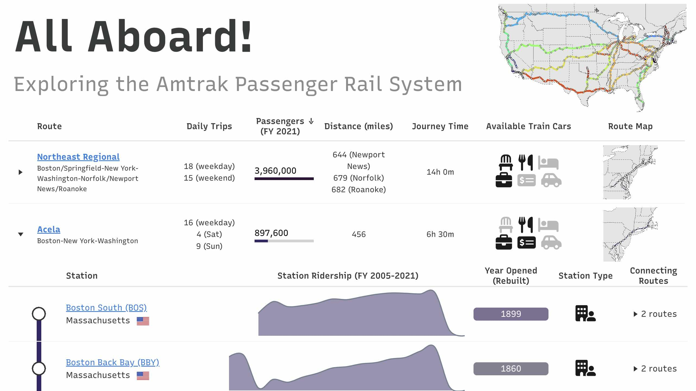
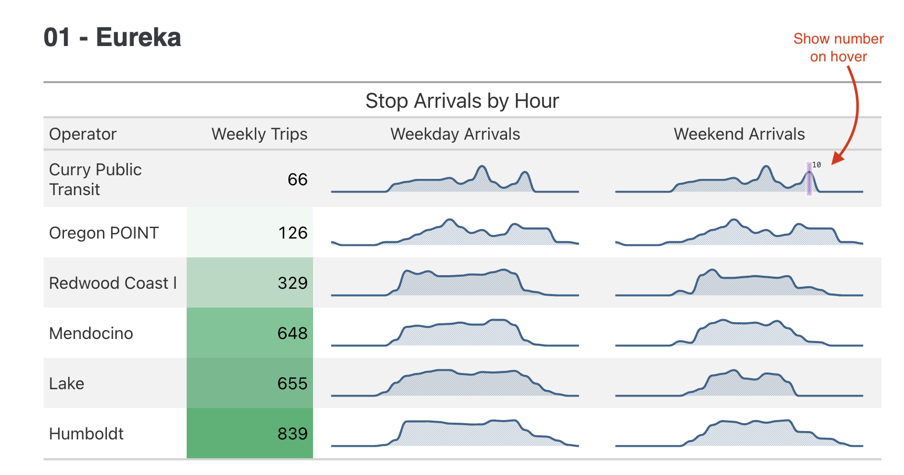

# Contributing to Public Transit Data Analysis and Tooling

Hello! Michael Chow here. In 2025, I'll be focusing on contributing to open source data standards and tooling for public transit. If you work on analytics at a public transit agency, please reach out on [linkedin](https://www.linkedin.com/in/michael-a-chow/) or [bluesky](https://bsky.app/profile/mchow.com)--I would love to hear about your work, and how I could be useful!

(I will also be at the TRB Annual Meeting 2025 in Washington D.C.)

At this point, you might be wondering three things:

- why focus on open source in public transit?
- why is this on the Great Tables blog?
- what are you hoping to contribute?


# Why focus on open source in public transit?

People doing analytics in public transit are active in developing open data standards (like GTFS, GTFS-RT, and TIDES). These open data sources are complex--they cover schedules that change from week to week, buses moving in realtime, and passenger events. As people like me work more and more on open source tools, we start to lose touch with data analysis in realistic, complex settings. Working on open source transit data is an opportunity for me to ensure my open source tooling work helps people solve real, complex problems.

An inspiration for this angle is the book [R for Data Science](https://r4ds.hadley.nz/), which uses realistic datasets--like NYC flights data--to teach data analysis using an ecosystem of packages called the Tidyverse. The Tidyverse packages have dozens of example datasets, and I think this focus on working through examples is part of what made their design so great.

A few years ago, I worked with the Cal-ITP project to build out a warehouse for their GTFS schedule and realtime data. This left a profound impression on me: transit data is perfect for educating on data analyses in R and Python, as well as analytics engineering with tools like dbt or sqlmesh. Many analysts in public transit are querying warehouses, which opens up interesting use-cases with tools like dbplyr (in R) and ibis (in Python).

(I'm also inspired by tools like [tidytransit](https://github.com/r-transit/tidytransit), and other communities like [pharmaverse.org](https://pharmaverse.org).)

Here are some relevant talks:

- [Tidy Transit: Real Life Data Modeling for Public Transportation (Hunter Owens, Cal-ITP)](https://youtu.be/MD5sKupHsTQ)
- [The Accidental Analytics Engineer (Michael Chow)](https://www.youtube.com/live/EYdb1x1cO9U)


# Why is this on the Great Tables blog?

It gives me the opportunity to show off a lot of interesting, transit related tables!


## Great Tables data: Paris metro lines

If you've seen the Great Tables documentation for <a href="../../reference/GT.fmt_image.html#great_tables.GT.fmt_image" class="gdls-link"><code>GT.fmt_image()</code></a>, then you've basked in this beautiful example from our Paris [metro](../../reference/data.metro.md#great_tables.data.metro) dataset.


Code

``` python
from great_tables import GT
from great_tables.data import metro
from importlib_resources import files

img_paths = files("great_tables") / "data/metro_images"

metro_mini = metro[["name", "lines", "passengers"]].head(5)

(
    GT(metro_mini)
    .fmt_image(columns="lines", path=img_paths, file_pattern="metro_{}.svg")
    .fmt_integer(columns="passengers")
)
```


| name | lines | passengers |
|----|----|----|
| Argentine | <span style="white-space:nowrap;"></span> | 2,079,212 |
2LTUxLjYyNyA4NS42MjktOTIuODY2IDg1LjYyOS00NS4xODggMC03NS4wMzctMTYuNjE1LTEwMC42MS0zMy45MTJsLTM4Ljg5NyA4Mi42OWM0MS4wOTMgMjMuMTcyIDg5LjI3NyAzOC4zMzMgMTQ1LjUgMzguMzMzIDEyMC43NzEtLjA0IDIwMS4xMi04Mi4wOCAyMDEuMTItMTgzLjM3Ii8+PC9zdmc+" style="height: 2em;vertical-align: middle;" /> </span> | 8,069,243 |
| Bérault | <span style="white-space:nowrap;"></span> | 2,106,827 |
| Champs-Élysées--Clemenceau | <span style="white-space:nowrap;"> </span> | 1,909,005 |
| Charles de Gaulle--Étoile | <span style="white-space:nowrap;">  </span> | 4,291,663 |


## Amtrak interactive route table

Our 2022 Annual Posit Table Contest received the most incredible entry--an interactive table of Amtrak routes. The table uses the library reactable in R (which we recently [ported to Python](https://github.com/machow/reactable-py)!).

Here is a link to to [the interactive Amtrak table by Josh Fangmeier](https://joshfangmeier.quarto.pub/table-contest-2022/#sec-table). And I'll drop a handy screenshot below.


<figure class="figure">
<p></p>
</figure>


## Cal-ITP trips table

Our 2024 contest saw a great set of transit tables submitted by Tiffany Ku at CalTrans ([submission](https://forum.posit.co/t/hourly-transit-service-patterns-table-contest/187805), [github repo](https://github.com/tiffanychu90/great-tables-contest)). The submission showed service patterns using stop times binned by hour. It produced these for all California operators!

Here is the reasoning given behind the table:

> We can see what service patterns look like across operators by hour of the day. In one table, we can quickly see a summary snapshot of what this service pattern is and see the type of riders the operator typically serves. Here's the same [chart](https://www.ncbi.nlm.nih.gov/pmc/articles/PMC7160583/figure/fig6/) made in a [paper](https://www.ncbi.nlm.nih.gov/pmc/articles/PMC7160583) about for transit in Calgary, Canada.


<figure class="figure">
<p></p>
</figure>


# What are you hoping to contribute?

I'm hoping to focus on two things:

- Workshops to support R and Python analyst teams (and help me appreciate their needs).
- Collaboration on creating open source tools and guides for analyzing transit data.


## Workshops

Beyond my obvious potential involvement as a table fanatic, I'm really interested in making the daily lives of R and Python users at public transit agencies easier.

- **Workshops on R**. Think Tidyverse, Shiny, Quarto, querying warehouses.
- **Workshops on Python**. Let's say Polars, Quarto, publishing notebooks, Great Tables, dashboards.
- **Analytics engineering**. How to get analysts to use your data models 😓.

I'm open to whatever topics seem most useful, even if they aren't in the list above.

> **Important: Scheduling a workshop**
>
> If you're a public transit agency, reach out on [linkedin](https://www.linkedin.com/in/michael-a-chow/) or [bluesky](https://bsky.app/profile/mchow.com), and I will send my calendly for scheduling.


## Collaboration

I'm interested in understanding major challenges analytics teams working on public transit face, and the kind of strategic and tooling support they'd most benefit from. If you're working on analytics in public transit, I would love to hear about what you're working on, and the tools you use most.

One topic I've discussed with a few agencies is [ghost buses](https://wwww.septa.org/news/ghost-bus-ting/), which is when a bus is scheduled but never shows up. This is an interesting analysis because it combines GTFS schedule data with GTFS-RT realtime bus data.

Another is passenger events (e.g. people tapping on or off a bus). This data is challenging because different vendors data record and deliver this data in different ways. This can make it hard for analysts across agencies to discuss analyses--every analysis is different in its own way.


# In summary

Analytics in public transit is a really neat, impactful area--with an active community working on open source data standards and tooling. As a data science tool builder on the open source team at Posit, PBC, my mission is to create value and give it away to teams using Python or R for code first data science. I'd love to support open source work in public transit however is most useful.
