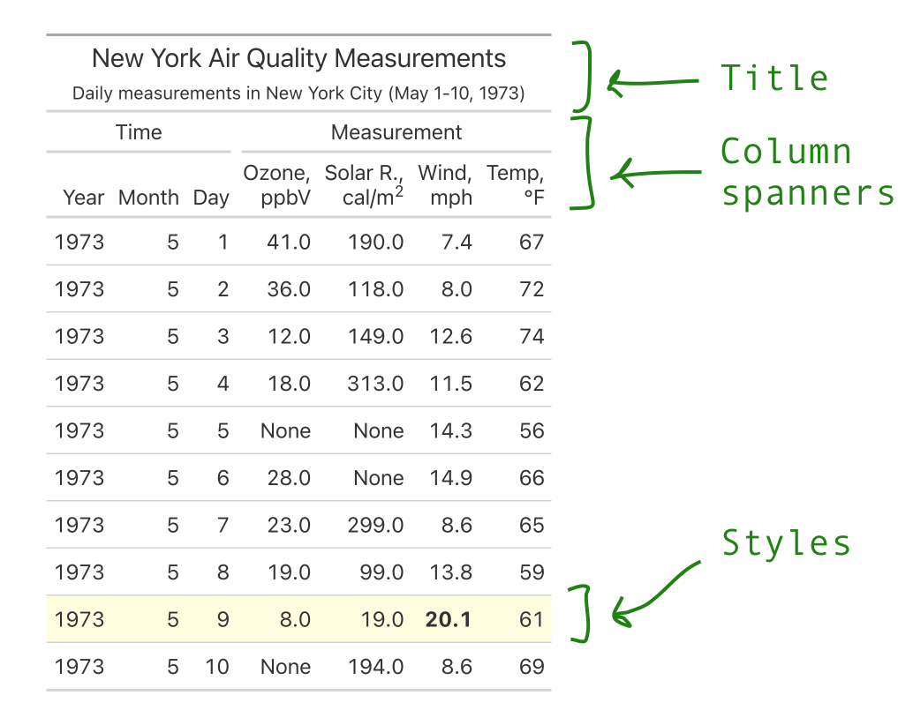

# Great Tables: The Polars DataFrame Styler of Your Dreams

Analyzing data with polars is a no-brainer in python. It provides an intuitive, expressive interface to data. When it comes to reports, it's trivial to plug polars into plotting libraries like seaborn, plotly, and plotnine.

However, there are fewer options for styling tables for presentation. You could convert from polars to pandas, and use the [built-in pandas DataFrame styler](https://pandas.pydata.org/docs/user_guide/style.html), but this has one major limitation: you can't use polars expressions.

As it turns out, polars expressions make styling tables very straightforward. The same polars code that you would use to select or filter combines with Great Tables to highlight, circle, or bolden text.

In this post, I'll show how Great Tables uses polars expressions to make delightful tables, like the one below.


Code

``` python
import polars as pl
import polars.selectors as cs

from great_tables import GT, md, html, style, loc
from great_tables.data import airquality

airquality_mini = airquality.head(10).assign(Year = 1973)
pl_airquality = pl.DataFrame(airquality_mini).select(
    "Year", "Month", "Day", "Ozone", "Solar_R", "Wind", "Temp"
)
gt_air = GT(pl_airquality)

(
    gt_air

    # Table header ----
    .tab_header(
        title = "New York Air Quality Measurements",
        subtitle = "Daily measurements in New York City (May 1-10, 1973)"
    )

    # Table column spanners ----
    .tab_spanner(
        label = "Time",
        columns = ["Year", "Month", "Day"]
    )
    .tab_spanner(
        label = "Measurement",
        columns = ["Ozone", "Solar_R", "Wind", "Temp"]
    )
    .cols_label(
        Ozone = html("Ozone,<br>ppbV"),
        Solar_R = html("Solar R.,<br>cal/m<sup>2</sup>"),
        Wind = html("Wind,<br>mph"),
        Temp = html("Temp,<br>°F")
    )

    # Table styles ----
    .tab_style(
        style.fill("lightyellow"),
        loc.body(
            columns = cs.all(),
            rows = pl.col("Wind") == pl.col("Wind").max()
        )
    )
    .tab_style(
        style.text(weight = "bold"),
        loc.body("Wind", pl.col("Wind") == pl.col("Wind").max())
    )
)
```


<table class="gt_table" style="width:100%;" data-quarto-disable-processing="false" data-quarto-bootstrap="false">
<colgroup>
<col style="width: 14%" />
<col style="width: 14%" />
<col style="width: 14%" />
<col style="width: 14%" />
<col style="width: 14%" />
<col style="width: 14%" />
<col style="width: 14%" />
</colgroup>
<thead>
<tr class="gt_heading">
<th colspan="7" class="gt_heading gt_title gt_font_normal">New York Air Quality Measurements</th>
</tr>
<tr class="gt_heading">
<th colspan="7" class="gt_heading gt_subtitle gt_font_normal gt_bottom_border">Daily measurements in New York City (May 1-10, 1973)</th>
</tr>
<tr class="gt_col_headings gt_spanner_row">
<th colspan="3" id="Time" class="gt_center gt_columns_top_border gt_column_spanner_outer" scope="colgroup">Time</th>
<th colspan="4" id="Measurement" class="gt_center gt_columns_top_border gt_column_spanner_outer" scope="colgroup">Measurement</th>
</tr>
<tr class="gt_col_headings">
<th id="Year" class="gt_col_heading gt_columns_bottom_border gt_right" scope="col">Year</th>
<th id="Month" class="gt_col_heading gt_columns_bottom_border gt_right" scope="col">Month</th>
<th id="Day" class="gt_col_heading gt_columns_bottom_border gt_right" scope="col">Day</th>
<th id="Ozone" class="gt_col_heading gt_columns_bottom_border gt_right" scope="col">Ozone,<br />
ppbV</th>
<th id="Solar_R" class="gt_col_heading gt_columns_bottom_border gt_right" scope="col">Solar R.,<br />
cal/m<sup>2</sup></th>
<th id="Wind" class="gt_col_heading gt_columns_bottom_border gt_right" scope="col">Wind,<br />
mph</th>
<th id="Temp" class="gt_col_heading gt_columns_bottom_border gt_right" scope="col">Temp,<br />
°F</th>
</tr>
</thead>
<tbody class="gt_table_body">
<tr>
<td class="gt_row gt_right">1973</td>
<td class="gt_row gt_right">5</td>
<td class="gt_row gt_right">1</td>
<td class="gt_row gt_right">41.0</td>
<td class="gt_row gt_right">190.0</td>
<td class="gt_row gt_right">7.4</td>
<td class="gt_row gt_right">67</td>
</tr>
<tr>
<td class="gt_row gt_right">1973</td>
<td class="gt_row gt_right">5</td>
<td class="gt_row gt_right">2</td>
<td class="gt_row gt_right">36.0</td>
<td class="gt_row gt_right">118.0</td>
<td class="gt_row gt_right">8.0</td>
<td class="gt_row gt_right">72</td>
</tr>
<tr>
<td class="gt_row gt_right">1973</td>
<td class="gt_row gt_right">5</td>
<td class="gt_row gt_right">3</td>
<td class="gt_row gt_right">12.0</td>
<td class="gt_row gt_right">149.0</td>
<td class="gt_row gt_right">12.6</td>
<td class="gt_row gt_right">74</td>
</tr>
<tr>
<td class="gt_row gt_right">1973</td>
<td class="gt_row gt_right">5</td>
<td class="gt_row gt_right">4</td>
<td class="gt_row gt_right">18.0</td>
<td class="gt_row gt_right">313.0</td>
<td class="gt_row gt_right">11.5</td>
<td class="gt_row gt_right">62</td>
</tr>
<tr>
<td class="gt_row gt_right">1973</td>
<td class="gt_row gt_right">5</td>
<td class="gt_row gt_right">5</td>
<td class="gt_row gt_right">None</td>
<td class="gt_row gt_right">None</td>
<td class="gt_row gt_right">14.3</td>
<td class="gt_row gt_right">56</td>
</tr>
<tr>
<td class="gt_row gt_right">1973</td>
<td class="gt_row gt_right">5</td>
<td class="gt_row gt_right">6</td>
<td class="gt_row gt_right">28.0</td>
<td class="gt_row gt_right">None</td>
<td class="gt_row gt_right">14.9</td>
<td class="gt_row gt_right">66</td>
</tr>
<tr>
<td class="gt_row gt_right">1973</td>
<td class="gt_row gt_right">5</td>
<td class="gt_row gt_right">7</td>
<td class="gt_row gt_right">23.0</td>
<td class="gt_row gt_right">299.0</td>
<td class="gt_row gt_right">8.6</td>
<td class="gt_row gt_right">65</td>
</tr>
<tr>
<td class="gt_row gt_right">1973</td>
<td class="gt_row gt_right">5</td>
<td class="gt_row gt_right">8</td>
<td class="gt_row gt_right">19.0</td>
<td class="gt_row gt_right">99.0</td>
<td class="gt_row gt_right">13.8</td>
<td class="gt_row gt_right">59</td>
</tr>
<tr>
<td class="gt_row gt_right" style="background-color: lightyellow">1973</td>
<td class="gt_row gt_right" style="background-color: lightyellow">5</td>
<td class="gt_row gt_right" style="background-color: lightyellow">9</td>
<td class="gt_row gt_right" style="background-color: lightyellow">8.0</td>
<td class="gt_row gt_right" style="background-color: lightyellow">19.0</td>
<td class="gt_row gt_right" style="background-color: lightyellow; font-weight: bold">20.1</td>
<td class="gt_row gt_right" style="background-color: lightyellow">61</td>
</tr>
<tr>
<td class="gt_row gt_right">1973</td>
<td class="gt_row gt_right">5</td>
<td class="gt_row gt_right">10</td>
<td class="gt_row gt_right">None</td>
<td class="gt_row gt_right">194.0</td>
<td class="gt_row gt_right">8.6</td>
<td class="gt_row gt_right">69</td>
</tr>
</tbody>
</table>


# The parts of a presentation-ready table

Our example table customized three main parts:

- **Title and subtitle**: User friendly titles and subtitles, describing the data.
- **Column spanners**: Group related columns together with a custom label.
- **Styles**: Highlight rows, columns, or individual cells of data.

This is marked below.





Let's walk through each piece in order to produce the table below.


# Creating GT object

First, we'll import the necessary libraries, and do a tiny bit of data processing.


``` python
import polars as pl
import polars.selectors as cs

from great_tables import GT
from great_tables.data import airquality

# Note that we'll use the first 5 rows as we build up our code
airquality_mini = airquality.head(5).assign(Year = 1973)
pl_airquality = pl.DataFrame(airquality_mini).select(
    "Year", "Month", "Day", "Ozone", "Solar_R", "Wind", "Temp"
)

pl_airquality
```


shape: (5, 7)

| Year | Month | Day | Ozone | Solar_R | Wind | Temp |
|------|-------|-----|-------|---------|------|------|
| i64  | i64   | i64 | f64   | f64     | f64  | i64  |
| 1973 | 5     | 1   | 41.0  | 190.0   | 7.4  | 67   |
| 1973 | 5     | 2   | 36.0  | 118.0   | 8.0  | 72   |
| 1973 | 5     | 3   | 12.0  | 149.0   | 12.6 | 74   |
| 1973 | 5     | 4   | 18.0  | 313.0   | 11.5 | 62   |
| 1973 | 5     | 5   | null  | null    | 14.3 | 56   |


The default polars output above is really helpful for data analysis! By passing it to the [GT](../../reference/GT.md#great_tables.GT) constructor, we can start getting it ready for presentation.


``` python
gt_air = GT(pl_airquality)

gt_air
```


| Year | Month | Day | Ozone | Solar_R | Wind | Temp |
|------|-------|-----|-------|---------|------|------|
| 1973 | 5     | 1   | 41.0  | 190.0   | 7.4  | 67   |
| 1973 | 5     | 2   | 36.0  | 118.0   | 8.0  | 72   |
| 1973 | 5     | 3   | 12.0  | 149.0   | 12.6 | 74   |
| 1973 | 5     | 4   | 18.0  | 313.0   | 11.5 | 62   |
| 1973 | 5     | 5   | None  | None    | 14.3 | 56   |


In the next section I'll show setting a title, and then go on to more exciting stuff like styling the body and creating column spanners.


# Set title and subtitle

The simplest method in gt is [GT.tab_header()](../../reference/GT.tab_header.md#great_tables.GT.tab_header), which lets you add a title and subtitle.


``` python
(
    gt_air

    # Table header ----
    .tab_header(
        title = "New York Air Quality Measurements",
        subtitle = "Daily measurements in New York City (May 1-10, 1973)"
    )
)
```


<table class="gt_table" data-quarto-disable-processing="false" data-quarto-bootstrap="false">
<thead>
<tr class="gt_heading">
<th colspan="7" class="gt_heading gt_title gt_font_normal">New York Air Quality Measurements</th>
</tr>
<tr class="gt_heading">
<th colspan="7" class="gt_heading gt_subtitle gt_font_normal gt_bottom_border">Daily measurements in New York City (May 1-10, 1973)</th>
</tr>
<tr class="gt_col_headings">
<th id="Year" class="gt_col_heading gt_columns_bottom_border gt_right" scope="col">Year</th>
<th id="Month" class="gt_col_heading gt_columns_bottom_border gt_right" scope="col">Month</th>
<th id="Day" class="gt_col_heading gt_columns_bottom_border gt_right" scope="col">Day</th>
<th id="Ozone" class="gt_col_heading gt_columns_bottom_border gt_right" scope="col">Ozone</th>
<th id="Solar_R" class="gt_col_heading gt_columns_bottom_border gt_right" scope="col">Solar_R</th>
<th id="Wind" class="gt_col_heading gt_columns_bottom_border gt_right" scope="col">Wind</th>
<th id="Temp" class="gt_col_heading gt_columns_bottom_border gt_right" scope="col">Temp</th>
</tr>
</thead>
<tbody class="gt_table_body">
<tr>
<td class="gt_row gt_right">1973</td>
<td class="gt_row gt_right">5</td>
<td class="gt_row gt_right">1</td>
<td class="gt_row gt_right">41.0</td>
<td class="gt_row gt_right">190.0</td>
<td class="gt_row gt_right">7.4</td>
<td class="gt_row gt_right">67</td>
</tr>
<tr>
<td class="gt_row gt_right">1973</td>
<td class="gt_row gt_right">5</td>
<td class="gt_row gt_right">2</td>
<td class="gt_row gt_right">36.0</td>
<td class="gt_row gt_right">118.0</td>
<td class="gt_row gt_right">8.0</td>
<td class="gt_row gt_right">72</td>
</tr>
<tr>
<td class="gt_row gt_right">1973</td>
<td class="gt_row gt_right">5</td>
<td class="gt_row gt_right">3</td>
<td class="gt_row gt_right">12.0</td>
<td class="gt_row gt_right">149.0</td>
<td class="gt_row gt_right">12.6</td>
<td class="gt_row gt_right">74</td>
</tr>
<tr>
<td class="gt_row gt_right">1973</td>
<td class="gt_row gt_right">5</td>
<td class="gt_row gt_right">4</td>
<td class="gt_row gt_right">18.0</td>
<td class="gt_row gt_right">313.0</td>
<td class="gt_row gt_right">11.5</td>
<td class="gt_row gt_right">62</td>
</tr>
<tr>
<td class="gt_row gt_right">1973</td>
<td class="gt_row gt_right">5</td>
<td class="gt_row gt_right">5</td>
<td class="gt_row gt_right">None</td>
<td class="gt_row gt_right">None</td>
<td class="gt_row gt_right">14.3</td>
<td class="gt_row gt_right">56</td>
</tr>
</tbody>
</table>


Just like with plots, tables need titles so people know what they're about!


# Set body styles

The `.tab_style()` method sets styles--like fill color, or text properties--on different parts of the table. Let's use it twice with a polars expression. First to highlight the row corresponding to the max Wind value, and then to bold that value.


``` python
from great_tables import style, loc

is_max_wind = pl.col("Wind") == pl.col("Wind").max()

(
    gt_air

    # Table styles ----
    .tab_style(
        style.fill("lightyellow"),
        loc.body(
            columns = cs.all(),
            rows = is_max_wind
        )
    )
    .tab_style(
        style.text(weight = "bold"),
        loc.body("Wind", is_max_wind)
    )
)
```


| Year | Month | Day | Ozone | Solar_R | Wind | Temp |
|------|-------|-----|-------|---------|------|------|
| 1973 | 5     | 1   | 41.0  | 190.0   | 7.4  | 67   |
| 1973 | 5     | 2   | 36.0  | 118.0   | 8.0  | 72   |
| 1973 | 5     | 3   | 12.0  | 149.0   | 12.6 | 74   |
| 1973 | 5     | 4   | 18.0  | 313.0   | 11.5 | 62   |
| 1973 | 5     | 5   | None  | None    | 14.3 | 56   |


Note two important pieces:

- Functions like [style.fill()](../../reference/style.fill.md#great_tables.style.fill) indicate **what** style to set.
- Functions like [loc.body()](../../reference/loc.body.md#great_tables.loc.body) indicate **where** to apply the style. Its `columns=` and `rows=` parameters let you target specific parts of the table body (using polars expressions).

Currently, Great Tables only supports styling the table body. In the (very near) future, other `loc.*` functions will allow styling other parts of the table (e.g. the title, column labels, etc..).

For more details on styles, see [Styling the Table Body](../../get-started/basic-styling.qmd) in the Getting Started guide.


# Set column spanners

The last piece to set in the table is the column spanners, which are made up of two things:

- Labels describing groups of columns (e.g. Time, Measurement).
- More readable labels for columns themselves.

Use [GT.tab_spanner()](../../reference/GT.tab_spanner.md#great_tables.GT.tab_spanner) to set labels on groups of columns.


``` python
time_cols = ["Year", "Month", "Day"]

gt_with_spanners = (
    gt_air

    # Table column spanners ----
    .tab_spanner(
        label="Time",
        columns=time_cols
    )
    .tab_spanner(
        label="Measurement",
        columns=cs.exclude(time_cols)
    )
)

gt_with_spanners
```


<table class="gt_table" data-quarto-disable-processing="false" data-quarto-bootstrap="false">
<thead>
<tr class="gt_col_headings gt_spanner_row">
<th colspan="3" id="Time" class="gt_center gt_columns_top_border gt_column_spanner_outer" scope="colgroup">Time</th>
<th colspan="4" id="Measurement" class="gt_center gt_columns_top_border gt_column_spanner_outer" scope="colgroup">Measurement</th>
</tr>
<tr class="gt_col_headings">
<th id="Year" class="gt_col_heading gt_columns_bottom_border gt_right" scope="col">Year</th>
<th id="Month" class="gt_col_heading gt_columns_bottom_border gt_right" scope="col">Month</th>
<th id="Day" class="gt_col_heading gt_columns_bottom_border gt_right" scope="col">Day</th>
<th id="Ozone" class="gt_col_heading gt_columns_bottom_border gt_right" scope="col">Ozone</th>
<th id="Solar_R" class="gt_col_heading gt_columns_bottom_border gt_right" scope="col">Solar_R</th>
<th id="Wind" class="gt_col_heading gt_columns_bottom_border gt_right" scope="col">Wind</th>
<th id="Temp" class="gt_col_heading gt_columns_bottom_border gt_right" scope="col">Temp</th>
</tr>
</thead>
<tbody class="gt_table_body">
<tr>
<td class="gt_row gt_right">1973</td>
<td class="gt_row gt_right">5</td>
<td class="gt_row gt_right">1</td>
<td class="gt_row gt_right">41.0</td>
<td class="gt_row gt_right">190.0</td>
<td class="gt_row gt_right">7.4</td>
<td class="gt_row gt_right">67</td>
</tr>
<tr>
<td class="gt_row gt_right">1973</td>
<td class="gt_row gt_right">5</td>
<td class="gt_row gt_right">2</td>
<td class="gt_row gt_right">36.0</td>
<td class="gt_row gt_right">118.0</td>
<td class="gt_row gt_right">8.0</td>
<td class="gt_row gt_right">72</td>
</tr>
<tr>
<td class="gt_row gt_right">1973</td>
<td class="gt_row gt_right">5</td>
<td class="gt_row gt_right">3</td>
<td class="gt_row gt_right">12.0</td>
<td class="gt_row gt_right">149.0</td>
<td class="gt_row gt_right">12.6</td>
<td class="gt_row gt_right">74</td>
</tr>
<tr>
<td class="gt_row gt_right">1973</td>
<td class="gt_row gt_right">5</td>
<td class="gt_row gt_right">4</td>
<td class="gt_row gt_right">18.0</td>
<td class="gt_row gt_right">313.0</td>
<td class="gt_row gt_right">11.5</td>
<td class="gt_row gt_right">62</td>
</tr>
<tr>
<td class="gt_row gt_right">1973</td>
<td class="gt_row gt_right">5</td>
<td class="gt_row gt_right">5</td>
<td class="gt_row gt_right">None</td>
<td class="gt_row gt_right">None</td>
<td class="gt_row gt_right">14.3</td>
<td class="gt_row gt_right">56</td>
</tr>
</tbody>
</table>


Notice that there are now labels for "Time" and "Measurement" sitting above the column names. This is useful for emphasizing columns that share something in common.

Use `GT.cols_labels()` with [html()](../../reference/html.md#great_tables.html) to create human-friendly labels (e.g. convert things like `cal_m_2` to `cal/m`<sup>`2`</sup>).


``` python
from great_tables import html

(
    gt_with_spanners
    .cols_label(
        Ozone = html("Ozone,<br>ppbV"),
        Solar_R = html("Solar R.,<br>cal/m<sup>2</sup>"),
        Wind = html("Wind,<br>mph"),
        Temp = html("Temp,<br>°F")
    )
)
```


<table class="gt_table" style="width:100%;" data-quarto-disable-processing="false" data-quarto-bootstrap="false">
<colgroup>
<col style="width: 14%" />
<col style="width: 14%" />
<col style="width: 14%" />
<col style="width: 14%" />
<col style="width: 14%" />
<col style="width: 14%" />
<col style="width: 14%" />
</colgroup>
<thead>
<tr class="gt_col_headings gt_spanner_row">
<th colspan="3" id="Time" class="gt_center gt_columns_top_border gt_column_spanner_outer" scope="colgroup">Time</th>
<th colspan="4" id="Measurement" class="gt_center gt_columns_top_border gt_column_spanner_outer" scope="colgroup">Measurement</th>
</tr>
<tr class="gt_col_headings">
<th id="Year" class="gt_col_heading gt_columns_bottom_border gt_right" scope="col">Year</th>
<th id="Month" class="gt_col_heading gt_columns_bottom_border gt_right" scope="col">Month</th>
<th id="Day" class="gt_col_heading gt_columns_bottom_border gt_right" scope="col">Day</th>
<th id="Ozone" class="gt_col_heading gt_columns_bottom_border gt_right" scope="col">Ozone,<br />
ppbV</th>
<th id="Solar_R" class="gt_col_heading gt_columns_bottom_border gt_right" scope="col">Solar R.,<br />
cal/m<sup>2</sup></th>
<th id="Wind" class="gt_col_heading gt_columns_bottom_border gt_right" scope="col">Wind,<br />
mph</th>
<th id="Temp" class="gt_col_heading gt_columns_bottom_border gt_right" scope="col">Temp,<br />
°F</th>
</tr>
</thead>
<tbody class="gt_table_body">
<tr>
<td class="gt_row gt_right">1973</td>
<td class="gt_row gt_right">5</td>
<td class="gt_row gt_right">1</td>
<td class="gt_row gt_right">41.0</td>
<td class="gt_row gt_right">190.0</td>
<td class="gt_row gt_right">7.4</td>
<td class="gt_row gt_right">67</td>
</tr>
<tr>
<td class="gt_row gt_right">1973</td>
<td class="gt_row gt_right">5</td>
<td class="gt_row gt_right">2</td>
<td class="gt_row gt_right">36.0</td>
<td class="gt_row gt_right">118.0</td>
<td class="gt_row gt_right">8.0</td>
<td class="gt_row gt_right">72</td>
</tr>
<tr>
<td class="gt_row gt_right">1973</td>
<td class="gt_row gt_right">5</td>
<td class="gt_row gt_right">3</td>
<td class="gt_row gt_right">12.0</td>
<td class="gt_row gt_right">149.0</td>
<td class="gt_row gt_right">12.6</td>
<td class="gt_row gt_right">74</td>
</tr>
<tr>
<td class="gt_row gt_right">1973</td>
<td class="gt_row gt_right">5</td>
<td class="gt_row gt_right">4</td>
<td class="gt_row gt_right">18.0</td>
<td class="gt_row gt_right">313.0</td>
<td class="gt_row gt_right">11.5</td>
<td class="gt_row gt_right">62</td>
</tr>
<tr>
<td class="gt_row gt_right">1973</td>
<td class="gt_row gt_right">5</td>
<td class="gt_row gt_right">5</td>
<td class="gt_row gt_right">None</td>
<td class="gt_row gt_right">None</td>
<td class="gt_row gt_right">14.3</td>
<td class="gt_row gt_right">56</td>
</tr>
</tbody>
</table>


This is helpful because labels are often in a funky format (e.g. `cal_m_2`) because they're easier to work with programmatically, so need to be cleaned up for presentation.

See the [Column Labels](../../get-started/basic-column-labels.qmd) page of the guide for more details.


# Putting it all together

Finally, we'll combine everything from the sections above into a single block of code, and use a few more rows of data.


Code

``` python
import polars as pl
import polars.selectors as cs

from great_tables import GT, md, html, style, loc
from great_tables.data import airquality

airquality_mini = airquality.head(10).assign(Year = 1973)
pl_airquality = pl.DataFrame(airquality_mini).select(
    "Year", "Month", "Day", "Ozone", "Solar_R", "Wind", "Temp"
)
gt_air = GT(pl_airquality)

(
    gt_air

    # Table header ----
    .tab_header(
        title = "New York Air Quality Measurements",
        subtitle = "Daily measurements in New York City (May 1-10, 1973)"
    )

    # Table column spanners ----
    .tab_spanner(
        label = "Time",
        columns = ["Year", "Month", "Day"]
    )
    .tab_spanner(
        label = "Measurement",
        columns = ["Ozone", "Solar_R", "Wind", "Temp"]
    )
    .cols_label(
        Ozone = html("Ozone,<br>ppbV"),
        Solar_R = html("Solar R.,<br>cal/m<sup>2</sup>"),
        Wind = html("Wind,<br>mph"),
        Temp = html("Temp,<br>°F")
    )

    # Table styles ----
    .tab_style(
        style.fill("lightyellow"),
        loc.body(
            columns = cs.all(),
            rows = pl.col("Wind") == pl.col("Wind").max()
        )
    )
    .tab_style(
        style.text(weight = "bold"),
        loc.body("Wind", pl.col("Wind") == pl.col("Wind").max())
    )
)
```


<table class="gt_table" style="width:100%;" data-quarto-disable-processing="false" data-quarto-bootstrap="false">
<colgroup>
<col style="width: 14%" />
<col style="width: 14%" />
<col style="width: 14%" />
<col style="width: 14%" />
<col style="width: 14%" />
<col style="width: 14%" />
<col style="width: 14%" />
</colgroup>
<thead>
<tr class="gt_heading">
<th colspan="7" class="gt_heading gt_title gt_font_normal">New York Air Quality Measurements</th>
</tr>
<tr class="gt_heading">
<th colspan="7" class="gt_heading gt_subtitle gt_font_normal gt_bottom_border">Daily measurements in New York City (May 1-10, 1973)</th>
</tr>
<tr class="gt_col_headings gt_spanner_row">
<th colspan="3" id="Time" class="gt_center gt_columns_top_border gt_column_spanner_outer" scope="colgroup">Time</th>
<th colspan="4" id="Measurement" class="gt_center gt_columns_top_border gt_column_spanner_outer" scope="colgroup">Measurement</th>
</tr>
<tr class="gt_col_headings">
<th id="Year" class="gt_col_heading gt_columns_bottom_border gt_right" scope="col">Year</th>
<th id="Month" class="gt_col_heading gt_columns_bottom_border gt_right" scope="col">Month</th>
<th id="Day" class="gt_col_heading gt_columns_bottom_border gt_right" scope="col">Day</th>
<th id="Ozone" class="gt_col_heading gt_columns_bottom_border gt_right" scope="col">Ozone,<br />
ppbV</th>
<th id="Solar_R" class="gt_col_heading gt_columns_bottom_border gt_right" scope="col">Solar R.,<br />
cal/m<sup>2</sup></th>
<th id="Wind" class="gt_col_heading gt_columns_bottom_border gt_right" scope="col">Wind,<br />
mph</th>
<th id="Temp" class="gt_col_heading gt_columns_bottom_border gt_right" scope="col">Temp,<br />
°F</th>
</tr>
</thead>
<tbody class="gt_table_body">
<tr>
<td class="gt_row gt_right">1973</td>
<td class="gt_row gt_right">5</td>
<td class="gt_row gt_right">1</td>
<td class="gt_row gt_right">41.0</td>
<td class="gt_row gt_right">190.0</td>
<td class="gt_row gt_right">7.4</td>
<td class="gt_row gt_right">67</td>
</tr>
<tr>
<td class="gt_row gt_right">1973</td>
<td class="gt_row gt_right">5</td>
<td class="gt_row gt_right">2</td>
<td class="gt_row gt_right">36.0</td>
<td class="gt_row gt_right">118.0</td>
<td class="gt_row gt_right">8.0</td>
<td class="gt_row gt_right">72</td>
</tr>
<tr>
<td class="gt_row gt_right">1973</td>
<td class="gt_row gt_right">5</td>
<td class="gt_row gt_right">3</td>
<td class="gt_row gt_right">12.0</td>
<td class="gt_row gt_right">149.0</td>
<td class="gt_row gt_right">12.6</td>
<td class="gt_row gt_right">74</td>
</tr>
<tr>
<td class="gt_row gt_right">1973</td>
<td class="gt_row gt_right">5</td>
<td class="gt_row gt_right">4</td>
<td class="gt_row gt_right">18.0</td>
<td class="gt_row gt_right">313.0</td>
<td class="gt_row gt_right">11.5</td>
<td class="gt_row gt_right">62</td>
</tr>
<tr>
<td class="gt_row gt_right">1973</td>
<td class="gt_row gt_right">5</td>
<td class="gt_row gt_right">5</td>
<td class="gt_row gt_right">None</td>
<td class="gt_row gt_right">None</td>
<td class="gt_row gt_right">14.3</td>
<td class="gt_row gt_right">56</td>
</tr>
<tr>
<td class="gt_row gt_right">1973</td>
<td class="gt_row gt_right">5</td>
<td class="gt_row gt_right">6</td>
<td class="gt_row gt_right">28.0</td>
<td class="gt_row gt_right">None</td>
<td class="gt_row gt_right">14.9</td>
<td class="gt_row gt_right">66</td>
</tr>
<tr>
<td class="gt_row gt_right">1973</td>
<td class="gt_row gt_right">5</td>
<td class="gt_row gt_right">7</td>
<td class="gt_row gt_right">23.0</td>
<td class="gt_row gt_right">299.0</td>
<td class="gt_row gt_right">8.6</td>
<td class="gt_row gt_right">65</td>
</tr>
<tr>
<td class="gt_row gt_right">1973</td>
<td class="gt_row gt_right">5</td>
<td class="gt_row gt_right">8</td>
<td class="gt_row gt_right">19.0</td>
<td class="gt_row gt_right">99.0</td>
<td class="gt_row gt_right">13.8</td>
<td class="gt_row gt_right">59</td>
</tr>
<tr>
<td class="gt_row gt_right" style="background-color: lightyellow">1973</td>
<td class="gt_row gt_right" style="background-color: lightyellow">5</td>
<td class="gt_row gt_right" style="background-color: lightyellow">9</td>
<td class="gt_row gt_right" style="background-color: lightyellow">8.0</td>
<td class="gt_row gt_right" style="background-color: lightyellow">19.0</td>
<td class="gt_row gt_right" style="background-color: lightyellow; font-weight: bold">20.1</td>
<td class="gt_row gt_right" style="background-color: lightyellow">61</td>
</tr>
<tr>
<td class="gt_row gt_right">1973</td>
<td class="gt_row gt_right">5</td>
<td class="gt_row gt_right">10</td>
<td class="gt_row gt_right">None</td>
<td class="gt_row gt_right">194.0</td>
<td class="gt_row gt_right">8.6</td>
<td class="gt_row gt_right">69</td>
</tr>
</tbody>
</table>


Not too bad!

Table styling is a surprisingly deep topic, and we've only scratched the surface on what Great Tables can do. A big one not covered here is the many [column formatting methods](../../get-started/basic-formatting.qmd), like [GT.fmt_currency()](../../reference/GT.fmt_currency.md#great_tables.GT.fmt_currency).

Thoughtfully styled tables tell viewers that you care as much about communicating the table, as much as the data wrangling behind it. Working with polars has been an absolute dream, and we're excited to explore different ways it and Great Tables make for easy table styling!
