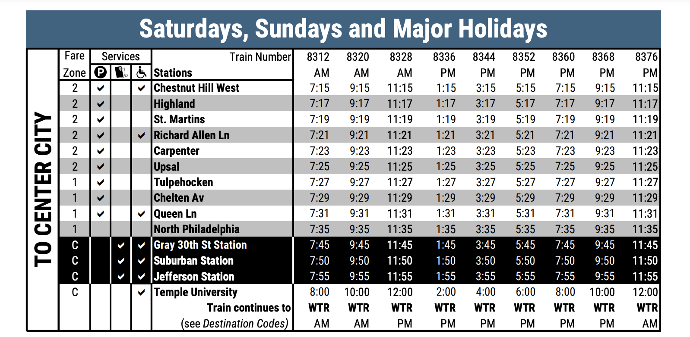
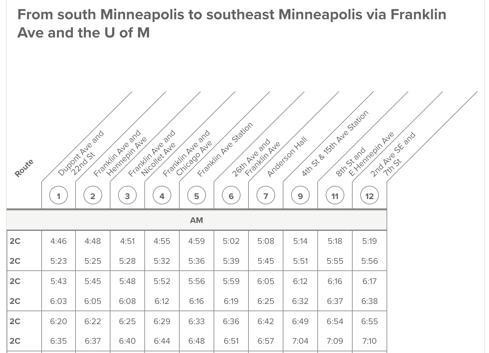
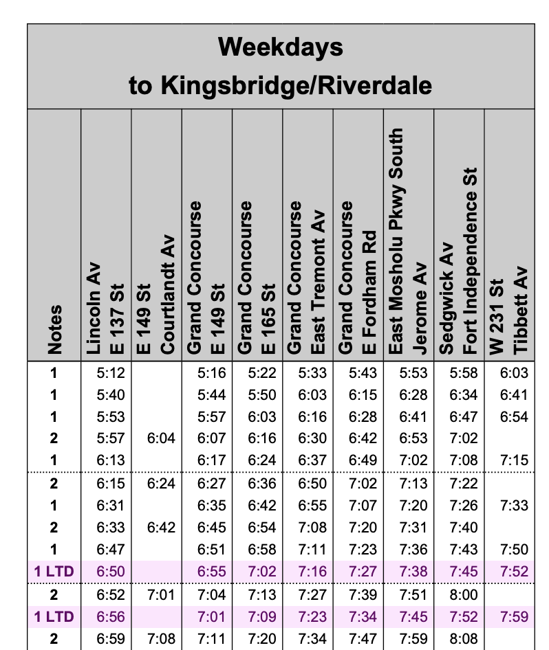
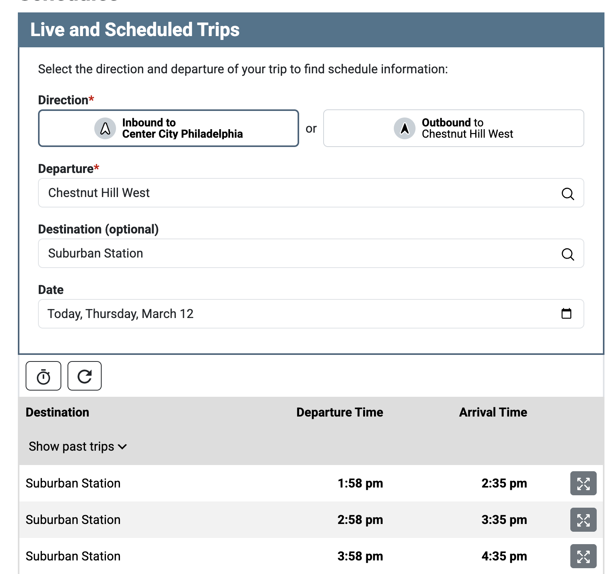

Recently, Rich and I were poking around transit data, and we were struck by the amount of structuring that goes into transit timetables.

For example, consider this weekend rail schedule table from SEPTA, Philadelphia's transit agency.

{style="max-width: 700px; display: block; margin-left: auto; margin-right: auto;"}


Notice these big pieces:

* The vertical text on the left indicating trains are traveling "TO CENTER CITY".
* The blue header, and spanner columns ("Services" and "Train Number") grouping related columns.
* The striped background for easier reading. Also the black background indicating stations in Center City (the urban core).

Tables like this often have to be created in tools like Illustrator, and updated by hand. At the same time, when agencies automate table creation, they often sacrifice a lot of the assistive features and helpful affordances of the table.

We set out to recreate this table in Great Tables (and by we I mean 99% Rich). In this post, I'll walk quickly through how we recreated it, and share some other examples of transit timetables in the wild. For the theory behind why tables like this are useful, see [The Design Philosophy of Great Tables](../design-philosophy/index.qmd).

## The final result

Here's a look at our quick version in Great Tables.
In this post we'll walk through quickly how we created it, but wanted to treat you to the final result up front! Note that the table is fully in HTML for accessibility.

```{python}
# | code-fold: true
from great_tables import GT, html, style, loc, google_font
import polars as pl
import polars.selectors as cs

stops = pl.read_csv("chw-stops.csv")
times = pl.read_csv("times.csv")

stop_times = times.join(other=stops, on="stop_name", maintain_order="left").select(
    pl.lit("To Center City").alias("direction"), pl.col("*")
)


def h_m_p(s):
    h, m, _ = [int(part) for part in s.split(":")]
    ap = "a"

    if h > 12:
        h -= 12
        ap = "p"
    return f"{h}:{m:02d}{ap}"


def tick(b):
    return "&check;" if b else ""


transit_table = (
    GT(stop_times)
    .tab_stub(groupname_col="direction")
    .tab_header("Saturdays, Sundays, and Major Holidays")
    .cols_hide(columns=["stop_url", "zone_id", "stop_desc", "stop_lat", "stop_lon", "stop_id"])
    .fmt(h_m_p, columns=cs.matches(r"^[0-9]{4}$"))
    .fmt(tick, columns=cs.starts_with("service_"))
    .cols_label(
        stop_name="Stations",
        service_access="A",
        service_cash="C",
        service_park="P",
        fare_zone=html("Fare<br>Zone"),
    )
    .tab_spanner(label="Services", columns=cs.starts_with("service_"))
    .tab_spanner(label="Train Number", columns=cs.matches(r"^[0-9]{4}$"))
    .cols_move_to_start("fare_zone")
    .cols_move_to_start(cs.starts_with("service_"))
    .cols_width(cases={c: "20px" for c in stop_times.columns if c.startswith("service_")})
    .cols_width(cases={c: "60px" for c in stop_times.columns if c.startswith("8")})
    .opt_row_striping(row_striping=True)
    .cols_align(align="center", columns="fare_zone")
    .cols_align(align="right", columns=cs.matches(r"^[0-9]{4}$"))
    # style header
    .tab_style(
        locations=loc.header(),
        style=style.css(
            "background-color: rgb(66, 99, 128) !important; color: white !important; font-size: 24px !important; font-weight: bold !important; border-width: 0px !important;",
        ),
    )
    # style vertical text on left
    .tab_style(
        locations=loc.row_groups(),
        # TODO: rotate text vertically
        style=style.css(
            "writing-mode: sideways-lr; padding-bottom: 25% !important; font-size: 24px !important; font-weight: bold !important; text-transform: uppercase !important;"
        ),
    )
    .tab_style(
        style=style.css(
            "background-color: black !important; color: white !important; border-top: none !important; border-bottom: none !important;"
        ),
        locations=loc.body(columns=None, rows=list(range(-4, -1))),
    )
    .tab_style(
        style=style.css(
            """
                border-top: none !important;
                border-bottom: none !important;
                border-right: solid white 2px !important;
                color: white !important;
            """
        ),
        locations=loc.body(columns=~cs.matches(r"^[0-9]{4}$"), rows=list(range(-4, -1))),
    )
    .tab_style(
        style=style.css("border-right: solid black 2px !important;"),
        locations=loc.body(columns=~cs.matches(r"^[0-9]{4}$"), rows=list(range(0, 10)) + [13]),
    )
    .tab_options(
        row_striping_background_color="#A9A9A9",
        row_group_as_column=True,
    )
    .opt_table_outline()
    .opt_table_font(font=google_font("IBM Plex Sans"))
)

transit_table
```

## Reading in stops and times

For this example, I simplified SEPTA's transit data down to two pieces:

* `chw-stops.csv` - detailed information about each stop location.
* `times.csv` - when a train arrives at a stop on the Chesnut Hill West line. Each row is a stop location, and each column is a trip (e.g. the 6:51am train).

To make the final table we joined these two together, to get the trips and stop information together.

```{python}
import polars as pl

stops = pl.read_csv("chw-stops.csv")
times = pl.read_csv("times.csv")
```

Here's a quick preview of stops.

```{python}
stops.select("stop_name", "service_access", "service_cash").head()
```

Notice that the table above has the name of each stop, and a 1 or 0 in the `service_access` column to indicate whether the stop is wheelchair accessible. Note that a big challenge for this specific route is that sometimes boarding the train requires using steps, and sometimes the station requires using steps. For example, Chelton Ave (not shown) does not require steps to board the train, but the station itself is not wheelchair accessible because of steps to get to the platform.

Here's a quick preview of the times.

```{python}
times.head(3)
```

Notice that each trip is a column (i.e. a train leaving from Chesnut Hill West at a specific time), and each row is a stop. For example, the 8210 train is the 6:51am train. (Note that schedules and train numbers can change, so this data may be out of date).

Joining these together gives us `stop_times`, with trips and stop information on the columns.


```{python}
stop_times = times.join(other=stops, on="stop_name", maintain_order="left").select(
    pl.lit("To Center City").alias("direction"), pl.col("*")
)

stop_times.head(3)
```

Notice that in the table above, the first row tells us when each train leaves Chesnut Hill West, and information about the Chesnut Hill West stop.

## Creating the table

Below is the code for the table, with 5 key activities marked with comments. For example, the first is creating high level structure, like the header and the left-hand "To Center City" stub. Others include formatting in checkmarks, customizing columns (e.g. their width), and styling (e.g. setting background colors and fonts).

It's a lot to take in, but worth it!:

```{python}
from great_tables import GT, html, style, loc, google_font
import polars as pl
import polars.selectors as cs


def h_m_p(s):
    h, m, _ = [int(part) for part in s.split(":")]
    ap = "a"

    if h > 12:
        h -= 12
        ap = "p"
    return f"{h}:{m:02d}{ap}"


def tick(b):
    return "&check;" if b else ""


transit_table = (
    GT(stop_times)

    # Create left-hand stub, top header, and hide extra cols --------
    .tab_stub(groupname_col="direction")
    .tab_header("Saturdays, Sundays, and Major Holidays")
    .cols_hide(
        columns=["stop_url", "zone_id", "stop_desc", "stop_lat", "stop_lon", "stop_id"]
    )

    # custom functions for checkmarks and time formatting -----------
    .fmt(h_m_p, columns=cs.matches(r"^[0-9]{4}$"))
    .fmt(tick, columns=cs.starts_with("service_"))

    # relabel columns and add spanners (labels over columns) --------
    .cols_label(
        stop_name="Stations",
        service_access="A",
        service_cash="C",
        service_park="P",
        fare_zone=html("Fare<br>Zone"),
    )
    .tab_spanner(label="Services", columns=cs.starts_with("service_"))
    .tab_spanner(label="Train Number", columns=cs.matches(r"^[0-9]{4}$"))

    # move columns around and setting their width and alignment -----
    .cols_move_to_start("fare_zone")
    .cols_move_to_start(cs.starts_with("service_"))
    .cols_width(
        cases={c: "18px" for c in stop_times.columns if c.startswith("service_")}
    )
    .cols_width(cases={c: "60px" for c in stop_times.columns if c.startswith("8")})
    .cols_align(align="center", columns="fare_zone")
    .cols_align(align="right", columns=cs.matches(r"^[0-9]{4}$"))

    # styles: striping, vertical text, background colors, fonts -----
    # style header
    .tab_style(
        locations=loc.header(),
        style=style.css(
            "background-color: rgb(66, 99, 128) !important; color: white !important; font-size: 24px !important; font-weight: bold !important; border-width: 0px !important;",
        ),
    )
    # style vertical text on left
    .tab_style(
        locations=loc.row_groups(),
        style=style.css(
            "writing-mode: sideways-lr; padding-bottom: 25% !important; font-size: 24px !important; font-weight: bold !important; text-transform: uppercase !important;"
        ),
    )
    .tab_style(
        style=style.css(
            "background-color: black !important; color: white !important; border-top: none !important; border-bottom: none !important;"
        ),
        locations=loc.body(columns=None, rows=list(range(-4, -1))),
    )
    .tab_style(
        style=style.css(
            """
                border-top: none !important;
                border-bottom: none !important;
                border-right: solid white 2px !important;
                color: white !important;
            """
        ),
        locations=loc.body(
            columns=~cs.matches(r"^[0-9]{4}$"), rows=list(range(-4, -1))
        ),
    )
    .tab_style(
        style=style.css("border-right: solid black 2px !important;"),
        locations=loc.body(
            columns=~cs.matches(r"^[0-9]{4}$"), rows=list(range(0, 10)) + [13]
        ),
    )
    .tab_options(
        row_striping_background_color="#A9A9A9",
        row_group_as_column=True,
    )
    .opt_row_striping(row_striping=True)
    .opt_table_outline()
    .opt_table_font(font=google_font("IBM Plex Sans"))
)

transit_table
```

## Other schedules in the wild

MetroTransit in Minneapolis uses a transposed format, with stops as columns and trips as rows. Here's an example from their [Route 2 bus timetable](https://www.metrotransit.org/route/2):

{style="max-width: 600px; display: block; margin-left: auto; margin-right: auto;"}

This is useful when there a lot of trips, because with trips on the rows readers can scroll down (versus needing to scroll sideways).

The MTA in New York City is similar. Here's an example of their [bx1 bus route timetable](https://www.mta.info/schedules/bus/bx1):

{style="max-width: 600px; display: block; margin-left: auto; margin-right: auto;"}

What I like about all these tables is they highlight the structure behind bus and train routes. Sometimes they skip certain stops. But realistically, what makes them a route is that trips tend to make the same stops over and over.

A common alternative to using these tables is to do routing from a set start to end point. For example, below is a form for selecting a start and end point on SEPTA's website, with a resulting table of departure and arrival times.

{style="max-width: 600px; display: block; margin-left: auto; margin-right: auto;"}

Notice that the table has removed a lot of information about intermediate stops people might not care about.


## In conclusion

Transit tables are richly structured displays of information.
They take advantage often of the fact that a train route like Chesnut Hill West is a fixed set of stops--so that stops can be on the rows, and arrival times for trips throughout the day can be on the columns.

This is intuitive to people reading transit timetables, but can get tricky to display on the web. Timetables are a core part of navigating transit networks, so it was a fun experiment to try replicating one of Septa's timetables in Great Tables!

