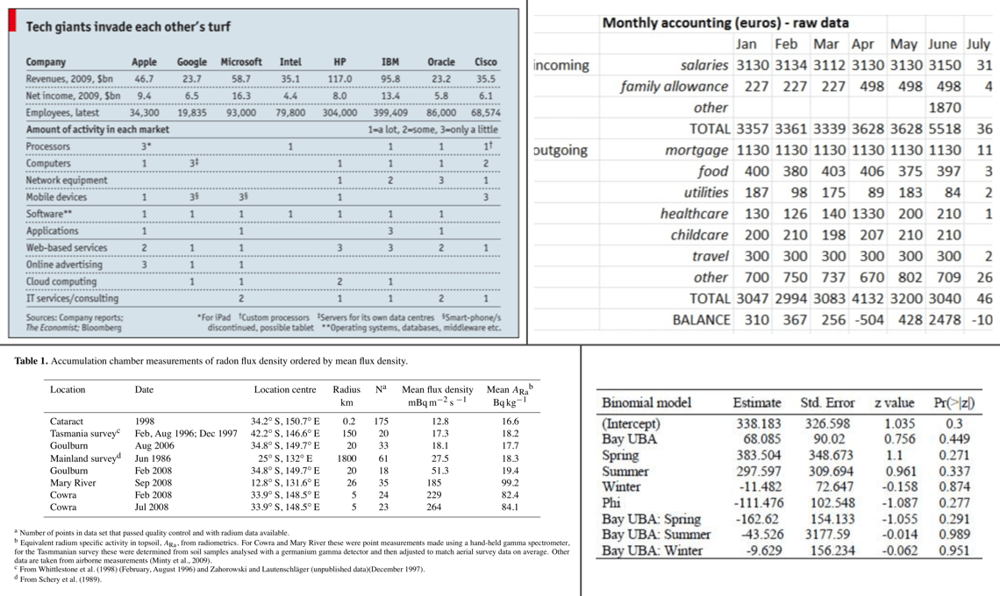

# Introduction

The **Great Tables** package is all about making it simple to produce nice-looking display tables. Display tables? Well yes, we are trying to distinguish between data tables (i.e., DataFrames) and those tables you'd find in a web page, a journal article, or in a magazine. Such tables can likewise be called presentation tables, summary tables, or just tables really. Here are some examples, ripped straight from the web:



We can think of display tables as output only, where we'd not want to use them as input ever again. Other features include annotations, table element styling, and text transformations that serve to communicate the subject matter more clearly.


# Let's Install

The installation really couldn't be much easier. Use this:

``` bash
pip install great_tables
```


# A Basic Table using **Great Tables**

> **Note: Note**
>
> The example below requires the Pandas library to be installed. But Pandas is not required to use Great Tables. You can also use a Polars DataFrame.

Let's use a subset of the `islands` dataset available within `great_tables.data`:


``` python
from great_tables import GT, md, html
from great_tables.data import islands

islands_mini = islands.head(10)
```


The `islands` data is a simple **Pandas** DataFrame with 2 columns and that'll serve as a great start. Speaking of which, the main entry point into the **Great Tables** API is the [GT](../reference/GT.md#great_tables.GT) class. Let's use that to make a presentable table:


``` python
# Create a display table showing ten of the largest islands in the world
gt_tbl = GT(islands_mini)

# Show the output table
gt_tbl
```


| name         | size  |
|--------------|-------|
| Africa       | 11506 |
| Antarctica   | 5500  |
| Asia         | 16988 |
| Australia    | 2968  |
| Axel Heiberg | 16    |
| Baffin       | 184   |
| Banks        | 23    |
| Borneo       | 280   |
| Britain      | 84    |
| Celebes      | 73    |


That doesn't look too bad! Sure, it's basic but we really didn't really ask for much. We did receive a proper table with column labels and the data. Oftentimes however, you'll want a bit more: a **Table header**, a **Stub**, and sometimes *source notes* in the **Table Footer** component.

> **Note: Note**
>
> Typically we use Great Tables in an notebook environment or within a Quarto document. Tables won't print to the console, but using the [show()](../reference/GT.show.md#great_tables.GT.show) method on a table object while in the console will open the HTML table in your default browser.


# **Polars** DataFrame support

[GT](../reference/GT.md#great_tables.GT) accepts both **Pandas** and **Polars** DataFrames. You can pass a **Polars** DataFrame to [GT](../reference/GT.md#great_tables.GT), or use its `DataFrame.style` property.


``` python
import polars as pl

df_polars = pl.from_pandas(islands_mini)

# Approach 1: call GT ----
GT(df_polars)

# Approach 2: Polars style property ----
df_polars.style
```


| name         | size  |
|--------------|-------|
| Africa       | 11506 |
| Antarctica   | 5500  |
| Asia         | 16988 |
| Australia    | 2968  |
| Axel Heiberg | 16    |
| Baffin       | 184   |
| Banks        | 23    |
| Borneo       | 280   |
| Britain      | 84    |
| Celebes      | 73    |


> **Note: Note**
>
> The `polars.DataFrame.style` property is currently considered [unstable](https://docs.pola.rs/api/python/stable/reference/dataframe/style.html#polars.DataFrame.style), and may change in the future. Using [GT](../reference/GT.md#great_tables.GT) on a **Polars** DataFrame will always work.


# Some Beautiful Examples

In the following pages we'll use **Great Tables** to turn DataFrames into beautiful tables, like the ones below.


Show the Code

``` python
from great_tables import GT, md, html
from great_tables.data import islands

islands_mini = islands.head(10)

(
    GT(islands_mini, rowname_col = "name")
    .tab_header(
        title="Large Landmasses of the World",
        subtitle="The top ten largest are presented"
    )
    .tab_source_note(
        source_note="Source: The World Almanac and Book of Facts, 1975, page 406."
    )
    .tab_source_note(
        source_note=md("Reference: McNeil, D. R. (1977) *Interactive Data Analysis*. Wiley.")
    )
    .tab_stubhead(label="landmass")
)
```


<table class="gt_table" data-quarto-disable-processing="false" data-quarto-bootstrap="false">
<thead>
<tr class="gt_heading">
<th colspan="2" class="gt_heading gt_title gt_font_normal">Large Landmasses of the World</th>
</tr>
<tr class="gt_heading">
<th colspan="2" class="gt_heading gt_subtitle gt_font_normal gt_bottom_border">The top ten largest are presented</th>
</tr>
<tr class="gt_col_headings">
<th id="landmass" class="gt_col_heading gt_columns_bottom_border gt_left" scope="col">landmass</th>
<th id="size" class="gt_col_heading gt_columns_bottom_border gt_right" scope="col">size</th>
</tr>
</thead>
<tbody class="gt_table_body">
<tr>
<th class="gt_row gt_left gt_stub">Africa</th>
<td class="gt_row gt_right">11506</td>
</tr>
<tr>
<th class="gt_row gt_left gt_stub">Antarctica</th>
<td class="gt_row gt_right">5500</td>
</tr>
<tr>
<th class="gt_row gt_left gt_stub">Asia</th>
<td class="gt_row gt_right">16988</td>
</tr>
<tr>
<th class="gt_row gt_left gt_stub">Australia</th>
<td class="gt_row gt_right">2968</td>
</tr>
<tr>
<th class="gt_row gt_left gt_stub">Axel Heiberg</th>
<td class="gt_row gt_right">16</td>
</tr>
<tr>
<th class="gt_row gt_left gt_stub">Baffin</th>
<td class="gt_row gt_right">184</td>
</tr>
<tr>
<th class="gt_row gt_left gt_stub">Banks</th>
<td class="gt_row gt_right">23</td>
</tr>
<tr>
<th class="gt_row gt_left gt_stub">Borneo</th>
<td class="gt_row gt_right">280</td>
</tr>
<tr>
<th class="gt_row gt_left gt_stub">Britain</th>
<td class="gt_row gt_right">84</td>
</tr>
<tr>
<th class="gt_row gt_left gt_stub">Celebes</th>
<td class="gt_row gt_right">73</td>
</tr>
</tbody><tfoot>
<tr class="gt_sourcenotes">
<td colspan="2" class="gt_sourcenote">Source: The World Almanac and Book of Facts, 1975, page 406.</td>
</tr>
<tr class="gt_sourcenotes">
<td colspan="2" class="gt_sourcenote">Reference: McNeil, D. R. (1977) <em>Interactive Data Analysis</em>. Wiley.</td>
</tr>
</tfoot>

</table>


Show the Code

``` python
from great_tables import GT, html
from great_tables.data import airquality

airquality_m = airquality.head(10).assign(Year=1973)

gt_airquality = (
    GT(airquality_m)
    .tab_header(
        title="New York Air Quality Measurements",
        subtitle="Daily measurements in New York City (May 1-10, 1973)",
    )
    .tab_spanner(label="Time", columns=["Year", "Month", "Day"])
    .tab_spanner(label="Measurement", columns=["Ozone", "Solar_R", "Wind", "Temp"])
    .cols_move_to_start(columns=["Year", "Month", "Day"])
    .cols_label(
        Ozone=html("Ozone,<br>ppbV"),
        Solar_R=html("Solar R.,<br>cal/m<sup>2</sup>"),
        Wind=html("Wind,<br>mph"),
        Temp=html("Temp,<br>°F"),
    )
)

gt_airquality
```


<table class="gt_table" style="width:100%;" data-quarto-disable-processing="false" data-quarto-bootstrap="false">
<colgroup>
<col style="width: 14%" />
<col style="width: 14%" />
<col style="width: 14%" />
<col style="width: 14%" />
<col style="width: 14%" />
<col style="width: 14%" />
<col style="width: 14%" />
</colgroup>
<thead>
<tr class="gt_heading">
<th colspan="7" class="gt_heading gt_title gt_font_normal">New York Air Quality Measurements</th>
</tr>
<tr class="gt_heading">
<th colspan="7" class="gt_heading gt_subtitle gt_font_normal gt_bottom_border">Daily measurements in New York City (May 1-10, 1973)</th>
</tr>
<tr class="gt_col_headings gt_spanner_row">
<th colspan="3" id="Time" class="gt_center gt_columns_top_border gt_column_spanner_outer" scope="colgroup">Time</th>
<th colspan="4" id="Measurement" class="gt_center gt_columns_top_border gt_column_spanner_outer" scope="colgroup">Measurement</th>
</tr>
<tr class="gt_col_headings">
<th id="Year" class="gt_col_heading gt_columns_bottom_border gt_right" scope="col">Year</th>
<th id="Month" class="gt_col_heading gt_columns_bottom_border gt_right" scope="col">Month</th>
<th id="Day" class="gt_col_heading gt_columns_bottom_border gt_right" scope="col">Day</th>
<th id="Ozone" class="gt_col_heading gt_columns_bottom_border gt_right" scope="col">Ozone,<br />
ppbV</th>
<th id="Solar_R" class="gt_col_heading gt_columns_bottom_border gt_right" scope="col">Solar R.,<br />
cal/m<sup>2</sup></th>
<th id="Wind" class="gt_col_heading gt_columns_bottom_border gt_right" scope="col">Wind,<br />
mph</th>
<th id="Temp" class="gt_col_heading gt_columns_bottom_border gt_right" scope="col">Temp,<br />
°F</th>
</tr>
</thead>
<tbody class="gt_table_body">
<tr>
<td class="gt_row gt_right">1973</td>
<td class="gt_row gt_right">5</td>
<td class="gt_row gt_right">1</td>
<td class="gt_row gt_right">41.0</td>
<td class="gt_row gt_right">190.0</td>
<td class="gt_row gt_right">7.4</td>
<td class="gt_row gt_right">67</td>
</tr>
<tr>
<td class="gt_row gt_right">1973</td>
<td class="gt_row gt_right">5</td>
<td class="gt_row gt_right">2</td>
<td class="gt_row gt_right">36.0</td>
<td class="gt_row gt_right">118.0</td>
<td class="gt_row gt_right">8.0</td>
<td class="gt_row gt_right">72</td>
</tr>
<tr>
<td class="gt_row gt_right">1973</td>
<td class="gt_row gt_right">5</td>
<td class="gt_row gt_right">3</td>
<td class="gt_row gt_right">12.0</td>
<td class="gt_row gt_right">149.0</td>
<td class="gt_row gt_right">12.6</td>
<td class="gt_row gt_right">74</td>
</tr>
<tr>
<td class="gt_row gt_right">1973</td>
<td class="gt_row gt_right">5</td>
<td class="gt_row gt_right">4</td>
<td class="gt_row gt_right">18.0</td>
<td class="gt_row gt_right">313.0</td>
<td class="gt_row gt_right">11.5</td>
<td class="gt_row gt_right">62</td>
</tr>
<tr>
<td class="gt_row gt_right">1973</td>
<td class="gt_row gt_right">5</td>
<td class="gt_row gt_right">5</td>
<td class="gt_row gt_right"></td>
<td class="gt_row gt_right"></td>
<td class="gt_row gt_right">14.3</td>
<td class="gt_row gt_right">56</td>
</tr>
<tr>
<td class="gt_row gt_right">1973</td>
<td class="gt_row gt_right">5</td>
<td class="gt_row gt_right">6</td>
<td class="gt_row gt_right">28.0</td>
<td class="gt_row gt_right"></td>
<td class="gt_row gt_right">14.9</td>
<td class="gt_row gt_right">66</td>
</tr>
<tr>
<td class="gt_row gt_right">1973</td>
<td class="gt_row gt_right">5</td>
<td class="gt_row gt_right">7</td>
<td class="gt_row gt_right">23.0</td>
<td class="gt_row gt_right">299.0</td>
<td class="gt_row gt_right">8.6</td>
<td class="gt_row gt_right">65</td>
</tr>
<tr>
<td class="gt_row gt_right">1973</td>
<td class="gt_row gt_right">5</td>
<td class="gt_row gt_right">8</td>
<td class="gt_row gt_right">19.0</td>
<td class="gt_row gt_right">99.0</td>
<td class="gt_row gt_right">13.8</td>
<td class="gt_row gt_right">59</td>
</tr>
<tr>
<td class="gt_row gt_right">1973</td>
<td class="gt_row gt_right">5</td>
<td class="gt_row gt_right">9</td>
<td class="gt_row gt_right">8.0</td>
<td class="gt_row gt_right">19.0</td>
<td class="gt_row gt_right">20.1</td>
<td class="gt_row gt_right">61</td>
</tr>
<tr>
<td class="gt_row gt_right">1973</td>
<td class="gt_row gt_right">5</td>
<td class="gt_row gt_right">10</td>
<td class="gt_row gt_right"></td>
<td class="gt_row gt_right">194.0</td>
<td class="gt_row gt_right">8.6</td>
<td class="gt_row gt_right">69</td>
</tr>
</tbody>
</table>


These examples show just a glimpse of what's possible with **Great Tables**. The rest of this User Guide will walk you through each capability in detail, from structuring your table with headers, stubs, and column labels, to formatting values, adding visual styles, and embedding nanoplots directly in your cells.


# The Anatomy of a Table

Every table produced by **Great Tables** is composed of a set of structural components. Understanding these components and how they relate to each other is key to building effective presentation tables.

The **Great Tables** package makes it relatively easy to add components so that the resulting output table better conveys the information you want to present. These table components work well together and the possible variations in arrangement can handle even the most demanding table presentation needs. The previous output table we showed had only two components: the **Column Labels** and the **Table Body**. The next few examples will show all of the other table parts that are available.

This is the way the main parts of a table (and their subparts) fit together:


The following list describes each major component of a **Great Tables** output, ordered from top to bottom:

- the **Table Header** (optional; with a **title** and possibly a **subtitle**)
- the **Stub** and the **Stub Head** (optional; contains *row labels*, optionally within *row groups* having *row group labels*)
- the **Column Labels** (contains *column labels*, optionally under *spanner labels*)
- the **Table Body** (contains *columns* and *rows* of *cells*)
- the **Table Footer** (optional; possibly with one or more **source notes**)

Each of these parts is covered in detail throughout the rest of this User Guide. The pages that follow will show you how to add a header and footer, create a stub with row labels and groupings, organize your column labels with spanners, format cell values, and apply styling to any part of the table.
