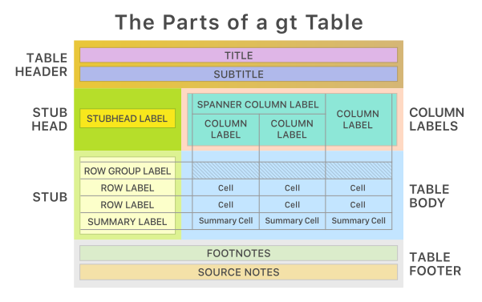

# Table Theme Options

When you need to apply broad visual changes across an entire table, [tab_options()](../reference/GT.tab_options.md#great_tables.GT.tab_options) is the right tool. Rather than styling individual cells or specific locations, this method lets you set colors, fonts, borders, and spacing for entire table parts in a single call. This page explains the structure of option names, demonstrates how to style different parts, and shows how to build a complete table theme.

A useful way to think about the relationship between [tab_options()](../reference/GT.tab_options.md#great_tables.GT.tab_options) and [tab_style()](../reference/GT.tab_style.md#great_tables.GT.tab_style): use [tab_options()](../reference/GT.tab_options.md#great_tables.GT.tab_options) when you want to set broad defaults for entire table parts (e.g., "all column labels should have this background color"). Use [tab_style()](../reference/GT.tab_style.md#great_tables.GT.tab_style) when you need to target specific cells, columns, or rows. The two work together naturally: [tab_options()](../reference/GT.tab_options.md#great_tables.GT.tab_options) sets the base theme, and [tab_style()](../reference/GT.tab_style.md#great_tables.GT.tab_style) applies targeted overrides on top of it.

Great Tables exposes options to customize the appearance of tables via two methods:

- [tab_style()](../reference/GT.tab_style.md#great_tables.GT.tab_style): targeted styles (e.g. color a specific cell of data, or a specific group label).
- [tab_options()](../reference/GT.tab_options.md#great_tables.GT.tab_options): broad styles (e.g. color the header and source notes).

Both methods target parts of the table, as shown in the diagram below.



This page covers how to style and theme your table using [GT.tab_options()](../reference/GT.tab_options.md#great_tables.GT.tab_options), which is meant to quickly set a broad range of styles.

We'll use the basic GT object below for most examples, since it marks some of the table parts.


``` python
from great_tables import GT, exibble

gt_ex = (
    GT(exibble.head(5), rowname_col="row", groupname_col="group")
    .tab_header("THE HEADING", "(a subtitle)")
    .tab_stubhead("THE STUBHEAD")
    .tab_source_note("THE SOURCE NOTE")
    .grand_summary_rows(fns={"GRAND SUMMARY ROW": lambda df: df.sum(numeric_only=True)})
)

gt_ex
```


<style>
#qomkqnymcg table {
          font-family: -apple-system, BlinkMacSystemFont, 'Segoe UI', Roboto, Oxygen, Ubuntu, Cantarell, 'Helvetica Neue', 'Fira Sans', 'Droid Sans', Arial, sans-serif;
          -webkit-font-smoothing: antialiased;
          -moz-osx-font-smoothing: grayscale;
        }

#qomkqnymcg thead, tbody, tfoot, tr, td, th { border-style: none; }
 tr { background-color: transparent; }
#qomkqnymcg p { margin: 0; padding: 0; }
 #qomkqnymcg .gt_table { display: table; border-collapse: collapse; line-height: normal; margin-left: auto; margin-right: auto; color: #333333; font-size: 16px; font-weight: normal; font-style: normal; background-color: #FFFFFF; width: auto; border-top-style: solid; border-top-width: 2px; border-top-color: #A8A8A8; border-right-style: none; border-right-width: 2px; border-right-color: #D3D3D3; border-bottom-style: solid; border-bottom-width: 2px; border-bottom-color: #A8A8A8; border-left-style: none; border-left-width: 2px; border-left-color: #D3D3D3; }
 #qomkqnymcg .gt_caption { padding-top: 4px; padding-bottom: 4px; }
 #qomkqnymcg .gt_title { color: #333333; font-size: 125%; font-weight: initial; padding-top: 4px; padding-bottom: 4px; padding-left: 5px; padding-right: 5px; border-bottom-color: #FFFFFF; border-bottom-width: 0; }
 #qomkqnymcg .gt_subtitle { color: #333333; font-size: 85%; font-weight: initial; padding-top: 3px; padding-bottom: 5px; padding-left: 5px; padding-right: 5px; border-top-color: #FFFFFF; border-top-width: 0; }
 #qomkqnymcg .gt_heading { background-color: #FFFFFF; text-align: center; border-bottom-color: #FFFFFF; border-left-style: none; border-left-width: 1px; border-left-color: #D3D3D3; border-right-style: none; border-right-width: 1px; border-right-color: #D3D3D3; }
 #qomkqnymcg .gt_bottom_border { border-bottom-style: solid; border-bottom-width: 2px; border-bottom-color: #D3D3D3; }
 #qomkqnymcg .gt_col_headings { border-top-style: solid; border-top-width: 2px; border-top-color: #D3D3D3; border-bottom-style: solid; border-bottom-width: 2px; border-bottom-color: #D3D3D3; border-left-style: none; border-left-width: 1px; border-left-color: #D3D3D3; border-right-style: none; border-right-width: 1px; border-right-color: #D3D3D3; }
 #qomkqnymcg .gt_col_heading { color: #333333; background-color: #FFFFFF; font-size: 100%; font-weight: normal; text-transform: inherit; border-left-style: none; border-left-width: 1px; border-left-color: #D3D3D3; border-right-style: none; border-right-width: 1px; border-right-color: #D3D3D3; vertical-align: bottom; padding-top: 5px; padding-bottom: 5px; padding-left: 5px; padding-right: 5px; overflow-x: hidden; }
 #qomkqnymcg .gt_column_spanner_outer { color: #333333; background-color: #FFFFFF; font-size: 100%; font-weight: normal; text-transform: inherit; padding-top: 0; padding-bottom: 0; padding-left: 4px; padding-right: 4px; }
 #qomkqnymcg .gt_column_spanner_outer:first-child { padding-left: 0; }
 #qomkqnymcg .gt_column_spanner_outer:last-child { padding-right: 0; }
 #qomkqnymcg .gt_column_spanner { border-bottom-style: solid; border-bottom-width: 2px; border-bottom-color: #D3D3D3; vertical-align: bottom; padding-top: 5px; padding-bottom: 5px; overflow-x: hidden; display: inline-block; width: 100%; }
 #qomkqnymcg .gt_spanner_row { border-bottom-style: hidden; }
 #qomkqnymcg .gt_group_heading { padding-top: 8px; padding-bottom: 8px; padding-left: 5px; padding-right: 5px; color: #333333; background-color: #FFFFFF; font-size: 100%; font-weight: initial; text-transform: inherit; border-top-style: solid; border-top-width: 2px; border-top-color: #D3D3D3; border-bottom-style: solid; border-bottom-width: 2px; border-bottom-color: #D3D3D3; border-left-style: none; border-left-width: 1px; border-left-color: #D3D3D3; border-right-style: none; border-right-width: 1px; border-right-color: #D3D3D3; vertical-align: middle; text-align: left; }
 #qomkqnymcg .gt_empty_group_heading { padding: 0.5px; color: #333333; background-color: #FFFFFF; font-size: 100%; font-weight: initial; border-top-style: solid; border-top-width: 2px; border-top-color: #D3D3D3; border-bottom-style: solid; border-bottom-width: 2px; border-bottom-color: #D3D3D3; vertical-align: middle; }
 #qomkqnymcg .gt_from_md> :first-child { margin-top: 0; }
 #qomkqnymcg .gt_from_md> :last-child { margin-bottom: 0; }
 #qomkqnymcg .gt_row { padding-top: 8px; padding-bottom: 8px; padding-left: 5px; padding-right: 5px; margin: 10px; border-top-style: solid; border-top-width: 1px; border-top-color: #D3D3D3; border-left-style: none; border-left-width: 1px; border-left-color: #D3D3D3; border-right-style: none; border-right-width: 1px; border-right-color: #D3D3D3; vertical-align: middle; overflow-x: hidden; }
 #qomkqnymcg .gt_stub { color: #333333; background-color: #FFFFFF; font-size: 100%; font-weight: initial; text-transform: inherit; border-right-style: solid; border-right-width: 2px; border-right-color: #D3D3D3; padding-left: 5px; padding-right: 5px; }
 #qomkqnymcg .gt_indent_1 { text-indent: 5px; }
 #qomkqnymcg .gt_indent_2 { text-indent: calc(5px * 2); }
 #qomkqnymcg .gt_indent_3 { text-indent: calc(5px * 3); }
 #qomkqnymcg .gt_indent_4 { text-indent: calc(5px * 4); }
 #qomkqnymcg .gt_indent_5 { text-indent: calc(5px * 5); }
 #qomkqnymcg .gt_stub_row_group { color: #333333; background-color: #FFFFFF; font-size: 100%; font-weight: initial; text-transform: inherit; border-right-style: solid; border-right-width: 2px; border-right-color: #D3D3D3; padding-left: 5px; padding-right: 5px; vertical-align: top; }
 #qomkqnymcg .gt_row_group_first td { border-top-width: 2px; }
 #qomkqnymcg .gt_row_group_first th { border-top-width: 2px; }
 #qomkqnymcg .gt_striped { color: #333333; background-color: #F4F4F4; }
 #qomkqnymcg .gt_table_body { border-top-style: solid; border-top-width: 2px; border-top-color: #D3D3D3; border-bottom-style: solid; border-bottom-width: 2px; border-bottom-color: #D3D3D3; }
 #qomkqnymcg .gt_summary_row { color: #333333; background-color: #FFFFFF; text-transform: inherit; padding-top: 8px; padding-bottom: 8px; padding-left: 5px; padding-right: 5px; }
 #qomkqnymcg .gt_first_summary_row { border-top-style: solid; border-top-width: 2px; border-top-color: #D3D3D3; }
 #qomkqnymcg .gt_last_summary_row_top { border-bottom-style: solid; border-bottom-width: 2px; border-bottom-color: #D3D3D3; }
 #qomkqnymcg .gt_grand_summary_row { color: #333333; background-color: #FFFFFF; text-transform: inherit; padding-top: 8px; padding-bottom: 8px; padding-left: 5px; padding-right: 5px; }
 #qomkqnymcg .gt_first_grand_summary_row_bottom { border-top-style: double; border-top-width: 6px; border-top-color: #D3D3D3; }
 #qomkqnymcg .gt_last_grand_summary_row_top { border-bottom-style: double; border-bottom-width: 6px; border-bottom-color: #D3D3D3; }
 #qomkqnymcg .gt_sourcenotes { color: #333333; background-color: #FFFFFF; border-bottom-style: none; border-bottom-width: 2px; border-bottom-color: #D3D3D3; border-left-style: none; border-left-width: 2px; border-left-color: #D3D3D3; border-right-style: none; border-right-width: 2px; border-right-color: #D3D3D3; }
 #qomkqnymcg .gt_sourcenote { font-size: 90%; padding-top: 4px; padding-bottom: 4px; padding-left: 5px; padding-right: 5px; text-align: left; }
 #qomkqnymcg .gt_left { text-align: left; }
 #qomkqnymcg .gt_center { text-align: center; }
 #qomkqnymcg .gt_right { text-align: right; font-variant-numeric: tabular-nums; }
 #qomkqnymcg .gt_font_normal { font-weight: normal; }
 #qomkqnymcg .gt_font_bold { font-weight: bold; }
 #qomkqnymcg .gt_font_italic { font-style: italic; }
 #qomkqnymcg .gt_super { font-size: 65%; }
 #qomkqnymcg .gt_footnotes { color: font-color(#FFFFFF); background-color: #FFFFFF; border-bottom-style: none; border-bottom-width: 2px; border-bottom-color: #D3D3D3; border-left-style: none; border-left-width: 2px; border-left-color: #D3D3D3; border-right-style: none; border-right-width: 2px; border-right-color: #D3D3D3; }
 #qomkqnymcg .gt_footnote { margin: 0px; font-size: 90%; padding-top: 4px; padding-bottom: 4px; padding-left: 5px; padding-right: 5px; }
 #qomkqnymcg .gt_sourcenotes { color: #333333; background-color: #FFFFFF; border-bottom-style: none; border-bottom-width: 2px; border-bottom-color: #D3D3D3; border-left-style: none; border-left-width: 2px; border-left-color: #D3D3D3; border-right-style: none; border-right-width: 2px; border-right-color: #D3D3D3; }
 #qomkqnymcg .gt_sourcenote { font-size: 90%; padding-top: 4px; padding-bottom: 4px; padding-left: 5px; padding-right: 5px; text-align: left; }
 #qomkqnymcg .gt_footnote_marks { font-size: 75%; vertical-align: 0.4em; position: initial; }
 #qomkqnymcg .gt_asterisk { font-size: 100%; vertical-align: 0; }
 
</style>

<table class="gt_table" data-quarto-disable-processing="false" data-quarto-bootstrap="false">
<thead>
<tr class="gt_heading">
<th colspan="8" class="gt_heading gt_title gt_font_normal">THE HEADING</th>
</tr>
<tr class="gt_heading">
<th colspan="8" class="gt_heading gt_subtitle gt_font_normal gt_bottom_border">(a subtitle)</th>
</tr>
<tr class="gt_col_headings">
<th id="THE-STUBHEAD" class="gt_col_heading gt_columns_bottom_border gt_left" scope="col">THE STUBHEAD</th>
<th id="num" class="gt_col_heading gt_columns_bottom_border gt_right" scope="col">num</th>
<th id="char" class="gt_col_heading gt_columns_bottom_border gt_left" scope="col">char</th>
<th id="fctr" class="gt_col_heading gt_columns_bottom_border gt_left" scope="col">fctr</th>
<th id="date" class="gt_col_heading gt_columns_bottom_border gt_right" scope="col">date</th>
<th id="time" class="gt_col_heading gt_columns_bottom_border gt_right" scope="col">time</th>
<th id="datetime" class="gt_col_heading gt_columns_bottom_border gt_right" scope="col">datetime</th>
<th id="currency" class="gt_col_heading gt_columns_bottom_border gt_right" scope="col">currency</th>
</tr>
</thead>
<tbody class="gt_table_body">
<tr class="gt_group_heading_row">
<th colspan="8" class="gt_group_heading" scope="colgroup">grp_a</th>
</tr>

<tr>
<td class="gt_row gt_left gt_stub" scope="row">row_1</td>
<td class="gt_row gt_right">0.1111</td>
<td class="gt_row gt_left">apricot</td>
<td class="gt_row gt_left">one</td>
<td class="gt_row gt_right">2015-01-15</td>
<td class="gt_row gt_right">13:35</td>
<td class="gt_row gt_right">2018-01-01 02:22</td>
<td class="gt_row gt_right">49.95</td>
</tr>
<tr>
<td class="gt_row gt_left gt_stub" scope="row">row_2</td>
<td class="gt_row gt_right">2.222</td>
<td class="gt_row gt_left">banana</td>
<td class="gt_row gt_left">two</td>
<td class="gt_row gt_right">2015-02-15</td>
<td class="gt_row gt_right">14:40</td>
<td class="gt_row gt_right">2018-02-02 14:33</td>
<td class="gt_row gt_right">17.95</td>
</tr>
<tr>
<td class="gt_row gt_left gt_stub" scope="row">row_3</td>
<td class="gt_row gt_right">33.33</td>
<td class="gt_row gt_left">coconut</td>
<td class="gt_row gt_left">three</td>
<td class="gt_row gt_right">2015-03-15</td>
<td class="gt_row gt_right">15:45</td>
<td class="gt_row gt_right">2018-03-03 03:44</td>
<td class="gt_row gt_right">1.39</td>
</tr>
<tr>
<td class="gt_row gt_left gt_stub" scope="row">row_4</td>
<td class="gt_row gt_right">444.4</td>
<td class="gt_row gt_left">durian</td>
<td class="gt_row gt_left">four</td>
<td class="gt_row gt_right">2015-04-15</td>
<td class="gt_row gt_right">16:50</td>
<td class="gt_row gt_right">2018-04-04 15:55</td>
<td class="gt_row gt_right">65100.0</td>
</tr>
<tr class="gt_group_heading_row">
<td colspan="8" class="gt_group_heading" scope="colgroup">grp_b</td>
</tr>
<tr>
<td class="gt_row gt_left gt_stub" scope="row">row_5</td>
<td class="gt_row gt_right">5550.0</td>
<td class="gt_row gt_left">None</td>
<td class="gt_row gt_left">five</td>
<td class="gt_row gt_right">2015-05-15</td>
<td class="gt_row gt_right">17:55</td>
<td class="gt_row gt_right">2018-05-05 04:00</td>
<td class="gt_row gt_right">1325.81</td>
</tr>
<tr>
<td class="gt_first_grand_summary_row_bottom gt_row gt_left gt_stub gt_grand_summary_row" scope="row">GRAND SUMMARY ROW</td>
<td class="gt_first_grand_summary_row_bottom gt_row gt_right gt_grand_summary_row">6030.0631</td>
<td class="gt_first_grand_summary_row_bottom gt_row gt_left gt_grand_summary_row">---</td>
<td class="gt_first_grand_summary_row_bottom gt_row gt_left gt_grand_summary_row">---</td>
<td class="gt_first_grand_summary_row_bottom gt_row gt_right gt_grand_summary_row">---</td>
<td class="gt_first_grand_summary_row_bottom gt_row gt_right gt_grand_summary_row">---</td>
<td class="gt_first_grand_summary_row_bottom gt_row gt_right gt_grand_summary_row">---</td>
<td class="gt_first_grand_summary_row_bottom gt_row gt_right gt_grand_summary_row">66495.1</td>
</tr>
</tbody><tfoot>
<tr class="gt_sourcenotes">
<td colspan="8" class="gt_sourcenote">THE SOURCE NOTE</td>
</tr>
</tfoot>

</table>


# Table option parts

As the graph above showed, tables are made of many parts. These include the heading, column labels, and the stub. [tab_options()](../reference/GT.tab_options.md#great_tables.GT.tab_options) organizes options based on table part.

The code below illustrates the table parts [tab_options()](../reference/GT.tab_options.md#great_tables.GT.tab_options) can target, by setting the background color for various parts.


``` python
(
    gt_ex
    .tab_options(
        container_width = "100%",
        table_background_color="lightblue",
        heading_background_color = "gold",
        column_labels_background_color="aquamarine",
        row_group_background_color="lightyellow",
        stub_background_color="lightgreen",
        source_notes_background_color="#f1e2af",
        grand_summary_row_background_color="lightpink",
    )
)
```


<style>
#exwoulbdgi table {
          font-family: -apple-system, BlinkMacSystemFont, 'Segoe UI', Roboto, Oxygen, Ubuntu, Cantarell, 'Helvetica Neue', 'Fira Sans', 'Droid Sans', Arial, sans-serif;
          -webkit-font-smoothing: antialiased;
          -moz-osx-font-smoothing: grayscale;
        }

#exwoulbdgi thead, tbody, tfoot, tr, td, th { border-style: none; }
 tr { background-color: transparent; }
#exwoulbdgi p { margin: 0; padding: 0; }
 #exwoulbdgi .gt_table { display: table; border-collapse: collapse; line-height: normal; margin-left: auto; margin-right: auto; color: #333333; font-size: 16px; font-weight: normal; font-style: normal; background-color: lightblue; width: auto; border-top-style: solid; border-top-width: 2px; border-top-color: #A8A8A8; border-right-style: none; border-right-width: 2px; border-right-color: #D3D3D3; border-bottom-style: solid; border-bottom-width: 2px; border-bottom-color: #A8A8A8; border-left-style: none; border-left-width: 2px; border-left-color: #D3D3D3; }
 #exwoulbdgi .gt_caption { padding-top: 4px; padding-bottom: 4px; }
 #exwoulbdgi .gt_title { color: #333333; font-size: 125%; font-weight: initial; padding-top: 4px; padding-bottom: 4px; padding-left: 5px; padding-right: 5px; border-bottom-color: lightblue; border-bottom-width: 0; }
 #exwoulbdgi .gt_subtitle { color: #333333; font-size: 85%; font-weight: initial; padding-top: 3px; padding-bottom: 5px; padding-left: 5px; padding-right: 5px; border-top-color: lightblue; border-top-width: 0; }
 #exwoulbdgi .gt_heading { background-color: gold; text-align: center; border-bottom-color: lightblue; border-left-style: none; border-left-width: 1px; border-left-color: #D3D3D3; border-right-style: none; border-right-width: 1px; border-right-color: #D3D3D3; }
 #exwoulbdgi .gt_bottom_border { border-bottom-style: solid; border-bottom-width: 2px; border-bottom-color: #D3D3D3; }
 #exwoulbdgi .gt_col_headings { border-top-style: solid; border-top-width: 2px; border-top-color: #D3D3D3; border-bottom-style: solid; border-bottom-width: 2px; border-bottom-color: #D3D3D3; border-left-style: none; border-left-width: 1px; border-left-color: #D3D3D3; border-right-style: none; border-right-width: 1px; border-right-color: #D3D3D3; }
 #exwoulbdgi .gt_col_heading { color: #333333; background-color: aquamarine; font-size: 100%; font-weight: normal; text-transform: inherit; border-left-style: none; border-left-width: 1px; border-left-color: #D3D3D3; border-right-style: none; border-right-width: 1px; border-right-color: #D3D3D3; vertical-align: bottom; padding-top: 5px; padding-bottom: 5px; padding-left: 5px; padding-right: 5px; overflow-x: hidden; }
 #exwoulbdgi .gt_column_spanner_outer { color: #333333; background-color: aquamarine; font-size: 100%; font-weight: normal; text-transform: inherit; padding-top: 0; padding-bottom: 0; padding-left: 4px; padding-right: 4px; }
 #exwoulbdgi .gt_column_spanner_outer:first-child { padding-left: 0; }
 #exwoulbdgi .gt_column_spanner_outer:last-child { padding-right: 0; }
 #exwoulbdgi .gt_column_spanner { border-bottom-style: solid; border-bottom-width: 2px; border-bottom-color: #D3D3D3; vertical-align: bottom; padding-top: 5px; padding-bottom: 5px; overflow-x: hidden; display: inline-block; width: 100%; }
 #exwoulbdgi .gt_spanner_row { border-bottom-style: hidden; }
 #exwoulbdgi .gt_group_heading { padding-top: 8px; padding-bottom: 8px; padding-left: 5px; padding-right: 5px; color: #333333; background-color: lightyellow; font-size: 100%; font-weight: initial; text-transform: inherit; border-top-style: solid; border-top-width: 2px; border-top-color: #D3D3D3; border-bottom-style: solid; border-bottom-width: 2px; border-bottom-color: #D3D3D3; border-left-style: none; border-left-width: 1px; border-left-color: #D3D3D3; border-right-style: none; border-right-width: 1px; border-right-color: #D3D3D3; vertical-align: middle; text-align: left; }
 #exwoulbdgi .gt_empty_group_heading { padding: 0.5px; color: #333333; background-color: lightyellow; font-size: 100%; font-weight: initial; border-top-style: solid; border-top-width: 2px; border-top-color: #D3D3D3; border-bottom-style: solid; border-bottom-width: 2px; border-bottom-color: #D3D3D3; vertical-align: middle; }
 #exwoulbdgi .gt_from_md> :first-child { margin-top: 0; }
 #exwoulbdgi .gt_from_md> :last-child { margin-bottom: 0; }
 #exwoulbdgi .gt_row { padding-top: 8px; padding-bottom: 8px; padding-left: 5px; padding-right: 5px; margin: 10px; border-top-style: solid; border-top-width: 1px; border-top-color: #D3D3D3; border-left-style: none; border-left-width: 1px; border-left-color: #D3D3D3; border-right-style: none; border-right-width: 1px; border-right-color: #D3D3D3; vertical-align: middle; overflow-x: hidden; }
 #exwoulbdgi .gt_stub { color: #333333; background-color: lightgreen; font-size: 100%; font-weight: initial; text-transform: inherit; border-right-style: solid; border-right-width: 2px; border-right-color: #D3D3D3; padding-left: 5px; padding-right: 5px; }
 #exwoulbdgi .gt_indent_1 { text-indent: 5px; }
 #exwoulbdgi .gt_indent_2 { text-indent: calc(5px * 2); }
 #exwoulbdgi .gt_indent_3 { text-indent: calc(5px * 3); }
 #exwoulbdgi .gt_indent_4 { text-indent: calc(5px * 4); }
 #exwoulbdgi .gt_indent_5 { text-indent: calc(5px * 5); }
 #exwoulbdgi .gt_stub_row_group { color: #333333; background-color: lightblue; font-size: 100%; font-weight: initial; text-transform: inherit; border-right-style: solid; border-right-width: 2px; border-right-color: #D3D3D3; padding-left: 5px; padding-right: 5px; vertical-align: top; }
 #exwoulbdgi .gt_row_group_first td { border-top-width: 2px; }
 #exwoulbdgi .gt_row_group_first th { border-top-width: 2px; }
 #exwoulbdgi .gt_striped { color: #333333; background-color: #F4F4F4; }
 #exwoulbdgi .gt_table_body { border-top-style: solid; border-top-width: 2px; border-top-color: #D3D3D3; border-bottom-style: solid; border-bottom-width: 2px; border-bottom-color: #D3D3D3; }
 #exwoulbdgi .gt_summary_row { color: #333333; background-color: lightblue; text-transform: inherit; padding-top: 8px; padding-bottom: 8px; padding-left: 5px; padding-right: 5px; }
 #exwoulbdgi .gt_first_summary_row { border-top-style: solid; border-top-width: 2px; border-top-color: #D3D3D3; }
 #exwoulbdgi .gt_last_summary_row_top { border-bottom-style: solid; border-bottom-width: 2px; border-bottom-color: #D3D3D3; }
 #exwoulbdgi .gt_grand_summary_row { color: #333333; background-color: lightpink; text-transform: inherit; padding-top: 8px; padding-bottom: 8px; padding-left: 5px; padding-right: 5px; }
 #exwoulbdgi .gt_first_grand_summary_row_bottom { border-top-style: double; border-top-width: 6px; border-top-color: #D3D3D3; }
 #exwoulbdgi .gt_last_grand_summary_row_top { border-bottom-style: double; border-bottom-width: 6px; border-bottom-color: #D3D3D3; }
 #exwoulbdgi .gt_sourcenotes { color: #333333; background-color: #f1e2af; border-bottom-style: none; border-bottom-width: 2px; border-bottom-color: #D3D3D3; border-left-style: none; border-left-width: 2px; border-left-color: #D3D3D3; border-right-style: none; border-right-width: 2px; border-right-color: #D3D3D3; }
 #exwoulbdgi .gt_sourcenote { font-size: 90%; padding-top: 4px; padding-bottom: 4px; padding-left: 5px; padding-right: 5px; text-align: left; }
 #exwoulbdgi .gt_left { text-align: left; }
 #exwoulbdgi .gt_center { text-align: center; }
 #exwoulbdgi .gt_right { text-align: right; font-variant-numeric: tabular-nums; }
 #exwoulbdgi .gt_font_normal { font-weight: normal; }
 #exwoulbdgi .gt_font_bold { font-weight: bold; }
 #exwoulbdgi .gt_font_italic { font-style: italic; }
 #exwoulbdgi .gt_super { font-size: 65%; }
 #exwoulbdgi .gt_footnotes { color: font-color(lightblue); background-color: lightblue; border-bottom-style: none; border-bottom-width: 2px; border-bottom-color: #D3D3D3; border-left-style: none; border-left-width: 2px; border-left-color: #D3D3D3; border-right-style: none; border-right-width: 2px; border-right-color: #D3D3D3; }
 #exwoulbdgi .gt_footnote { margin: 0px; font-size: 90%; padding-top: 4px; padding-bottom: 4px; padding-left: 5px; padding-right: 5px; }
 #exwoulbdgi .gt_sourcenotes { color: #333333; background-color: #f1e2af; border-bottom-style: none; border-bottom-width: 2px; border-bottom-color: #D3D3D3; border-left-style: none; border-left-width: 2px; border-left-color: #D3D3D3; border-right-style: none; border-right-width: 2px; border-right-color: #D3D3D3; }
 #exwoulbdgi .gt_sourcenote { font-size: 90%; padding-top: 4px; padding-bottom: 4px; padding-left: 5px; padding-right: 5px; text-align: left; }
 #exwoulbdgi .gt_footnote_marks { font-size: 75%; vertical-align: 0.4em; position: initial; }
 #exwoulbdgi .gt_asterisk { font-size: 100%; vertical-align: 0; }
 
</style>

<table class="gt_table" data-quarto-disable-processing="false" data-quarto-bootstrap="false">
<thead>
<tr class="gt_heading">
<th colspan="8" class="gt_heading gt_title gt_font_normal">THE HEADING</th>
</tr>
<tr class="gt_heading">
<th colspan="8" class="gt_heading gt_subtitle gt_font_normal gt_bottom_border">(a subtitle)</th>
</tr>
<tr class="gt_col_headings">
<th id="THE-STUBHEAD" class="gt_col_heading gt_columns_bottom_border gt_left" scope="col">THE STUBHEAD</th>
<th id="num" class="gt_col_heading gt_columns_bottom_border gt_right" scope="col">num</th>
<th id="char" class="gt_col_heading gt_columns_bottom_border gt_left" scope="col">char</th>
<th id="fctr" class="gt_col_heading gt_columns_bottom_border gt_left" scope="col">fctr</th>
<th id="date" class="gt_col_heading gt_columns_bottom_border gt_right" scope="col">date</th>
<th id="time" class="gt_col_heading gt_columns_bottom_border gt_right" scope="col">time</th>
<th id="datetime" class="gt_col_heading gt_columns_bottom_border gt_right" scope="col">datetime</th>
<th id="currency" class="gt_col_heading gt_columns_bottom_border gt_right" scope="col">currency</th>
</tr>
</thead>
<tbody class="gt_table_body">
<tr class="gt_group_heading_row">
<th colspan="8" class="gt_group_heading" scope="colgroup">grp_a</th>
</tr>

<tr>
<td class="gt_row gt_left gt_stub" scope="row">row_1</td>
<td class="gt_row gt_right">0.1111</td>
<td class="gt_row gt_left">apricot</td>
<td class="gt_row gt_left">one</td>
<td class="gt_row gt_right">2015-01-15</td>
<td class="gt_row gt_right">13:35</td>
<td class="gt_row gt_right">2018-01-01 02:22</td>
<td class="gt_row gt_right">49.95</td>
</tr>
<tr>
<td class="gt_row gt_left gt_stub" scope="row">row_2</td>
<td class="gt_row gt_right">2.222</td>
<td class="gt_row gt_left">banana</td>
<td class="gt_row gt_left">two</td>
<td class="gt_row gt_right">2015-02-15</td>
<td class="gt_row gt_right">14:40</td>
<td class="gt_row gt_right">2018-02-02 14:33</td>
<td class="gt_row gt_right">17.95</td>
</tr>
<tr>
<td class="gt_row gt_left gt_stub" scope="row">row_3</td>
<td class="gt_row gt_right">33.33</td>
<td class="gt_row gt_left">coconut</td>
<td class="gt_row gt_left">three</td>
<td class="gt_row gt_right">2015-03-15</td>
<td class="gt_row gt_right">15:45</td>
<td class="gt_row gt_right">2018-03-03 03:44</td>
<td class="gt_row gt_right">1.39</td>
</tr>
<tr>
<td class="gt_row gt_left gt_stub" scope="row">row_4</td>
<td class="gt_row gt_right">444.4</td>
<td class="gt_row gt_left">durian</td>
<td class="gt_row gt_left">four</td>
<td class="gt_row gt_right">2015-04-15</td>
<td class="gt_row gt_right">16:50</td>
<td class="gt_row gt_right">2018-04-04 15:55</td>
<td class="gt_row gt_right">65100.0</td>
</tr>
<tr class="gt_group_heading_row">
<td colspan="8" class="gt_group_heading" scope="colgroup">grp_b</td>
</tr>
<tr>
<td class="gt_row gt_left gt_stub" scope="row">row_5</td>
<td class="gt_row gt_right">5550.0</td>
<td class="gt_row gt_left">None</td>
<td class="gt_row gt_left">five</td>
<td class="gt_row gt_right">2015-05-15</td>
<td class="gt_row gt_right">17:55</td>
<td class="gt_row gt_right">2018-05-05 04:00</td>
<td class="gt_row gt_right">1325.81</td>
</tr>
<tr>
<td class="gt_first_grand_summary_row_bottom gt_row gt_left gt_stub gt_grand_summary_row" scope="row">GRAND SUMMARY ROW</td>
<td class="gt_first_grand_summary_row_bottom gt_row gt_right gt_grand_summary_row">6030.0631</td>
<td class="gt_first_grand_summary_row_bottom gt_row gt_left gt_grand_summary_row">---</td>
<td class="gt_first_grand_summary_row_bottom gt_row gt_left gt_grand_summary_row">---</td>
<td class="gt_first_grand_summary_row_bottom gt_row gt_right gt_grand_summary_row">---</td>
<td class="gt_first_grand_summary_row_bottom gt_row gt_right gt_grand_summary_row">---</td>
<td class="gt_first_grand_summary_row_bottom gt_row gt_right gt_grand_summary_row">---</td>
<td class="gt_first_grand_summary_row_bottom gt_row gt_right gt_grand_summary_row">66495.1</td>
</tr>
</tbody><tfoot>
<tr class="gt_sourcenotes">
<td colspan="8" class="gt_sourcenote">THE SOURCE NOTE</td>
</tr>
</tfoot>

</table>


Notice two important pieces:

- The argument `heading_background_color="gold"` sets the heading part's background to gold.
- Parts like `container` and `table` are the broadest. They cover all the other parts of the table.


# Finding options: part, type, attribute

Option names in [tab_options()](../reference/GT.tab_options.md#great_tables.GT.tab_options) follow a consistent naming convention. Understanding the pattern makes it easy to find the exact option you need without searching through documentation. The format is:

``` python
{part name}_{type}_{attribute}
```

For example, the option `row_group_border_top_color` has these pieces:

- **part**: `row_group`
- **type**: `border_top`
- **attribute**: `color`

> **Note: Note**
>
> Here are the parts supported in [tab_options()](../reference/GT.tab_options.md#great_tables.GT.tab_options):
>
> - container, table
> - heading, source_note
> - column_labels, row_group, stub, stub_row
> - table_body


# Styling borders

Many table parts support customizing border colors and style. This is shown below for column labels.


``` python
gt_ex.tab_options(
    column_labels_border_top_color="blue",
    column_labels_border_top_style="solid",
    column_labels_border_top_width="5px"
)
```


<style>
#zpafvpdpop table {
          font-family: -apple-system, BlinkMacSystemFont, 'Segoe UI', Roboto, Oxygen, Ubuntu, Cantarell, 'Helvetica Neue', 'Fira Sans', 'Droid Sans', Arial, sans-serif;
          -webkit-font-smoothing: antialiased;
          -moz-osx-font-smoothing: grayscale;
        }

#zpafvpdpop thead, tbody, tfoot, tr, td, th { border-style: none; }
 tr { background-color: transparent; }
#zpafvpdpop p { margin: 0; padding: 0; }
 #zpafvpdpop .gt_table { display: table; border-collapse: collapse; line-height: normal; margin-left: auto; margin-right: auto; color: #333333; font-size: 16px; font-weight: normal; font-style: normal; background-color: #FFFFFF; width: auto; border-top-style: solid; border-top-width: 2px; border-top-color: #A8A8A8; border-right-style: none; border-right-width: 2px; border-right-color: #D3D3D3; border-bottom-style: solid; border-bottom-width: 2px; border-bottom-color: #A8A8A8; border-left-style: none; border-left-width: 2px; border-left-color: #D3D3D3; }
 #zpafvpdpop .gt_caption { padding-top: 4px; padding-bottom: 4px; }
 #zpafvpdpop .gt_title { color: #333333; font-size: 125%; font-weight: initial; padding-top: 4px; padding-bottom: 4px; padding-left: 5px; padding-right: 5px; border-bottom-color: #FFFFFF; border-bottom-width: 0; }
 #zpafvpdpop .gt_subtitle { color: #333333; font-size: 85%; font-weight: initial; padding-top: 3px; padding-bottom: 5px; padding-left: 5px; padding-right: 5px; border-top-color: #FFFFFF; border-top-width: 0; }
 #zpafvpdpop .gt_heading { background-color: #FFFFFF; text-align: center; border-bottom-color: #FFFFFF; border-left-style: none; border-left-width: 1px; border-left-color: #D3D3D3; border-right-style: none; border-right-width: 1px; border-right-color: #D3D3D3; }
 #zpafvpdpop .gt_bottom_border { border-bottom-style: solid; border-bottom-width: 2px; border-bottom-color: #D3D3D3; }
 #zpafvpdpop .gt_col_headings { border-top-style: solid; border-top-width: 5px; border-top-color: blue; border-bottom-style: solid; border-bottom-width: 2px; border-bottom-color: #D3D3D3; border-left-style: none; border-left-width: 1px; border-left-color: #D3D3D3; border-right-style: none; border-right-width: 1px; border-right-color: #D3D3D3; }
 #zpafvpdpop .gt_col_heading { color: #333333; background-color: #FFFFFF; font-size: 100%; font-weight: normal; text-transform: inherit; border-left-style: none; border-left-width: 1px; border-left-color: #D3D3D3; border-right-style: none; border-right-width: 1px; border-right-color: #D3D3D3; vertical-align: bottom; padding-top: 5px; padding-bottom: 5px; padding-left: 5px; padding-right: 5px; overflow-x: hidden; }
 #zpafvpdpop .gt_column_spanner_outer { color: #333333; background-color: #FFFFFF; font-size: 100%; font-weight: normal; text-transform: inherit; padding-top: 0; padding-bottom: 0; padding-left: 4px; padding-right: 4px; }
 #zpafvpdpop .gt_column_spanner_outer:first-child { padding-left: 0; }
 #zpafvpdpop .gt_column_spanner_outer:last-child { padding-right: 0; }
 #zpafvpdpop .gt_column_spanner { border-bottom-style: solid; border-bottom-width: 2px; border-bottom-color: #D3D3D3; vertical-align: bottom; padding-top: 5px; padding-bottom: 5px; overflow-x: hidden; display: inline-block; width: 100%; }
 #zpafvpdpop .gt_spanner_row { border-bottom-style: hidden; }
 #zpafvpdpop .gt_group_heading { padding-top: 8px; padding-bottom: 8px; padding-left: 5px; padding-right: 5px; color: #333333; background-color: #FFFFFF; font-size: 100%; font-weight: initial; text-transform: inherit; border-top-style: solid; border-top-width: 2px; border-top-color: #D3D3D3; border-bottom-style: solid; border-bottom-width: 2px; border-bottom-color: #D3D3D3; border-left-style: none; border-left-width: 1px; border-left-color: #D3D3D3; border-right-style: none; border-right-width: 1px; border-right-color: #D3D3D3; vertical-align: middle; text-align: left; }
 #zpafvpdpop .gt_empty_group_heading { padding: 0.5px; color: #333333; background-color: #FFFFFF; font-size: 100%; font-weight: initial; border-top-style: solid; border-top-width: 2px; border-top-color: #D3D3D3; border-bottom-style: solid; border-bottom-width: 2px; border-bottom-color: #D3D3D3; vertical-align: middle; }
 #zpafvpdpop .gt_from_md> :first-child { margin-top: 0; }
 #zpafvpdpop .gt_from_md> :last-child { margin-bottom: 0; }
 #zpafvpdpop .gt_row { padding-top: 8px; padding-bottom: 8px; padding-left: 5px; padding-right: 5px; margin: 10px; border-top-style: solid; border-top-width: 1px; border-top-color: #D3D3D3; border-left-style: none; border-left-width: 1px; border-left-color: #D3D3D3; border-right-style: none; border-right-width: 1px; border-right-color: #D3D3D3; vertical-align: middle; overflow-x: hidden; }
 #zpafvpdpop .gt_stub { color: #333333; background-color: #FFFFFF; font-size: 100%; font-weight: initial; text-transform: inherit; border-right-style: solid; border-right-width: 2px; border-right-color: #D3D3D3; padding-left: 5px; padding-right: 5px; }
 #zpafvpdpop .gt_indent_1 { text-indent: 5px; }
 #zpafvpdpop .gt_indent_2 { text-indent: calc(5px * 2); }
 #zpafvpdpop .gt_indent_3 { text-indent: calc(5px * 3); }
 #zpafvpdpop .gt_indent_4 { text-indent: calc(5px * 4); }
 #zpafvpdpop .gt_indent_5 { text-indent: calc(5px * 5); }
 #zpafvpdpop .gt_stub_row_group { color: #333333; background-color: #FFFFFF; font-size: 100%; font-weight: initial; text-transform: inherit; border-right-style: solid; border-right-width: 2px; border-right-color: #D3D3D3; padding-left: 5px; padding-right: 5px; vertical-align: top; }
 #zpafvpdpop .gt_row_group_first td { border-top-width: 2px; }
 #zpafvpdpop .gt_row_group_first th { border-top-width: 2px; }
 #zpafvpdpop .gt_striped { color: #333333; background-color: #F4F4F4; }
 #zpafvpdpop .gt_table_body { border-top-style: solid; border-top-width: 2px; border-top-color: #D3D3D3; border-bottom-style: solid; border-bottom-width: 2px; border-bottom-color: #D3D3D3; }
 #zpafvpdpop .gt_summary_row { color: #333333; background-color: #FFFFFF; text-transform: inherit; padding-top: 8px; padding-bottom: 8px; padding-left: 5px; padding-right: 5px; }
 #zpafvpdpop .gt_first_summary_row { border-top-style: solid; border-top-width: 2px; border-top-color: #D3D3D3; }
 #zpafvpdpop .gt_last_summary_row_top { border-bottom-style: solid; border-bottom-width: 2px; border-bottom-color: #D3D3D3; }
 #zpafvpdpop .gt_grand_summary_row { color: #333333; background-color: #FFFFFF; text-transform: inherit; padding-top: 8px; padding-bottom: 8px; padding-left: 5px; padding-right: 5px; }
 #zpafvpdpop .gt_first_grand_summary_row_bottom { border-top-style: double; border-top-width: 6px; border-top-color: #D3D3D3; }
 #zpafvpdpop .gt_last_grand_summary_row_top { border-bottom-style: double; border-bottom-width: 6px; border-bottom-color: #D3D3D3; }
 #zpafvpdpop .gt_sourcenotes { color: #333333; background-color: #FFFFFF; border-bottom-style: none; border-bottom-width: 2px; border-bottom-color: #D3D3D3; border-left-style: none; border-left-width: 2px; border-left-color: #D3D3D3; border-right-style: none; border-right-width: 2px; border-right-color: #D3D3D3; }
 #zpafvpdpop .gt_sourcenote { font-size: 90%; padding-top: 4px; padding-bottom: 4px; padding-left: 5px; padding-right: 5px; text-align: left; }
 #zpafvpdpop .gt_left { text-align: left; }
 #zpafvpdpop .gt_center { text-align: center; }
 #zpafvpdpop .gt_right { text-align: right; font-variant-numeric: tabular-nums; }
 #zpafvpdpop .gt_font_normal { font-weight: normal; }
 #zpafvpdpop .gt_font_bold { font-weight: bold; }
 #zpafvpdpop .gt_font_italic { font-style: italic; }
 #zpafvpdpop .gt_super { font-size: 65%; }
 #zpafvpdpop .gt_footnotes { color: font-color(#FFFFFF); background-color: #FFFFFF; border-bottom-style: none; border-bottom-width: 2px; border-bottom-color: #D3D3D3; border-left-style: none; border-left-width: 2px; border-left-color: #D3D3D3; border-right-style: none; border-right-width: 2px; border-right-color: #D3D3D3; }
 #zpafvpdpop .gt_footnote { margin: 0px; font-size: 90%; padding-top: 4px; padding-bottom: 4px; padding-left: 5px; padding-right: 5px; }
 #zpafvpdpop .gt_sourcenotes { color: #333333; background-color: #FFFFFF; border-bottom-style: none; border-bottom-width: 2px; border-bottom-color: #D3D3D3; border-left-style: none; border-left-width: 2px; border-left-color: #D3D3D3; border-right-style: none; border-right-width: 2px; border-right-color: #D3D3D3; }
 #zpafvpdpop .gt_sourcenote { font-size: 90%; padding-top: 4px; padding-bottom: 4px; padding-left: 5px; padding-right: 5px; text-align: left; }
 #zpafvpdpop .gt_footnote_marks { font-size: 75%; vertical-align: 0.4em; position: initial; }
 #zpafvpdpop .gt_asterisk { font-size: 100%; vertical-align: 0; }
 
</style>

<table class="gt_table" data-quarto-disable-processing="false" data-quarto-bootstrap="false">
<thead>
<tr class="gt_heading">
<th colspan="8" class="gt_heading gt_title gt_font_normal">THE HEADING</th>
</tr>
<tr class="gt_heading">
<th colspan="8" class="gt_heading gt_subtitle gt_font_normal gt_bottom_border">(a subtitle)</th>
</tr>
<tr class="gt_col_headings">
<th id="THE-STUBHEAD" class="gt_col_heading gt_columns_bottom_border gt_left" scope="col">THE STUBHEAD</th>
<th id="num" class="gt_col_heading gt_columns_bottom_border gt_right" scope="col">num</th>
<th id="char" class="gt_col_heading gt_columns_bottom_border gt_left" scope="col">char</th>
<th id="fctr" class="gt_col_heading gt_columns_bottom_border gt_left" scope="col">fctr</th>
<th id="date" class="gt_col_heading gt_columns_bottom_border gt_right" scope="col">date</th>
<th id="time" class="gt_col_heading gt_columns_bottom_border gt_right" scope="col">time</th>
<th id="datetime" class="gt_col_heading gt_columns_bottom_border gt_right" scope="col">datetime</th>
<th id="currency" class="gt_col_heading gt_columns_bottom_border gt_right" scope="col">currency</th>
</tr>
</thead>
<tbody class="gt_table_body">
<tr class="gt_group_heading_row">
<th colspan="8" class="gt_group_heading" scope="colgroup">grp_a</th>
</tr>

<tr>
<td class="gt_row gt_left gt_stub" scope="row">row_1</td>
<td class="gt_row gt_right">0.1111</td>
<td class="gt_row gt_left">apricot</td>
<td class="gt_row gt_left">one</td>
<td class="gt_row gt_right">2015-01-15</td>
<td class="gt_row gt_right">13:35</td>
<td class="gt_row gt_right">2018-01-01 02:22</td>
<td class="gt_row gt_right">49.95</td>
</tr>
<tr>
<td class="gt_row gt_left gt_stub" scope="row">row_2</td>
<td class="gt_row gt_right">2.222</td>
<td class="gt_row gt_left">banana</td>
<td class="gt_row gt_left">two</td>
<td class="gt_row gt_right">2015-02-15</td>
<td class="gt_row gt_right">14:40</td>
<td class="gt_row gt_right">2018-02-02 14:33</td>
<td class="gt_row gt_right">17.95</td>
</tr>
<tr>
<td class="gt_row gt_left gt_stub" scope="row">row_3</td>
<td class="gt_row gt_right">33.33</td>
<td class="gt_row gt_left">coconut</td>
<td class="gt_row gt_left">three</td>
<td class="gt_row gt_right">2015-03-15</td>
<td class="gt_row gt_right">15:45</td>
<td class="gt_row gt_right">2018-03-03 03:44</td>
<td class="gt_row gt_right">1.39</td>
</tr>
<tr>
<td class="gt_row gt_left gt_stub" scope="row">row_4</td>
<td class="gt_row gt_right">444.4</td>
<td class="gt_row gt_left">durian</td>
<td class="gt_row gt_left">four</td>
<td class="gt_row gt_right">2015-04-15</td>
<td class="gt_row gt_right">16:50</td>
<td class="gt_row gt_right">2018-04-04 15:55</td>
<td class="gt_row gt_right">65100.0</td>
</tr>
<tr class="gt_group_heading_row">
<td colspan="8" class="gt_group_heading" scope="colgroup">grp_b</td>
</tr>
<tr>
<td class="gt_row gt_left gt_stub" scope="row">row_5</td>
<td class="gt_row gt_right">5550.0</td>
<td class="gt_row gt_left">None</td>
<td class="gt_row gt_left">five</td>
<td class="gt_row gt_right">2015-05-15</td>
<td class="gt_row gt_right">17:55</td>
<td class="gt_row gt_right">2018-05-05 04:00</td>
<td class="gt_row gt_right">1325.81</td>
</tr>
<tr>
<td class="gt_first_grand_summary_row_bottom gt_row gt_left gt_stub gt_grand_summary_row" scope="row">GRAND SUMMARY ROW</td>
<td class="gt_first_grand_summary_row_bottom gt_row gt_right gt_grand_summary_row">6030.0631</td>
<td class="gt_first_grand_summary_row_bottom gt_row gt_left gt_grand_summary_row">---</td>
<td class="gt_first_grand_summary_row_bottom gt_row gt_left gt_grand_summary_row">---</td>
<td class="gt_first_grand_summary_row_bottom gt_row gt_right gt_grand_summary_row">---</td>
<td class="gt_first_grand_summary_row_bottom gt_row gt_right gt_grand_summary_row">---</td>
<td class="gt_first_grand_summary_row_bottom gt_row gt_right gt_grand_summary_row">---</td>
<td class="gt_first_grand_summary_row_bottom gt_row gt_right gt_grand_summary_row">66495.1</td>
</tr>
</tbody><tfoot>
<tr class="gt_sourcenotes">
<td colspan="8" class="gt_sourcenote">THE SOURCE NOTE</td>
</tr>
</tfoot>

</table>


The column labels section now has a thick blue border on top. Each border option follows the same triplet of `color`, `style`, and `width` attributes, which you can combine to create the exact look you want.


# Styling background color


``` python
gt_ex.tab_options(
    heading_background_color="purple"
)
```


<style>
#mpjywqfgxc table {
          font-family: -apple-system, BlinkMacSystemFont, 'Segoe UI', Roboto, Oxygen, Ubuntu, Cantarell, 'Helvetica Neue', 'Fira Sans', 'Droid Sans', Arial, sans-serif;
          -webkit-font-smoothing: antialiased;
          -moz-osx-font-smoothing: grayscale;
        }

#mpjywqfgxc thead, tbody, tfoot, tr, td, th { border-style: none; }
 tr { background-color: transparent; }
#mpjywqfgxc p { margin: 0; padding: 0; }
 #mpjywqfgxc .gt_table { display: table; border-collapse: collapse; line-height: normal; margin-left: auto; margin-right: auto; color: #333333; font-size: 16px; font-weight: normal; font-style: normal; background-color: #FFFFFF; width: auto; border-top-style: solid; border-top-width: 2px; border-top-color: #A8A8A8; border-right-style: none; border-right-width: 2px; border-right-color: #D3D3D3; border-bottom-style: solid; border-bottom-width: 2px; border-bottom-color: #A8A8A8; border-left-style: none; border-left-width: 2px; border-left-color: #D3D3D3; }
 #mpjywqfgxc .gt_caption { padding-top: 4px; padding-bottom: 4px; }
 #mpjywqfgxc .gt_title { color: #FFFFFF; font-size: 125%; font-weight: initial; padding-top: 4px; padding-bottom: 4px; padding-left: 5px; padding-right: 5px; border-bottom-color: #FFFFFF; border-bottom-width: 0; }
 #mpjywqfgxc .gt_subtitle { color: #FFFFFF; font-size: 85%; font-weight: initial; padding-top: 3px; padding-bottom: 5px; padding-left: 5px; padding-right: 5px; border-top-color: #FFFFFF; border-top-width: 0; }
 #mpjywqfgxc .gt_heading { background-color: purple; text-align: center; border-bottom-color: #FFFFFF; border-left-style: none; border-left-width: 1px; border-left-color: #D3D3D3; border-right-style: none; border-right-width: 1px; border-right-color: #D3D3D3; }
 #mpjywqfgxc .gt_bottom_border { border-bottom-style: solid; border-bottom-width: 2px; border-bottom-color: #D3D3D3; }
 #mpjywqfgxc .gt_col_headings { border-top-style: solid; border-top-width: 2px; border-top-color: #D3D3D3; border-bottom-style: solid; border-bottom-width: 2px; border-bottom-color: #D3D3D3; border-left-style: none; border-left-width: 1px; border-left-color: #D3D3D3; border-right-style: none; border-right-width: 1px; border-right-color: #D3D3D3; }
 #mpjywqfgxc .gt_col_heading { color: #333333; background-color: #FFFFFF; font-size: 100%; font-weight: normal; text-transform: inherit; border-left-style: none; border-left-width: 1px; border-left-color: #D3D3D3; border-right-style: none; border-right-width: 1px; border-right-color: #D3D3D3; vertical-align: bottom; padding-top: 5px; padding-bottom: 5px; padding-left: 5px; padding-right: 5px; overflow-x: hidden; }
 #mpjywqfgxc .gt_column_spanner_outer { color: #333333; background-color: #FFFFFF; font-size: 100%; font-weight: normal; text-transform: inherit; padding-top: 0; padding-bottom: 0; padding-left: 4px; padding-right: 4px; }
 #mpjywqfgxc .gt_column_spanner_outer:first-child { padding-left: 0; }
 #mpjywqfgxc .gt_column_spanner_outer:last-child { padding-right: 0; }
 #mpjywqfgxc .gt_column_spanner { border-bottom-style: solid; border-bottom-width: 2px; border-bottom-color: #D3D3D3; vertical-align: bottom; padding-top: 5px; padding-bottom: 5px; overflow-x: hidden; display: inline-block; width: 100%; }
 #mpjywqfgxc .gt_spanner_row { border-bottom-style: hidden; }
 #mpjywqfgxc .gt_group_heading { padding-top: 8px; padding-bottom: 8px; padding-left: 5px; padding-right: 5px; color: #333333; background-color: #FFFFFF; font-size: 100%; font-weight: initial; text-transform: inherit; border-top-style: solid; border-top-width: 2px; border-top-color: #D3D3D3; border-bottom-style: solid; border-bottom-width: 2px; border-bottom-color: #D3D3D3; border-left-style: none; border-left-width: 1px; border-left-color: #D3D3D3; border-right-style: none; border-right-width: 1px; border-right-color: #D3D3D3; vertical-align: middle; text-align: left; }
 #mpjywqfgxc .gt_empty_group_heading { padding: 0.5px; color: #333333; background-color: #FFFFFF; font-size: 100%; font-weight: initial; border-top-style: solid; border-top-width: 2px; border-top-color: #D3D3D3; border-bottom-style: solid; border-bottom-width: 2px; border-bottom-color: #D3D3D3; vertical-align: middle; }
 #mpjywqfgxc .gt_from_md> :first-child { margin-top: 0; }
 #mpjywqfgxc .gt_from_md> :last-child { margin-bottom: 0; }
 #mpjywqfgxc .gt_row { padding-top: 8px; padding-bottom: 8px; padding-left: 5px; padding-right: 5px; margin: 10px; border-top-style: solid; border-top-width: 1px; border-top-color: #D3D3D3; border-left-style: none; border-left-width: 1px; border-left-color: #D3D3D3; border-right-style: none; border-right-width: 1px; border-right-color: #D3D3D3; vertical-align: middle; overflow-x: hidden; }
 #mpjywqfgxc .gt_stub { color: #333333; background-color: #FFFFFF; font-size: 100%; font-weight: initial; text-transform: inherit; border-right-style: solid; border-right-width: 2px; border-right-color: #D3D3D3; padding-left: 5px; padding-right: 5px; }
 #mpjywqfgxc .gt_indent_1 { text-indent: 5px; }
 #mpjywqfgxc .gt_indent_2 { text-indent: calc(5px * 2); }
 #mpjywqfgxc .gt_indent_3 { text-indent: calc(5px * 3); }
 #mpjywqfgxc .gt_indent_4 { text-indent: calc(5px * 4); }
 #mpjywqfgxc .gt_indent_5 { text-indent: calc(5px * 5); }
 #mpjywqfgxc .gt_stub_row_group { color: #333333; background-color: #FFFFFF; font-size: 100%; font-weight: initial; text-transform: inherit; border-right-style: solid; border-right-width: 2px; border-right-color: #D3D3D3; padding-left: 5px; padding-right: 5px; vertical-align: top; }
 #mpjywqfgxc .gt_row_group_first td { border-top-width: 2px; }
 #mpjywqfgxc .gt_row_group_first th { border-top-width: 2px; }
 #mpjywqfgxc .gt_striped { color: #333333; background-color: #F4F4F4; }
 #mpjywqfgxc .gt_table_body { border-top-style: solid; border-top-width: 2px; border-top-color: #D3D3D3; border-bottom-style: solid; border-bottom-width: 2px; border-bottom-color: #D3D3D3; }
 #mpjywqfgxc .gt_summary_row { color: #333333; background-color: #FFFFFF; text-transform: inherit; padding-top: 8px; padding-bottom: 8px; padding-left: 5px; padding-right: 5px; }
 #mpjywqfgxc .gt_first_summary_row { border-top-style: solid; border-top-width: 2px; border-top-color: #D3D3D3; }
 #mpjywqfgxc .gt_last_summary_row_top { border-bottom-style: solid; border-bottom-width: 2px; border-bottom-color: #D3D3D3; }
 #mpjywqfgxc .gt_grand_summary_row { color: #333333; background-color: #FFFFFF; text-transform: inherit; padding-top: 8px; padding-bottom: 8px; padding-left: 5px; padding-right: 5px; }
 #mpjywqfgxc .gt_first_grand_summary_row_bottom { border-top-style: double; border-top-width: 6px; border-top-color: #D3D3D3; }
 #mpjywqfgxc .gt_last_grand_summary_row_top { border-bottom-style: double; border-bottom-width: 6px; border-bottom-color: #D3D3D3; }
 #mpjywqfgxc .gt_sourcenotes { color: #333333; background-color: #FFFFFF; border-bottom-style: none; border-bottom-width: 2px; border-bottom-color: #D3D3D3; border-left-style: none; border-left-width: 2px; border-left-color: #D3D3D3; border-right-style: none; border-right-width: 2px; border-right-color: #D3D3D3; }
 #mpjywqfgxc .gt_sourcenote { font-size: 90%; padding-top: 4px; padding-bottom: 4px; padding-left: 5px; padding-right: 5px; text-align: left; }
 #mpjywqfgxc .gt_left { text-align: left; }
 #mpjywqfgxc .gt_center { text-align: center; }
 #mpjywqfgxc .gt_right { text-align: right; font-variant-numeric: tabular-nums; }
 #mpjywqfgxc .gt_font_normal { font-weight: normal; }
 #mpjywqfgxc .gt_font_bold { font-weight: bold; }
 #mpjywqfgxc .gt_font_italic { font-style: italic; }
 #mpjywqfgxc .gt_super { font-size: 65%; }
 #mpjywqfgxc .gt_footnotes { color: font-color(#FFFFFF); background-color: #FFFFFF; border-bottom-style: none; border-bottom-width: 2px; border-bottom-color: #D3D3D3; border-left-style: none; border-left-width: 2px; border-left-color: #D3D3D3; border-right-style: none; border-right-width: 2px; border-right-color: #D3D3D3; }
 #mpjywqfgxc .gt_footnote { margin: 0px; font-size: 90%; padding-top: 4px; padding-bottom: 4px; padding-left: 5px; padding-right: 5px; }
 #mpjywqfgxc .gt_sourcenotes { color: #333333; background-color: #FFFFFF; border-bottom-style: none; border-bottom-width: 2px; border-bottom-color: #D3D3D3; border-left-style: none; border-left-width: 2px; border-left-color: #D3D3D3; border-right-style: none; border-right-width: 2px; border-right-color: #D3D3D3; }
 #mpjywqfgxc .gt_sourcenote { font-size: 90%; padding-top: 4px; padding-bottom: 4px; padding-left: 5px; padding-right: 5px; text-align: left; }
 #mpjywqfgxc .gt_footnote_marks { font-size: 75%; vertical-align: 0.4em; position: initial; }
 #mpjywqfgxc .gt_asterisk { font-size: 100%; vertical-align: 0; }
 
</style>

<table class="gt_table" data-quarto-disable-processing="false" data-quarto-bootstrap="false">
<thead>
<tr class="gt_heading">
<th colspan="8" class="gt_heading gt_title gt_font_normal">THE HEADING</th>
</tr>
<tr class="gt_heading">
<th colspan="8" class="gt_heading gt_subtitle gt_font_normal gt_bottom_border">(a subtitle)</th>
</tr>
<tr class="gt_col_headings">
<th id="THE-STUBHEAD" class="gt_col_heading gt_columns_bottom_border gt_left" scope="col">THE STUBHEAD</th>
<th id="num" class="gt_col_heading gt_columns_bottom_border gt_right" scope="col">num</th>
<th id="char" class="gt_col_heading gt_columns_bottom_border gt_left" scope="col">char</th>
<th id="fctr" class="gt_col_heading gt_columns_bottom_border gt_left" scope="col">fctr</th>
<th id="date" class="gt_col_heading gt_columns_bottom_border gt_right" scope="col">date</th>
<th id="time" class="gt_col_heading gt_columns_bottom_border gt_right" scope="col">time</th>
<th id="datetime" class="gt_col_heading gt_columns_bottom_border gt_right" scope="col">datetime</th>
<th id="currency" class="gt_col_heading gt_columns_bottom_border gt_right" scope="col">currency</th>
</tr>
</thead>
<tbody class="gt_table_body">
<tr class="gt_group_heading_row">
<th colspan="8" class="gt_group_heading" scope="colgroup">grp_a</th>
</tr>

<tr>
<td class="gt_row gt_left gt_stub" scope="row">row_1</td>
<td class="gt_row gt_right">0.1111</td>
<td class="gt_row gt_left">apricot</td>
<td class="gt_row gt_left">one</td>
<td class="gt_row gt_right">2015-01-15</td>
<td class="gt_row gt_right">13:35</td>
<td class="gt_row gt_right">2018-01-01 02:22</td>
<td class="gt_row gt_right">49.95</td>
</tr>
<tr>
<td class="gt_row gt_left gt_stub" scope="row">row_2</td>
<td class="gt_row gt_right">2.222</td>
<td class="gt_row gt_left">banana</td>
<td class="gt_row gt_left">two</td>
<td class="gt_row gt_right">2015-02-15</td>
<td class="gt_row gt_right">14:40</td>
<td class="gt_row gt_right">2018-02-02 14:33</td>
<td class="gt_row gt_right">17.95</td>
</tr>
<tr>
<td class="gt_row gt_left gt_stub" scope="row">row_3</td>
<td class="gt_row gt_right">33.33</td>
<td class="gt_row gt_left">coconut</td>
<td class="gt_row gt_left">three</td>
<td class="gt_row gt_right">2015-03-15</td>
<td class="gt_row gt_right">15:45</td>
<td class="gt_row gt_right">2018-03-03 03:44</td>
<td class="gt_row gt_right">1.39</td>
</tr>
<tr>
<td class="gt_row gt_left gt_stub" scope="row">row_4</td>
<td class="gt_row gt_right">444.4</td>
<td class="gt_row gt_left">durian</td>
<td class="gt_row gt_left">four</td>
<td class="gt_row gt_right">2015-04-15</td>
<td class="gt_row gt_right">16:50</td>
<td class="gt_row gt_right">2018-04-04 15:55</td>
<td class="gt_row gt_right">65100.0</td>
</tr>
<tr class="gt_group_heading_row">
<td colspan="8" class="gt_group_heading" scope="colgroup">grp_b</td>
</tr>
<tr>
<td class="gt_row gt_left gt_stub" scope="row">row_5</td>
<td class="gt_row gt_right">5550.0</td>
<td class="gt_row gt_left">None</td>
<td class="gt_row gt_left">five</td>
<td class="gt_row gt_right">2015-05-15</td>
<td class="gt_row gt_right">17:55</td>
<td class="gt_row gt_right">2018-05-05 04:00</td>
<td class="gt_row gt_right">1325.81</td>
</tr>
<tr>
<td class="gt_first_grand_summary_row_bottom gt_row gt_left gt_stub gt_grand_summary_row" scope="row">GRAND SUMMARY ROW</td>
<td class="gt_first_grand_summary_row_bottom gt_row gt_right gt_grand_summary_row">6030.0631</td>
<td class="gt_first_grand_summary_row_bottom gt_row gt_left gt_grand_summary_row">---</td>
<td class="gt_first_grand_summary_row_bottom gt_row gt_left gt_grand_summary_row">---</td>
<td class="gt_first_grand_summary_row_bottom gt_row gt_right gt_grand_summary_row">---</td>
<td class="gt_first_grand_summary_row_bottom gt_row gt_right gt_grand_summary_row">---</td>
<td class="gt_first_grand_summary_row_bottom gt_row gt_right gt_grand_summary_row">---</td>
<td class="gt_first_grand_summary_row_bottom gt_row gt_right gt_grand_summary_row">66495.1</td>
</tr>
</tbody><tfoot>
<tr class="gt_sourcenotes">
<td colspan="8" class="gt_sourcenote">THE SOURCE NOTE</td>
</tr>
</tfoot>

</table>


The heading area (title and subtitle) is now purple. Background color options are available for every table part, letting you assign a distinct visual identity to each region.


# Styling body cells

The table body can style the lines between individual cells. Use the `hline` and `vline` option types to specify cell line color, style, and width.

For example, the code below changes horizontal lines (`hline`) between cells to be red, dashed lines.


``` python
gt_ex.tab_options(
    table_body_hlines_color="red",
    table_body_hlines_style="dashed",
    table_body_hlines_width="4px",
)
```


<style>
#gknbpikqmu table {
          font-family: -apple-system, BlinkMacSystemFont, 'Segoe UI', Roboto, Oxygen, Ubuntu, Cantarell, 'Helvetica Neue', 'Fira Sans', 'Droid Sans', Arial, sans-serif;
          -webkit-font-smoothing: antialiased;
          -moz-osx-font-smoothing: grayscale;
        }

#gknbpikqmu thead, tbody, tfoot, tr, td, th { border-style: none; }
 tr { background-color: transparent; }
#gknbpikqmu p { margin: 0; padding: 0; }
 #gknbpikqmu .gt_table { display: table; border-collapse: collapse; line-height: normal; margin-left: auto; margin-right: auto; color: #333333; font-size: 16px; font-weight: normal; font-style: normal; background-color: #FFFFFF; width: auto; border-top-style: solid; border-top-width: 2px; border-top-color: #A8A8A8; border-right-style: none; border-right-width: 2px; border-right-color: #D3D3D3; border-bottom-style: solid; border-bottom-width: 2px; border-bottom-color: #A8A8A8; border-left-style: none; border-left-width: 2px; border-left-color: #D3D3D3; }
 #gknbpikqmu .gt_caption { padding-top: 4px; padding-bottom: 4px; }
 #gknbpikqmu .gt_title { color: #333333; font-size: 125%; font-weight: initial; padding-top: 4px; padding-bottom: 4px; padding-left: 5px; padding-right: 5px; border-bottom-color: #FFFFFF; border-bottom-width: 0; }
 #gknbpikqmu .gt_subtitle { color: #333333; font-size: 85%; font-weight: initial; padding-top: 3px; padding-bottom: 5px; padding-left: 5px; padding-right: 5px; border-top-color: #FFFFFF; border-top-width: 0; }
 #gknbpikqmu .gt_heading { background-color: #FFFFFF; text-align: center; border-bottom-color: #FFFFFF; border-left-style: none; border-left-width: 1px; border-left-color: #D3D3D3; border-right-style: none; border-right-width: 1px; border-right-color: #D3D3D3; }
 #gknbpikqmu .gt_bottom_border { border-bottom-style: solid; border-bottom-width: 2px; border-bottom-color: #D3D3D3; }
 #gknbpikqmu .gt_col_headings { border-top-style: solid; border-top-width: 2px; border-top-color: #D3D3D3; border-bottom-style: solid; border-bottom-width: 2px; border-bottom-color: #D3D3D3; border-left-style: none; border-left-width: 1px; border-left-color: #D3D3D3; border-right-style: none; border-right-width: 1px; border-right-color: #D3D3D3; }
 #gknbpikqmu .gt_col_heading { color: #333333; background-color: #FFFFFF; font-size: 100%; font-weight: normal; text-transform: inherit; border-left-style: none; border-left-width: 1px; border-left-color: #D3D3D3; border-right-style: none; border-right-width: 1px; border-right-color: #D3D3D3; vertical-align: bottom; padding-top: 5px; padding-bottom: 5px; padding-left: 5px; padding-right: 5px; overflow-x: hidden; }
 #gknbpikqmu .gt_column_spanner_outer { color: #333333; background-color: #FFFFFF; font-size: 100%; font-weight: normal; text-transform: inherit; padding-top: 0; padding-bottom: 0; padding-left: 4px; padding-right: 4px; }
 #gknbpikqmu .gt_column_spanner_outer:first-child { padding-left: 0; }
 #gknbpikqmu .gt_column_spanner_outer:last-child { padding-right: 0; }
 #gknbpikqmu .gt_column_spanner { border-bottom-style: solid; border-bottom-width: 2px; border-bottom-color: #D3D3D3; vertical-align: bottom; padding-top: 5px; padding-bottom: 5px; overflow-x: hidden; display: inline-block; width: 100%; }
 #gknbpikqmu .gt_spanner_row { border-bottom-style: hidden; }
 #gknbpikqmu .gt_group_heading { padding-top: 8px; padding-bottom: 8px; padding-left: 5px; padding-right: 5px; color: #333333; background-color: #FFFFFF; font-size: 100%; font-weight: initial; text-transform: inherit; border-top-style: solid; border-top-width: 2px; border-top-color: #D3D3D3; border-bottom-style: solid; border-bottom-width: 2px; border-bottom-color: #D3D3D3; border-left-style: none; border-left-width: 1px; border-left-color: #D3D3D3; border-right-style: none; border-right-width: 1px; border-right-color: #D3D3D3; vertical-align: middle; text-align: left; }
 #gknbpikqmu .gt_empty_group_heading { padding: 0.5px; color: #333333; background-color: #FFFFFF; font-size: 100%; font-weight: initial; border-top-style: solid; border-top-width: 2px; border-top-color: #D3D3D3; border-bottom-style: solid; border-bottom-width: 2px; border-bottom-color: #D3D3D3; vertical-align: middle; }
 #gknbpikqmu .gt_from_md> :first-child { margin-top: 0; }
 #gknbpikqmu .gt_from_md> :last-child { margin-bottom: 0; }
 #gknbpikqmu .gt_row { padding-top: 8px; padding-bottom: 8px; padding-left: 5px; padding-right: 5px; margin: 10px; border-top-style: dashed; border-top-width: 4px; border-top-color: red; border-left-style: none; border-left-width: 1px; border-left-color: #D3D3D3; border-right-style: none; border-right-width: 1px; border-right-color: #D3D3D3; vertical-align: middle; overflow-x: hidden; }
 #gknbpikqmu .gt_stub { color: #333333; background-color: #FFFFFF; font-size: 100%; font-weight: initial; text-transform: inherit; border-right-style: solid; border-right-width: 2px; border-right-color: #D3D3D3; padding-left: 5px; padding-right: 5px; }
 #gknbpikqmu .gt_indent_1 { text-indent: 5px; }
 #gknbpikqmu .gt_indent_2 { text-indent: calc(5px * 2); }
 #gknbpikqmu .gt_indent_3 { text-indent: calc(5px * 3); }
 #gknbpikqmu .gt_indent_4 { text-indent: calc(5px * 4); }
 #gknbpikqmu .gt_indent_5 { text-indent: calc(5px * 5); }
 #gknbpikqmu .gt_stub_row_group { color: #333333; background-color: #FFFFFF; font-size: 100%; font-weight: initial; text-transform: inherit; border-right-style: solid; border-right-width: 2px; border-right-color: #D3D3D3; padding-left: 5px; padding-right: 5px; vertical-align: top; }
 #gknbpikqmu .gt_row_group_first td { border-top-width: 2px; }
 #gknbpikqmu .gt_row_group_first th { border-top-width: 2px; }
 #gknbpikqmu .gt_striped { color: #333333; background-color: #F4F4F4; }
 #gknbpikqmu .gt_table_body { border-top-style: solid; border-top-width: 2px; border-top-color: #D3D3D3; border-bottom-style: solid; border-bottom-width: 2px; border-bottom-color: #D3D3D3; }
 #gknbpikqmu .gt_summary_row { color: #333333; background-color: #FFFFFF; text-transform: inherit; padding-top: 8px; padding-bottom: 8px; padding-left: 5px; padding-right: 5px; }
 #gknbpikqmu .gt_first_summary_row { border-top-style: solid; border-top-width: 2px; border-top-color: #D3D3D3; }
 #gknbpikqmu .gt_last_summary_row_top { border-bottom-style: solid; border-bottom-width: 2px; border-bottom-color: #D3D3D3; }
 #gknbpikqmu .gt_grand_summary_row { color: #333333; background-color: #FFFFFF; text-transform: inherit; padding-top: 8px; padding-bottom: 8px; padding-left: 5px; padding-right: 5px; }
 #gknbpikqmu .gt_first_grand_summary_row_bottom { border-top-style: double; border-top-width: 6px; border-top-color: #D3D3D3; }
 #gknbpikqmu .gt_last_grand_summary_row_top { border-bottom-style: double; border-bottom-width: 6px; border-bottom-color: #D3D3D3; }
 #gknbpikqmu .gt_sourcenotes { color: #333333; background-color: #FFFFFF; border-bottom-style: none; border-bottom-width: 2px; border-bottom-color: #D3D3D3; border-left-style: none; border-left-width: 2px; border-left-color: #D3D3D3; border-right-style: none; border-right-width: 2px; border-right-color: #D3D3D3; }
 #gknbpikqmu .gt_sourcenote { font-size: 90%; padding-top: 4px; padding-bottom: 4px; padding-left: 5px; padding-right: 5px; text-align: left; }
 #gknbpikqmu .gt_left { text-align: left; }
 #gknbpikqmu .gt_center { text-align: center; }
 #gknbpikqmu .gt_right { text-align: right; font-variant-numeric: tabular-nums; }
 #gknbpikqmu .gt_font_normal { font-weight: normal; }
 #gknbpikqmu .gt_font_bold { font-weight: bold; }
 #gknbpikqmu .gt_font_italic { font-style: italic; }
 #gknbpikqmu .gt_super { font-size: 65%; }
 #gknbpikqmu .gt_footnotes { color: font-color(#FFFFFF); background-color: #FFFFFF; border-bottom-style: none; border-bottom-width: 2px; border-bottom-color: #D3D3D3; border-left-style: none; border-left-width: 2px; border-left-color: #D3D3D3; border-right-style: none; border-right-width: 2px; border-right-color: #D3D3D3; }
 #gknbpikqmu .gt_footnote { margin: 0px; font-size: 90%; padding-top: 4px; padding-bottom: 4px; padding-left: 5px; padding-right: 5px; }
 #gknbpikqmu .gt_sourcenotes { color: #333333; background-color: #FFFFFF; border-bottom-style: none; border-bottom-width: 2px; border-bottom-color: #D3D3D3; border-left-style: none; border-left-width: 2px; border-left-color: #D3D3D3; border-right-style: none; border-right-width: 2px; border-right-color: #D3D3D3; }
 #gknbpikqmu .gt_sourcenote { font-size: 90%; padding-top: 4px; padding-bottom: 4px; padding-left: 5px; padding-right: 5px; text-align: left; }
 #gknbpikqmu .gt_footnote_marks { font-size: 75%; vertical-align: 0.4em; position: initial; }
 #gknbpikqmu .gt_asterisk { font-size: 100%; vertical-align: 0; }
 
</style>

<table class="gt_table" data-quarto-disable-processing="false" data-quarto-bootstrap="false">
<thead>
<tr class="gt_heading">
<th colspan="8" class="gt_heading gt_title gt_font_normal">THE HEADING</th>
</tr>
<tr class="gt_heading">
<th colspan="8" class="gt_heading gt_subtitle gt_font_normal gt_bottom_border">(a subtitle)</th>
</tr>
<tr class="gt_col_headings">
<th id="THE-STUBHEAD" class="gt_col_heading gt_columns_bottom_border gt_left" scope="col">THE STUBHEAD</th>
<th id="num" class="gt_col_heading gt_columns_bottom_border gt_right" scope="col">num</th>
<th id="char" class="gt_col_heading gt_columns_bottom_border gt_left" scope="col">char</th>
<th id="fctr" class="gt_col_heading gt_columns_bottom_border gt_left" scope="col">fctr</th>
<th id="date" class="gt_col_heading gt_columns_bottom_border gt_right" scope="col">date</th>
<th id="time" class="gt_col_heading gt_columns_bottom_border gt_right" scope="col">time</th>
<th id="datetime" class="gt_col_heading gt_columns_bottom_border gt_right" scope="col">datetime</th>
<th id="currency" class="gt_col_heading gt_columns_bottom_border gt_right" scope="col">currency</th>
</tr>
</thead>
<tbody class="gt_table_body">
<tr class="gt_group_heading_row">
<th colspan="8" class="gt_group_heading" scope="colgroup">grp_a</th>
</tr>

<tr>
<td class="gt_row gt_left gt_stub" scope="row">row_1</td>
<td class="gt_row gt_right">0.1111</td>
<td class="gt_row gt_left">apricot</td>
<td class="gt_row gt_left">one</td>
<td class="gt_row gt_right">2015-01-15</td>
<td class="gt_row gt_right">13:35</td>
<td class="gt_row gt_right">2018-01-01 02:22</td>
<td class="gt_row gt_right">49.95</td>
</tr>
<tr>
<td class="gt_row gt_left gt_stub" scope="row">row_2</td>
<td class="gt_row gt_right">2.222</td>
<td class="gt_row gt_left">banana</td>
<td class="gt_row gt_left">two</td>
<td class="gt_row gt_right">2015-02-15</td>
<td class="gt_row gt_right">14:40</td>
<td class="gt_row gt_right">2018-02-02 14:33</td>
<td class="gt_row gt_right">17.95</td>
</tr>
<tr>
<td class="gt_row gt_left gt_stub" scope="row">row_3</td>
<td class="gt_row gt_right">33.33</td>
<td class="gt_row gt_left">coconut</td>
<td class="gt_row gt_left">three</td>
<td class="gt_row gt_right">2015-03-15</td>
<td class="gt_row gt_right">15:45</td>
<td class="gt_row gt_right">2018-03-03 03:44</td>
<td class="gt_row gt_right">1.39</td>
</tr>
<tr>
<td class="gt_row gt_left gt_stub" scope="row">row_4</td>
<td class="gt_row gt_right">444.4</td>
<td class="gt_row gt_left">durian</td>
<td class="gt_row gt_left">four</td>
<td class="gt_row gt_right">2015-04-15</td>
<td class="gt_row gt_right">16:50</td>
<td class="gt_row gt_right">2018-04-04 15:55</td>
<td class="gt_row gt_right">65100.0</td>
</tr>
<tr class="gt_group_heading_row">
<td colspan="8" class="gt_group_heading" scope="colgroup">grp_b</td>
</tr>
<tr>
<td class="gt_row gt_left gt_stub" scope="row">row_5</td>
<td class="gt_row gt_right">5550.0</td>
<td class="gt_row gt_left">None</td>
<td class="gt_row gt_left">five</td>
<td class="gt_row gt_right">2015-05-15</td>
<td class="gt_row gt_right">17:55</td>
<td class="gt_row gt_right">2018-05-05 04:00</td>
<td class="gt_row gt_right">1325.81</td>
</tr>
<tr>
<td class="gt_first_grand_summary_row_bottom gt_row gt_left gt_stub gt_grand_summary_row" scope="row">GRAND SUMMARY ROW</td>
<td class="gt_first_grand_summary_row_bottom gt_row gt_right gt_grand_summary_row">6030.0631</td>
<td class="gt_first_grand_summary_row_bottom gt_row gt_left gt_grand_summary_row">---</td>
<td class="gt_first_grand_summary_row_bottom gt_row gt_left gt_grand_summary_row">---</td>
<td class="gt_first_grand_summary_row_bottom gt_row gt_right gt_grand_summary_row">---</td>
<td class="gt_first_grand_summary_row_bottom gt_row gt_right gt_grand_summary_row">---</td>
<td class="gt_first_grand_summary_row_bottom gt_row gt_right gt_grand_summary_row">---</td>
<td class="gt_first_grand_summary_row_bottom gt_row gt_right gt_grand_summary_row">66495.1</td>
</tr>
</tbody><tfoot>
<tr class="gt_sourcenotes">
<td colspan="8" class="gt_sourcenote">THE SOURCE NOTE</td>
</tr>
</tfoot>

</table>


In order to define the vertical lines between cells, set `vline` styles. For example, the code below makes both horizontal and vertical lines between cells solid.


``` python
gt_ex.tab_options(
    table_body_hlines_style="solid",
    table_body_vlines_style="solid",
)
```


<style>
#rrstgdxnwp table {
          font-family: -apple-system, BlinkMacSystemFont, 'Segoe UI', Roboto, Oxygen, Ubuntu, Cantarell, 'Helvetica Neue', 'Fira Sans', 'Droid Sans', Arial, sans-serif;
          -webkit-font-smoothing: antialiased;
          -moz-osx-font-smoothing: grayscale;
        }

#rrstgdxnwp thead, tbody, tfoot, tr, td, th { border-style: none; }
 tr { background-color: transparent; }
#rrstgdxnwp p { margin: 0; padding: 0; }
 #rrstgdxnwp .gt_table { display: table; border-collapse: collapse; line-height: normal; margin-left: auto; margin-right: auto; color: #333333; font-size: 16px; font-weight: normal; font-style: normal; background-color: #FFFFFF; width: auto; border-top-style: solid; border-top-width: 2px; border-top-color: #A8A8A8; border-right-style: none; border-right-width: 2px; border-right-color: #D3D3D3; border-bottom-style: solid; border-bottom-width: 2px; border-bottom-color: #A8A8A8; border-left-style: none; border-left-width: 2px; border-left-color: #D3D3D3; }
 #rrstgdxnwp .gt_caption { padding-top: 4px; padding-bottom: 4px; }
 #rrstgdxnwp .gt_title { color: #333333; font-size: 125%; font-weight: initial; padding-top: 4px; padding-bottom: 4px; padding-left: 5px; padding-right: 5px; border-bottom-color: #FFFFFF; border-bottom-width: 0; }
 #rrstgdxnwp .gt_subtitle { color: #333333; font-size: 85%; font-weight: initial; padding-top: 3px; padding-bottom: 5px; padding-left: 5px; padding-right: 5px; border-top-color: #FFFFFF; border-top-width: 0; }
 #rrstgdxnwp .gt_heading { background-color: #FFFFFF; text-align: center; border-bottom-color: #FFFFFF; border-left-style: none; border-left-width: 1px; border-left-color: #D3D3D3; border-right-style: none; border-right-width: 1px; border-right-color: #D3D3D3; }
 #rrstgdxnwp .gt_bottom_border { border-bottom-style: solid; border-bottom-width: 2px; border-bottom-color: #D3D3D3; }
 #rrstgdxnwp .gt_col_headings { border-top-style: solid; border-top-width: 2px; border-top-color: #D3D3D3; border-bottom-style: solid; border-bottom-width: 2px; border-bottom-color: #D3D3D3; border-left-style: none; border-left-width: 1px; border-left-color: #D3D3D3; border-right-style: none; border-right-width: 1px; border-right-color: #D3D3D3; }
 #rrstgdxnwp .gt_col_heading { color: #333333; background-color: #FFFFFF; font-size: 100%; font-weight: normal; text-transform: inherit; border-left-style: none; border-left-width: 1px; border-left-color: #D3D3D3; border-right-style: none; border-right-width: 1px; border-right-color: #D3D3D3; vertical-align: bottom; padding-top: 5px; padding-bottom: 5px; padding-left: 5px; padding-right: 5px; overflow-x: hidden; }
 #rrstgdxnwp .gt_column_spanner_outer { color: #333333; background-color: #FFFFFF; font-size: 100%; font-weight: normal; text-transform: inherit; padding-top: 0; padding-bottom: 0; padding-left: 4px; padding-right: 4px; }
 #rrstgdxnwp .gt_column_spanner_outer:first-child { padding-left: 0; }
 #rrstgdxnwp .gt_column_spanner_outer:last-child { padding-right: 0; }
 #rrstgdxnwp .gt_column_spanner { border-bottom-style: solid; border-bottom-width: 2px; border-bottom-color: #D3D3D3; vertical-align: bottom; padding-top: 5px; padding-bottom: 5px; overflow-x: hidden; display: inline-block; width: 100%; }
 #rrstgdxnwp .gt_spanner_row { border-bottom-style: hidden; }
 #rrstgdxnwp .gt_group_heading { padding-top: 8px; padding-bottom: 8px; padding-left: 5px; padding-right: 5px; color: #333333; background-color: #FFFFFF; font-size: 100%; font-weight: initial; text-transform: inherit; border-top-style: solid; border-top-width: 2px; border-top-color: #D3D3D3; border-bottom-style: solid; border-bottom-width: 2px; border-bottom-color: #D3D3D3; border-left-style: none; border-left-width: 1px; border-left-color: #D3D3D3; border-right-style: none; border-right-width: 1px; border-right-color: #D3D3D3; vertical-align: middle; text-align: left; }
 #rrstgdxnwp .gt_empty_group_heading { padding: 0.5px; color: #333333; background-color: #FFFFFF; font-size: 100%; font-weight: initial; border-top-style: solid; border-top-width: 2px; border-top-color: #D3D3D3; border-bottom-style: solid; border-bottom-width: 2px; border-bottom-color: #D3D3D3; vertical-align: middle; }
 #rrstgdxnwp .gt_from_md> :first-child { margin-top: 0; }
 #rrstgdxnwp .gt_from_md> :last-child { margin-bottom: 0; }
 #rrstgdxnwp .gt_row { padding-top: 8px; padding-bottom: 8px; padding-left: 5px; padding-right: 5px; margin: 10px; border-top-style: solid; border-top-width: 1px; border-top-color: #D3D3D3; border-left-style: solid; border-left-width: 1px; border-left-color: #D3D3D3; border-right-style: solid; border-right-width: 1px; border-right-color: #D3D3D3; vertical-align: middle; overflow-x: hidden; }
 #rrstgdxnwp .gt_stub { color: #333333; background-color: #FFFFFF; font-size: 100%; font-weight: initial; text-transform: inherit; border-right-style: solid; border-right-width: 2px; border-right-color: #D3D3D3; padding-left: 5px; padding-right: 5px; }
 #rrstgdxnwp .gt_indent_1 { text-indent: 5px; }
 #rrstgdxnwp .gt_indent_2 { text-indent: calc(5px * 2); }
 #rrstgdxnwp .gt_indent_3 { text-indent: calc(5px * 3); }
 #rrstgdxnwp .gt_indent_4 { text-indent: calc(5px * 4); }
 #rrstgdxnwp .gt_indent_5 { text-indent: calc(5px * 5); }
 #rrstgdxnwp .gt_stub_row_group { color: #333333; background-color: #FFFFFF; font-size: 100%; font-weight: initial; text-transform: inherit; border-right-style: solid; border-right-width: 2px; border-right-color: #D3D3D3; padding-left: 5px; padding-right: 5px; vertical-align: top; }
 #rrstgdxnwp .gt_row_group_first td { border-top-width: 2px; }
 #rrstgdxnwp .gt_row_group_first th { border-top-width: 2px; }
 #rrstgdxnwp .gt_striped { color: #333333; background-color: #F4F4F4; }
 #rrstgdxnwp .gt_table_body { border-top-style: solid; border-top-width: 2px; border-top-color: #D3D3D3; border-bottom-style: solid; border-bottom-width: 2px; border-bottom-color: #D3D3D3; }
 #rrstgdxnwp .gt_summary_row { color: #333333; background-color: #FFFFFF; text-transform: inherit; padding-top: 8px; padding-bottom: 8px; padding-left: 5px; padding-right: 5px; }
 #rrstgdxnwp .gt_first_summary_row { border-top-style: solid; border-top-width: 2px; border-top-color: #D3D3D3; }
 #rrstgdxnwp .gt_last_summary_row_top { border-bottom-style: solid; border-bottom-width: 2px; border-bottom-color: #D3D3D3; }
 #rrstgdxnwp .gt_grand_summary_row { color: #333333; background-color: #FFFFFF; text-transform: inherit; padding-top: 8px; padding-bottom: 8px; padding-left: 5px; padding-right: 5px; }
 #rrstgdxnwp .gt_first_grand_summary_row_bottom { border-top-style: double; border-top-width: 6px; border-top-color: #D3D3D3; }
 #rrstgdxnwp .gt_last_grand_summary_row_top { border-bottom-style: double; border-bottom-width: 6px; border-bottom-color: #D3D3D3; }
 #rrstgdxnwp .gt_sourcenotes { color: #333333; background-color: #FFFFFF; border-bottom-style: none; border-bottom-width: 2px; border-bottom-color: #D3D3D3; border-left-style: none; border-left-width: 2px; border-left-color: #D3D3D3; border-right-style: none; border-right-width: 2px; border-right-color: #D3D3D3; }
 #rrstgdxnwp .gt_sourcenote { font-size: 90%; padding-top: 4px; padding-bottom: 4px; padding-left: 5px; padding-right: 5px; text-align: left; }
 #rrstgdxnwp .gt_left { text-align: left; }
 #rrstgdxnwp .gt_center { text-align: center; }
 #rrstgdxnwp .gt_right { text-align: right; font-variant-numeric: tabular-nums; }
 #rrstgdxnwp .gt_font_normal { font-weight: normal; }
 #rrstgdxnwp .gt_font_bold { font-weight: bold; }
 #rrstgdxnwp .gt_font_italic { font-style: italic; }
 #rrstgdxnwp .gt_super { font-size: 65%; }
 #rrstgdxnwp .gt_footnotes { color: font-color(#FFFFFF); background-color: #FFFFFF; border-bottom-style: none; border-bottom-width: 2px; border-bottom-color: #D3D3D3; border-left-style: none; border-left-width: 2px; border-left-color: #D3D3D3; border-right-style: none; border-right-width: 2px; border-right-color: #D3D3D3; }
 #rrstgdxnwp .gt_footnote { margin: 0px; font-size: 90%; padding-top: 4px; padding-bottom: 4px; padding-left: 5px; padding-right: 5px; }
 #rrstgdxnwp .gt_sourcenotes { color: #333333; background-color: #FFFFFF; border-bottom-style: none; border-bottom-width: 2px; border-bottom-color: #D3D3D3; border-left-style: none; border-left-width: 2px; border-left-color: #D3D3D3; border-right-style: none; border-right-width: 2px; border-right-color: #D3D3D3; }
 #rrstgdxnwp .gt_sourcenote { font-size: 90%; padding-top: 4px; padding-bottom: 4px; padding-left: 5px; padding-right: 5px; text-align: left; }
 #rrstgdxnwp .gt_footnote_marks { font-size: 75%; vertical-align: 0.4em; position: initial; }
 #rrstgdxnwp .gt_asterisk { font-size: 100%; vertical-align: 0; }
 
</style>

<table class="gt_table" data-quarto-disable-processing="false" data-quarto-bootstrap="false">
<thead>
<tr class="gt_heading">
<th colspan="8" class="gt_heading gt_title gt_font_normal">THE HEADING</th>
</tr>
<tr class="gt_heading">
<th colspan="8" class="gt_heading gt_subtitle gt_font_normal gt_bottom_border">(a subtitle)</th>
</tr>
<tr class="gt_col_headings">
<th id="THE-STUBHEAD" class="gt_col_heading gt_columns_bottom_border gt_left" scope="col">THE STUBHEAD</th>
<th id="num" class="gt_col_heading gt_columns_bottom_border gt_right" scope="col">num</th>
<th id="char" class="gt_col_heading gt_columns_bottom_border gt_left" scope="col">char</th>
<th id="fctr" class="gt_col_heading gt_columns_bottom_border gt_left" scope="col">fctr</th>
<th id="date" class="gt_col_heading gt_columns_bottom_border gt_right" scope="col">date</th>
<th id="time" class="gt_col_heading gt_columns_bottom_border gt_right" scope="col">time</th>
<th id="datetime" class="gt_col_heading gt_columns_bottom_border gt_right" scope="col">datetime</th>
<th id="currency" class="gt_col_heading gt_columns_bottom_border gt_right" scope="col">currency</th>
</tr>
</thead>
<tbody class="gt_table_body">
<tr class="gt_group_heading_row">
<th colspan="8" class="gt_group_heading" scope="colgroup">grp_a</th>
</tr>

<tr>
<td class="gt_row gt_left gt_stub" scope="row">row_1</td>
<td class="gt_row gt_right">0.1111</td>
<td class="gt_row gt_left">apricot</td>
<td class="gt_row gt_left">one</td>
<td class="gt_row gt_right">2015-01-15</td>
<td class="gt_row gt_right">13:35</td>
<td class="gt_row gt_right">2018-01-01 02:22</td>
<td class="gt_row gt_right">49.95</td>
</tr>
<tr>
<td class="gt_row gt_left gt_stub" scope="row">row_2</td>
<td class="gt_row gt_right">2.222</td>
<td class="gt_row gt_left">banana</td>
<td class="gt_row gt_left">two</td>
<td class="gt_row gt_right">2015-02-15</td>
<td class="gt_row gt_right">14:40</td>
<td class="gt_row gt_right">2018-02-02 14:33</td>
<td class="gt_row gt_right">17.95</td>
</tr>
<tr>
<td class="gt_row gt_left gt_stub" scope="row">row_3</td>
<td class="gt_row gt_right">33.33</td>
<td class="gt_row gt_left">coconut</td>
<td class="gt_row gt_left">three</td>
<td class="gt_row gt_right">2015-03-15</td>
<td class="gt_row gt_right">15:45</td>
<td class="gt_row gt_right">2018-03-03 03:44</td>
<td class="gt_row gt_right">1.39</td>
</tr>
<tr>
<td class="gt_row gt_left gt_stub" scope="row">row_4</td>
<td class="gt_row gt_right">444.4</td>
<td class="gt_row gt_left">durian</td>
<td class="gt_row gt_left">four</td>
<td class="gt_row gt_right">2015-04-15</td>
<td class="gt_row gt_right">16:50</td>
<td class="gt_row gt_right">2018-04-04 15:55</td>
<td class="gt_row gt_right">65100.0</td>
</tr>
<tr class="gt_group_heading_row">
<td colspan="8" class="gt_group_heading" scope="colgroup">grp_b</td>
</tr>
<tr>
<td class="gt_row gt_left gt_stub" scope="row">row_5</td>
<td class="gt_row gt_right">5550.0</td>
<td class="gt_row gt_left">None</td>
<td class="gt_row gt_left">five</td>
<td class="gt_row gt_right">2015-05-15</td>
<td class="gt_row gt_right">17:55</td>
<td class="gt_row gt_right">2018-05-05 04:00</td>
<td class="gt_row gt_right">1325.81</td>
</tr>
<tr>
<td class="gt_first_grand_summary_row_bottom gt_row gt_left gt_stub gt_grand_summary_row" scope="row">GRAND SUMMARY ROW</td>
<td class="gt_first_grand_summary_row_bottom gt_row gt_right gt_grand_summary_row">6030.0631</td>
<td class="gt_first_grand_summary_row_bottom gt_row gt_left gt_grand_summary_row">---</td>
<td class="gt_first_grand_summary_row_bottom gt_row gt_left gt_grand_summary_row">---</td>
<td class="gt_first_grand_summary_row_bottom gt_row gt_right gt_grand_summary_row">---</td>
<td class="gt_first_grand_summary_row_bottom gt_row gt_right gt_grand_summary_row">---</td>
<td class="gt_first_grand_summary_row_bottom gt_row gt_right gt_grand_summary_row">---</td>
<td class="gt_first_grand_summary_row_bottom gt_row gt_right gt_grand_summary_row">66495.1</td>
</tr>
</tbody><tfoot>
<tr class="gt_sourcenotes">
<td colspan="8" class="gt_sourcenote">THE SOURCE NOTE</td>
</tr>
</tfoot>

</table>


With both `hlines` and `vlines` set to solid, the table body displays a classic grid appearance. Setting either to `"none"` removes those lines entirely for a cleaner, minimal look.


# Set options across table parts

Some options starting with `table_` apply to all parts of the table. For example, fonts and background color apply everywhere.


``` python
gt_ex.tab_options(
    table_background_color="green",
    table_font_color="darkblue",
    table_font_style="italic",
    table_font_names="Times New Roman"
)
```


<style>
#mnypgrqbcv table {
          font-family: 'Times New Roman';
          -webkit-font-smoothing: antialiased;
          -moz-osx-font-smoothing: grayscale;
        }

#mnypgrqbcv thead, tbody, tfoot, tr, td, th { border-style: none; }
 tr { background-color: transparent; }
#mnypgrqbcv p { margin: 0; padding: 0; }
 #mnypgrqbcv .gt_table { display: table; border-collapse: collapse; line-height: normal; margin-left: auto; margin-right: auto; color: #FFFFFF; font-size: 16px; font-weight: normal; font-style: italic; background-color: green; width: auto; border-top-style: solid; border-top-width: 2px; border-top-color: #A8A8A8; border-right-style: none; border-right-width: 2px; border-right-color: #D3D3D3; border-bottom-style: solid; border-bottom-width: 2px; border-bottom-color: #A8A8A8; border-left-style: none; border-left-width: 2px; border-left-color: #D3D3D3; }
 #mnypgrqbcv .gt_caption { padding-top: 4px; padding-bottom: 4px; }
 #mnypgrqbcv .gt_title { color: #FFFFFF; font-size: 125%; font-weight: initial; padding-top: 4px; padding-bottom: 4px; padding-left: 5px; padding-right: 5px; border-bottom-color: green; border-bottom-width: 0; }
 #mnypgrqbcv .gt_subtitle { color: #FFFFFF; font-size: 85%; font-weight: initial; padding-top: 3px; padding-bottom: 5px; padding-left: 5px; padding-right: 5px; border-top-color: green; border-top-width: 0; }
 #mnypgrqbcv .gt_heading { background-color: green; text-align: center; border-bottom-color: green; border-left-style: none; border-left-width: 1px; border-left-color: #D3D3D3; border-right-style: none; border-right-width: 1px; border-right-color: #D3D3D3; }
 #mnypgrqbcv .gt_bottom_border { border-bottom-style: solid; border-bottom-width: 2px; border-bottom-color: #D3D3D3; }
 #mnypgrqbcv .gt_col_headings { border-top-style: solid; border-top-width: 2px; border-top-color: #D3D3D3; border-bottom-style: solid; border-bottom-width: 2px; border-bottom-color: #D3D3D3; border-left-style: none; border-left-width: 1px; border-left-color: #D3D3D3; border-right-style: none; border-right-width: 1px; border-right-color: #D3D3D3; }
 #mnypgrqbcv .gt_col_heading { color: #FFFFFF; background-color: green; font-size: 100%; font-weight: normal; text-transform: inherit; border-left-style: none; border-left-width: 1px; border-left-color: #D3D3D3; border-right-style: none; border-right-width: 1px; border-right-color: #D3D3D3; vertical-align: bottom; padding-top: 5px; padding-bottom: 5px; padding-left: 5px; padding-right: 5px; overflow-x: hidden; }
 #mnypgrqbcv .gt_column_spanner_outer { color: #FFFFFF; background-color: green; font-size: 100%; font-weight: normal; text-transform: inherit; padding-top: 0; padding-bottom: 0; padding-left: 4px; padding-right: 4px; }
 #mnypgrqbcv .gt_column_spanner_outer:first-child { padding-left: 0; }
 #mnypgrqbcv .gt_column_spanner_outer:last-child { padding-right: 0; }
 #mnypgrqbcv .gt_column_spanner { border-bottom-style: solid; border-bottom-width: 2px; border-bottom-color: #D3D3D3; vertical-align: bottom; padding-top: 5px; padding-bottom: 5px; overflow-x: hidden; display: inline-block; width: 100%; }
 #mnypgrqbcv .gt_spanner_row { border-bottom-style: hidden; }
 #mnypgrqbcv .gt_group_heading { padding-top: 8px; padding-bottom: 8px; padding-left: 5px; padding-right: 5px; color: #FFFFFF; background-color: green; font-size: 100%; font-weight: initial; text-transform: inherit; border-top-style: solid; border-top-width: 2px; border-top-color: #D3D3D3; border-bottom-style: solid; border-bottom-width: 2px; border-bottom-color: #D3D3D3; border-left-style: none; border-left-width: 1px; border-left-color: #D3D3D3; border-right-style: none; border-right-width: 1px; border-right-color: #D3D3D3; vertical-align: middle; text-align: left; }
 #mnypgrqbcv .gt_empty_group_heading { padding: 0.5px; color: #FFFFFF; background-color: green; font-size: 100%; font-weight: initial; border-top-style: solid; border-top-width: 2px; border-top-color: #D3D3D3; border-bottom-style: solid; border-bottom-width: 2px; border-bottom-color: #D3D3D3; vertical-align: middle; }
 #mnypgrqbcv .gt_from_md> :first-child { margin-top: 0; }
 #mnypgrqbcv .gt_from_md> :last-child { margin-bottom: 0; }
 #mnypgrqbcv .gt_row { padding-top: 8px; padding-bottom: 8px; padding-left: 5px; padding-right: 5px; margin: 10px; border-top-style: solid; border-top-width: 1px; border-top-color: #D3D3D3; border-left-style: none; border-left-width: 1px; border-left-color: #D3D3D3; border-right-style: none; border-right-width: 1px; border-right-color: #D3D3D3; vertical-align: middle; overflow-x: hidden; }
 #mnypgrqbcv .gt_stub { color: #FFFFFF; background-color: green; font-size: 100%; font-weight: initial; text-transform: inherit; border-right-style: solid; border-right-width: 2px; border-right-color: #D3D3D3; padding-left: 5px; padding-right: 5px; }
 #mnypgrqbcv .gt_indent_1 { text-indent: 5px; }
 #mnypgrqbcv .gt_indent_2 { text-indent: calc(5px * 2); }
 #mnypgrqbcv .gt_indent_3 { text-indent: calc(5px * 3); }
 #mnypgrqbcv .gt_indent_4 { text-indent: calc(5px * 4); }
 #mnypgrqbcv .gt_indent_5 { text-indent: calc(5px * 5); }
 #mnypgrqbcv .gt_stub_row_group { color: #FFFFFF; background-color: green; font-size: 100%; font-weight: initial; text-transform: inherit; border-right-style: solid; border-right-width: 2px; border-right-color: #D3D3D3; padding-left: 5px; padding-right: 5px; vertical-align: top; }
 #mnypgrqbcv .gt_row_group_first td { border-top-width: 2px; }
 #mnypgrqbcv .gt_row_group_first th { border-top-width: 2px; }
 #mnypgrqbcv .gt_striped { color: #00008B; background-color: #F4F4F4; }
 #mnypgrqbcv .gt_table_body { border-top-style: solid; border-top-width: 2px; border-top-color: #D3D3D3; border-bottom-style: solid; border-bottom-width: 2px; border-bottom-color: #D3D3D3; }
 #mnypgrqbcv .gt_summary_row { color: #FFFFFF; background-color: green; text-transform: inherit; padding-top: 8px; padding-bottom: 8px; padding-left: 5px; padding-right: 5px; }
 #mnypgrqbcv .gt_first_summary_row { border-top-style: solid; border-top-width: 2px; border-top-color: #D3D3D3; }
 #mnypgrqbcv .gt_last_summary_row_top { border-bottom-style: solid; border-bottom-width: 2px; border-bottom-color: #D3D3D3; }
 #mnypgrqbcv .gt_grand_summary_row { color: #FFFFFF; background-color: green; text-transform: inherit; padding-top: 8px; padding-bottom: 8px; padding-left: 5px; padding-right: 5px; }
 #mnypgrqbcv .gt_first_grand_summary_row_bottom { border-top-style: double; border-top-width: 6px; border-top-color: #D3D3D3; }
 #mnypgrqbcv .gt_last_grand_summary_row_top { border-bottom-style: double; border-bottom-width: 6px; border-bottom-color: #D3D3D3; }
 #mnypgrqbcv .gt_sourcenotes { color: #FFFFFF; background-color: green; border-bottom-style: none; border-bottom-width: 2px; border-bottom-color: #D3D3D3; border-left-style: none; border-left-width: 2px; border-left-color: #D3D3D3; border-right-style: none; border-right-width: 2px; border-right-color: #D3D3D3; }
 #mnypgrqbcv .gt_sourcenote { font-size: 90%; padding-top: 4px; padding-bottom: 4px; padding-left: 5px; padding-right: 5px; text-align: left; }
 #mnypgrqbcv .gt_left { text-align: left; }
 #mnypgrqbcv .gt_center { text-align: center; }
 #mnypgrqbcv .gt_right { text-align: right; font-variant-numeric: tabular-nums; }
 #mnypgrqbcv .gt_font_normal { font-weight: normal; }
 #mnypgrqbcv .gt_font_bold { font-weight: bold; }
 #mnypgrqbcv .gt_font_italic { font-style: italic; }
 #mnypgrqbcv .gt_super { font-size: 65%; }
 #mnypgrqbcv .gt_footnotes { color: font-color(green); background-color: green; border-bottom-style: none; border-bottom-width: 2px; border-bottom-color: #D3D3D3; border-left-style: none; border-left-width: 2px; border-left-color: #D3D3D3; border-right-style: none; border-right-width: 2px; border-right-color: #D3D3D3; }
 #mnypgrqbcv .gt_footnote { margin: 0px; font-size: 90%; padding-top: 4px; padding-bottom: 4px; padding-left: 5px; padding-right: 5px; }
 #mnypgrqbcv .gt_sourcenotes { color: #FFFFFF; background-color: green; border-bottom-style: none; border-bottom-width: 2px; border-bottom-color: #D3D3D3; border-left-style: none; border-left-width: 2px; border-left-color: #D3D3D3; border-right-style: none; border-right-width: 2px; border-right-color: #D3D3D3; }
 #mnypgrqbcv .gt_sourcenote { font-size: 90%; padding-top: 4px; padding-bottom: 4px; padding-left: 5px; padding-right: 5px; text-align: left; }
 #mnypgrqbcv .gt_footnote_marks { font-size: 75%; vertical-align: 0.4em; position: initial; }
 #mnypgrqbcv .gt_asterisk { font-size: 100%; vertical-align: 0; }
 
</style>

<table class="gt_table" data-quarto-disable-processing="false" data-quarto-bootstrap="false">
<thead>
<tr class="gt_heading">
<th colspan="8" class="gt_heading gt_title gt_font_normal">THE HEADING</th>
</tr>
<tr class="gt_heading">
<th colspan="8" class="gt_heading gt_subtitle gt_font_normal gt_bottom_border">(a subtitle)</th>
</tr>
<tr class="gt_col_headings">
<th id="THE-STUBHEAD" class="gt_col_heading gt_columns_bottom_border gt_left" scope="col">THE STUBHEAD</th>
<th id="num" class="gt_col_heading gt_columns_bottom_border gt_right" scope="col">num</th>
<th id="char" class="gt_col_heading gt_columns_bottom_border gt_left" scope="col">char</th>
<th id="fctr" class="gt_col_heading gt_columns_bottom_border gt_left" scope="col">fctr</th>
<th id="date" class="gt_col_heading gt_columns_bottom_border gt_right" scope="col">date</th>
<th id="time" class="gt_col_heading gt_columns_bottom_border gt_right" scope="col">time</th>
<th id="datetime" class="gt_col_heading gt_columns_bottom_border gt_right" scope="col">datetime</th>
<th id="currency" class="gt_col_heading gt_columns_bottom_border gt_right" scope="col">currency</th>
</tr>
</thead>
<tbody class="gt_table_body">
<tr class="gt_group_heading_row">
<th colspan="8" class="gt_group_heading" scope="colgroup">grp_a</th>
</tr>

<tr>
<td class="gt_row gt_left gt_stub" scope="row">row_1</td>
<td class="gt_row gt_right">0.1111</td>
<td class="gt_row gt_left">apricot</td>
<td class="gt_row gt_left">one</td>
<td class="gt_row gt_right">2015-01-15</td>
<td class="gt_row gt_right">13:35</td>
<td class="gt_row gt_right">2018-01-01 02:22</td>
<td class="gt_row gt_right">49.95</td>
</tr>
<tr>
<td class="gt_row gt_left gt_stub" scope="row">row_2</td>
<td class="gt_row gt_right">2.222</td>
<td class="gt_row gt_left">banana</td>
<td class="gt_row gt_left">two</td>
<td class="gt_row gt_right">2015-02-15</td>
<td class="gt_row gt_right">14:40</td>
<td class="gt_row gt_right">2018-02-02 14:33</td>
<td class="gt_row gt_right">17.95</td>
</tr>
<tr>
<td class="gt_row gt_left gt_stub" scope="row">row_3</td>
<td class="gt_row gt_right">33.33</td>
<td class="gt_row gt_left">coconut</td>
<td class="gt_row gt_left">three</td>
<td class="gt_row gt_right">2015-03-15</td>
<td class="gt_row gt_right">15:45</td>
<td class="gt_row gt_right">2018-03-03 03:44</td>
<td class="gt_row gt_right">1.39</td>
</tr>
<tr>
<td class="gt_row gt_left gt_stub" scope="row">row_4</td>
<td class="gt_row gt_right">444.4</td>
<td class="gt_row gt_left">durian</td>
<td class="gt_row gt_left">four</td>
<td class="gt_row gt_right">2015-04-15</td>
<td class="gt_row gt_right">16:50</td>
<td class="gt_row gt_right">2018-04-04 15:55</td>
<td class="gt_row gt_right">65100.0</td>
</tr>
<tr class="gt_group_heading_row">
<td colspan="8" class="gt_group_heading" scope="colgroup">grp_b</td>
</tr>
<tr>
<td class="gt_row gt_left gt_stub" scope="row">row_5</td>
<td class="gt_row gt_right">5550.0</td>
<td class="gt_row gt_left">None</td>
<td class="gt_row gt_left">five</td>
<td class="gt_row gt_right">2015-05-15</td>
<td class="gt_row gt_right">17:55</td>
<td class="gt_row gt_right">2018-05-05 04:00</td>
<td class="gt_row gt_right">1325.81</td>
</tr>
<tr>
<td class="gt_first_grand_summary_row_bottom gt_row gt_left gt_stub gt_grand_summary_row" scope="row">GRAND SUMMARY ROW</td>
<td class="gt_first_grand_summary_row_bottom gt_row gt_right gt_grand_summary_row">6030.0631</td>
<td class="gt_first_grand_summary_row_bottom gt_row gt_left gt_grand_summary_row">---</td>
<td class="gt_first_grand_summary_row_bottom gt_row gt_left gt_grand_summary_row">---</td>
<td class="gt_first_grand_summary_row_bottom gt_row gt_right gt_grand_summary_row">---</td>
<td class="gt_first_grand_summary_row_bottom gt_row gt_right gt_grand_summary_row">---</td>
<td class="gt_first_grand_summary_row_bottom gt_row gt_right gt_grand_summary_row">---</td>
<td class="gt_first_grand_summary_row_bottom gt_row gt_right gt_grand_summary_row">66495.1</td>
</tr>
</tbody><tfoot>
<tr class="gt_sourcenotes">
<td colspan="8" class="gt_sourcenote">THE SOURCE NOTE</td>
</tr>
</tfoot>

</table>


Options set across the whole table, can be overridden by styling a specific part.


``` python
gt_ex.tab_options(
    table_background_color="orange",
    heading_background_color="pink"
)
```


<style>
#gmwhuxnpxb table {
          font-family: -apple-system, BlinkMacSystemFont, 'Segoe UI', Roboto, Oxygen, Ubuntu, Cantarell, 'Helvetica Neue', 'Fira Sans', 'Droid Sans', Arial, sans-serif;
          -webkit-font-smoothing: antialiased;
          -moz-osx-font-smoothing: grayscale;
        }

#gmwhuxnpxb thead, tbody, tfoot, tr, td, th { border-style: none; }
 tr { background-color: transparent; }
#gmwhuxnpxb p { margin: 0; padding: 0; }
 #gmwhuxnpxb .gt_table { display: table; border-collapse: collapse; line-height: normal; margin-left: auto; margin-right: auto; color: #333333; font-size: 16px; font-weight: normal; font-style: normal; background-color: orange; width: auto; border-top-style: solid; border-top-width: 2px; border-top-color: #A8A8A8; border-right-style: none; border-right-width: 2px; border-right-color: #D3D3D3; border-bottom-style: solid; border-bottom-width: 2px; border-bottom-color: #A8A8A8; border-left-style: none; border-left-width: 2px; border-left-color: #D3D3D3; }
 #gmwhuxnpxb .gt_caption { padding-top: 4px; padding-bottom: 4px; }
 #gmwhuxnpxb .gt_title { color: #333333; font-size: 125%; font-weight: initial; padding-top: 4px; padding-bottom: 4px; padding-left: 5px; padding-right: 5px; border-bottom-color: orange; border-bottom-width: 0; }
 #gmwhuxnpxb .gt_subtitle { color: #333333; font-size: 85%; font-weight: initial; padding-top: 3px; padding-bottom: 5px; padding-left: 5px; padding-right: 5px; border-top-color: orange; border-top-width: 0; }
 #gmwhuxnpxb .gt_heading { background-color: pink; text-align: center; border-bottom-color: orange; border-left-style: none; border-left-width: 1px; border-left-color: #D3D3D3; border-right-style: none; border-right-width: 1px; border-right-color: #D3D3D3; }
 #gmwhuxnpxb .gt_bottom_border { border-bottom-style: solid; border-bottom-width: 2px; border-bottom-color: #D3D3D3; }
 #gmwhuxnpxb .gt_col_headings { border-top-style: solid; border-top-width: 2px; border-top-color: #D3D3D3; border-bottom-style: solid; border-bottom-width: 2px; border-bottom-color: #D3D3D3; border-left-style: none; border-left-width: 1px; border-left-color: #D3D3D3; border-right-style: none; border-right-width: 1px; border-right-color: #D3D3D3; }
 #gmwhuxnpxb .gt_col_heading { color: #333333; background-color: orange; font-size: 100%; font-weight: normal; text-transform: inherit; border-left-style: none; border-left-width: 1px; border-left-color: #D3D3D3; border-right-style: none; border-right-width: 1px; border-right-color: #D3D3D3; vertical-align: bottom; padding-top: 5px; padding-bottom: 5px; padding-left: 5px; padding-right: 5px; overflow-x: hidden; }
 #gmwhuxnpxb .gt_column_spanner_outer { color: #333333; background-color: orange; font-size: 100%; font-weight: normal; text-transform: inherit; padding-top: 0; padding-bottom: 0; padding-left: 4px; padding-right: 4px; }
 #gmwhuxnpxb .gt_column_spanner_outer:first-child { padding-left: 0; }
 #gmwhuxnpxb .gt_column_spanner_outer:last-child { padding-right: 0; }
 #gmwhuxnpxb .gt_column_spanner { border-bottom-style: solid; border-bottom-width: 2px; border-bottom-color: #D3D3D3; vertical-align: bottom; padding-top: 5px; padding-bottom: 5px; overflow-x: hidden; display: inline-block; width: 100%; }
 #gmwhuxnpxb .gt_spanner_row { border-bottom-style: hidden; }
 #gmwhuxnpxb .gt_group_heading { padding-top: 8px; padding-bottom: 8px; padding-left: 5px; padding-right: 5px; color: #333333; background-color: orange; font-size: 100%; font-weight: initial; text-transform: inherit; border-top-style: solid; border-top-width: 2px; border-top-color: #D3D3D3; border-bottom-style: solid; border-bottom-width: 2px; border-bottom-color: #D3D3D3; border-left-style: none; border-left-width: 1px; border-left-color: #D3D3D3; border-right-style: none; border-right-width: 1px; border-right-color: #D3D3D3; vertical-align: middle; text-align: left; }
 #gmwhuxnpxb .gt_empty_group_heading { padding: 0.5px; color: #333333; background-color: orange; font-size: 100%; font-weight: initial; border-top-style: solid; border-top-width: 2px; border-top-color: #D3D3D3; border-bottom-style: solid; border-bottom-width: 2px; border-bottom-color: #D3D3D3; vertical-align: middle; }
 #gmwhuxnpxb .gt_from_md> :first-child { margin-top: 0; }
 #gmwhuxnpxb .gt_from_md> :last-child { margin-bottom: 0; }
 #gmwhuxnpxb .gt_row { padding-top: 8px; padding-bottom: 8px; padding-left: 5px; padding-right: 5px; margin: 10px; border-top-style: solid; border-top-width: 1px; border-top-color: #D3D3D3; border-left-style: none; border-left-width: 1px; border-left-color: #D3D3D3; border-right-style: none; border-right-width: 1px; border-right-color: #D3D3D3; vertical-align: middle; overflow-x: hidden; }
 #gmwhuxnpxb .gt_stub { color: #333333; background-color: orange; font-size: 100%; font-weight: initial; text-transform: inherit; border-right-style: solid; border-right-width: 2px; border-right-color: #D3D3D3; padding-left: 5px; padding-right: 5px; }
 #gmwhuxnpxb .gt_indent_1 { text-indent: 5px; }
 #gmwhuxnpxb .gt_indent_2 { text-indent: calc(5px * 2); }
 #gmwhuxnpxb .gt_indent_3 { text-indent: calc(5px * 3); }
 #gmwhuxnpxb .gt_indent_4 { text-indent: calc(5px * 4); }
 #gmwhuxnpxb .gt_indent_5 { text-indent: calc(5px * 5); }
 #gmwhuxnpxb .gt_stub_row_group { color: #333333; background-color: orange; font-size: 100%; font-weight: initial; text-transform: inherit; border-right-style: solid; border-right-width: 2px; border-right-color: #D3D3D3; padding-left: 5px; padding-right: 5px; vertical-align: top; }
 #gmwhuxnpxb .gt_row_group_first td { border-top-width: 2px; }
 #gmwhuxnpxb .gt_row_group_first th { border-top-width: 2px; }
 #gmwhuxnpxb .gt_striped { color: #333333; background-color: #F4F4F4; }
 #gmwhuxnpxb .gt_table_body { border-top-style: solid; border-top-width: 2px; border-top-color: #D3D3D3; border-bottom-style: solid; border-bottom-width: 2px; border-bottom-color: #D3D3D3; }
 #gmwhuxnpxb .gt_summary_row { color: #333333; background-color: orange; text-transform: inherit; padding-top: 8px; padding-bottom: 8px; padding-left: 5px; padding-right: 5px; }
 #gmwhuxnpxb .gt_first_summary_row { border-top-style: solid; border-top-width: 2px; border-top-color: #D3D3D3; }
 #gmwhuxnpxb .gt_last_summary_row_top { border-bottom-style: solid; border-bottom-width: 2px; border-bottom-color: #D3D3D3; }
 #gmwhuxnpxb .gt_grand_summary_row { color: #333333; background-color: orange; text-transform: inherit; padding-top: 8px; padding-bottom: 8px; padding-left: 5px; padding-right: 5px; }
 #gmwhuxnpxb .gt_first_grand_summary_row_bottom { border-top-style: double; border-top-width: 6px; border-top-color: #D3D3D3; }
 #gmwhuxnpxb .gt_last_grand_summary_row_top { border-bottom-style: double; border-bottom-width: 6px; border-bottom-color: #D3D3D3; }
 #gmwhuxnpxb .gt_sourcenotes { color: #333333; background-color: orange; border-bottom-style: none; border-bottom-width: 2px; border-bottom-color: #D3D3D3; border-left-style: none; border-left-width: 2px; border-left-color: #D3D3D3; border-right-style: none; border-right-width: 2px; border-right-color: #D3D3D3; }
 #gmwhuxnpxb .gt_sourcenote { font-size: 90%; padding-top: 4px; padding-bottom: 4px; padding-left: 5px; padding-right: 5px; text-align: left; }
 #gmwhuxnpxb .gt_left { text-align: left; }
 #gmwhuxnpxb .gt_center { text-align: center; }
 #gmwhuxnpxb .gt_right { text-align: right; font-variant-numeric: tabular-nums; }
 #gmwhuxnpxb .gt_font_normal { font-weight: normal; }
 #gmwhuxnpxb .gt_font_bold { font-weight: bold; }
 #gmwhuxnpxb .gt_font_italic { font-style: italic; }
 #gmwhuxnpxb .gt_super { font-size: 65%; }
 #gmwhuxnpxb .gt_footnotes { color: font-color(orange); background-color: orange; border-bottom-style: none; border-bottom-width: 2px; border-bottom-color: #D3D3D3; border-left-style: none; border-left-width: 2px; border-left-color: #D3D3D3; border-right-style: none; border-right-width: 2px; border-right-color: #D3D3D3; }
 #gmwhuxnpxb .gt_footnote { margin: 0px; font-size: 90%; padding-top: 4px; padding-bottom: 4px; padding-left: 5px; padding-right: 5px; }
 #gmwhuxnpxb .gt_sourcenotes { color: #333333; background-color: orange; border-bottom-style: none; border-bottom-width: 2px; border-bottom-color: #D3D3D3; border-left-style: none; border-left-width: 2px; border-left-color: #D3D3D3; border-right-style: none; border-right-width: 2px; border-right-color: #D3D3D3; }
 #gmwhuxnpxb .gt_sourcenote { font-size: 90%; padding-top: 4px; padding-bottom: 4px; padding-left: 5px; padding-right: 5px; text-align: left; }
 #gmwhuxnpxb .gt_footnote_marks { font-size: 75%; vertical-align: 0.4em; position: initial; }
 #gmwhuxnpxb .gt_asterisk { font-size: 100%; vertical-align: 0; }
 
</style>

<table class="gt_table" data-quarto-disable-processing="false" data-quarto-bootstrap="false">
<thead>
<tr class="gt_heading">
<th colspan="8" class="gt_heading gt_title gt_font_normal">THE HEADING</th>
</tr>
<tr class="gt_heading">
<th colspan="8" class="gt_heading gt_subtitle gt_font_normal gt_bottom_border">(a subtitle)</th>
</tr>
<tr class="gt_col_headings">
<th id="THE-STUBHEAD" class="gt_col_heading gt_columns_bottom_border gt_left" scope="col">THE STUBHEAD</th>
<th id="num" class="gt_col_heading gt_columns_bottom_border gt_right" scope="col">num</th>
<th id="char" class="gt_col_heading gt_columns_bottom_border gt_left" scope="col">char</th>
<th id="fctr" class="gt_col_heading gt_columns_bottom_border gt_left" scope="col">fctr</th>
<th id="date" class="gt_col_heading gt_columns_bottom_border gt_right" scope="col">date</th>
<th id="time" class="gt_col_heading gt_columns_bottom_border gt_right" scope="col">time</th>
<th id="datetime" class="gt_col_heading gt_columns_bottom_border gt_right" scope="col">datetime</th>
<th id="currency" class="gt_col_heading gt_columns_bottom_border gt_right" scope="col">currency</th>
</tr>
</thead>
<tbody class="gt_table_body">
<tr class="gt_group_heading_row">
<th colspan="8" class="gt_group_heading" scope="colgroup">grp_a</th>
</tr>

<tr>
<td class="gt_row gt_left gt_stub" scope="row">row_1</td>
<td class="gt_row gt_right">0.1111</td>
<td class="gt_row gt_left">apricot</td>
<td class="gt_row gt_left">one</td>
<td class="gt_row gt_right">2015-01-15</td>
<td class="gt_row gt_right">13:35</td>
<td class="gt_row gt_right">2018-01-01 02:22</td>
<td class="gt_row gt_right">49.95</td>
</tr>
<tr>
<td class="gt_row gt_left gt_stub" scope="row">row_2</td>
<td class="gt_row gt_right">2.222</td>
<td class="gt_row gt_left">banana</td>
<td class="gt_row gt_left">two</td>
<td class="gt_row gt_right">2015-02-15</td>
<td class="gt_row gt_right">14:40</td>
<td class="gt_row gt_right">2018-02-02 14:33</td>
<td class="gt_row gt_right">17.95</td>
</tr>
<tr>
<td class="gt_row gt_left gt_stub" scope="row">row_3</td>
<td class="gt_row gt_right">33.33</td>
<td class="gt_row gt_left">coconut</td>
<td class="gt_row gt_left">three</td>
<td class="gt_row gt_right">2015-03-15</td>
<td class="gt_row gt_right">15:45</td>
<td class="gt_row gt_right">2018-03-03 03:44</td>
<td class="gt_row gt_right">1.39</td>
</tr>
<tr>
<td class="gt_row gt_left gt_stub" scope="row">row_4</td>
<td class="gt_row gt_right">444.4</td>
<td class="gt_row gt_left">durian</td>
<td class="gt_row gt_left">four</td>
<td class="gt_row gt_right">2015-04-15</td>
<td class="gt_row gt_right">16:50</td>
<td class="gt_row gt_right">2018-04-04 15:55</td>
<td class="gt_row gt_right">65100.0</td>
</tr>
<tr class="gt_group_heading_row">
<td colspan="8" class="gt_group_heading" scope="colgroup">grp_b</td>
</tr>
<tr>
<td class="gt_row gt_left gt_stub" scope="row">row_5</td>
<td class="gt_row gt_right">5550.0</td>
<td class="gt_row gt_left">None</td>
<td class="gt_row gt_left">five</td>
<td class="gt_row gt_right">2015-05-15</td>
<td class="gt_row gt_right">17:55</td>
<td class="gt_row gt_right">2018-05-05 04:00</td>
<td class="gt_row gt_right">1325.81</td>
</tr>
<tr>
<td class="gt_first_grand_summary_row_bottom gt_row gt_left gt_stub gt_grand_summary_row" scope="row">GRAND SUMMARY ROW</td>
<td class="gt_first_grand_summary_row_bottom gt_row gt_right gt_grand_summary_row">6030.0631</td>
<td class="gt_first_grand_summary_row_bottom gt_row gt_left gt_grand_summary_row">---</td>
<td class="gt_first_grand_summary_row_bottom gt_row gt_left gt_grand_summary_row">---</td>
<td class="gt_first_grand_summary_row_bottom gt_row gt_right gt_grand_summary_row">---</td>
<td class="gt_first_grand_summary_row_bottom gt_row gt_right gt_grand_summary_row">---</td>
<td class="gt_first_grand_summary_row_bottom gt_row gt_right gt_grand_summary_row">---</td>
<td class="gt_first_grand_summary_row_bottom gt_row gt_right gt_grand_summary_row">66495.1</td>
</tr>
</tbody><tfoot>
<tr class="gt_sourcenotes">
<td colspan="8" class="gt_sourcenote">THE SOURCE NOTE</td>
</tr>
</tfoot>

</table>


The orange background applies everywhere except the heading, which overrides it with pink. This layered approach means you can set sensible table-wide defaults and then customize individual parts as needed.

If you find yourself applying the same [tab_options()](../reference/GT.tab_options.md#great_tables.GT.tab_options) settings across multiple tables, consider wrapping them in a function. This ensures visual consistency and lets you update the theme in one place. The next page on [Premade Themes](premade-themes.md) shows exactly how this works with the `opt_*()` convenience methods, which are essentially pre-built theme functions that are included in **Great Tables**.


# A basic theme

Based on the sections above, we can design an overall theme for a table.

This requires setting a decent number of options, but it makes a big difference when presenting a table! Below is a table with a simple, blue theme. (The code is hidden by default, but can be expanded to see all the options set.)


Code

``` python
from great_tables import GT, exibble

# TODO: are there names we can give the three colors?
# e.g. primary = "#0076BA", etc..

(GT(exibble, rowname_col="row", groupname_col="group")
    .tab_header("THE HEADING", "(a subtitle)")
    .tab_stubhead("THE STUBHEAD")
    .tab_source_note("THE SOURCE NOTE")
    .tab_options(
        # table ----
        table_border_top_color="#004D80",
        table_border_bottom_color="#004D80",

        # heading ----
        heading_border_bottom_color="#0076BA",

        # column labels ----
        column_labels_border_top_color="#0076BA",
        column_labels_border_bottom_color="#0076BA",
        column_labels_background_color="#FFFFFF",

        # row group ----
        row_group_border_top_color="#0076BA",
        row_group_border_bottom_color="#0076BA",

        # stub ----
        stub_background_color="#0076BA",
        stub_border_style="solid",
        stub_border_color="#0076BA",

        # table body ----
        table_body_border_top_color="#0076BA",
        table_body_border_bottom_color="#0076BA",
        table_body_hlines_style="none",
        table_body_vlines_style="none",

        # misc ----
        #row_striping_background_color="#F4F4F4"
    )

)
```


<style>
#gmdrydvhlc table {
          font-family: -apple-system, BlinkMacSystemFont, 'Segoe UI', Roboto, Oxygen, Ubuntu, Cantarell, 'Helvetica Neue', 'Fira Sans', 'Droid Sans', Arial, sans-serif;
          -webkit-font-smoothing: antialiased;
          -moz-osx-font-smoothing: grayscale;
        }

#gmdrydvhlc thead, tbody, tfoot, tr, td, th { border-style: none; }
 tr { background-color: transparent; }
#gmdrydvhlc p { margin: 0; padding: 0; }
 #gmdrydvhlc .gt_table { display: table; border-collapse: collapse; line-height: normal; margin-left: auto; margin-right: auto; color: #333333; font-size: 16px; font-weight: normal; font-style: normal; background-color: #FFFFFF; width: auto; border-top-style: solid; border-top-width: 2px; border-top-color: #004D80; border-right-style: none; border-right-width: 2px; border-right-color: #D3D3D3; border-bottom-style: solid; border-bottom-width: 2px; border-bottom-color: #004D80; border-left-style: none; border-left-width: 2px; border-left-color: #D3D3D3; }
 #gmdrydvhlc .gt_caption { padding-top: 4px; padding-bottom: 4px; }
 #gmdrydvhlc .gt_title { color: #333333; font-size: 125%; font-weight: initial; padding-top: 4px; padding-bottom: 4px; padding-left: 5px; padding-right: 5px; border-bottom-color: #FFFFFF; border-bottom-width: 0; }
 #gmdrydvhlc .gt_subtitle { color: #333333; font-size: 85%; font-weight: initial; padding-top: 3px; padding-bottom: 5px; padding-left: 5px; padding-right: 5px; border-top-color: #FFFFFF; border-top-width: 0; }
 #gmdrydvhlc .gt_heading { background-color: #FFFFFF; text-align: center; border-bottom-color: #FFFFFF; border-left-style: none; border-left-width: 1px; border-left-color: #D3D3D3; border-right-style: none; border-right-width: 1px; border-right-color: #D3D3D3; }
 #gmdrydvhlc .gt_bottom_border { border-bottom-style: solid; border-bottom-width: 2px; border-bottom-color: #0076BA; }
 #gmdrydvhlc .gt_col_headings { border-top-style: solid; border-top-width: 2px; border-top-color: #0076BA; border-bottom-style: solid; border-bottom-width: 2px; border-bottom-color: #0076BA; border-left-style: none; border-left-width: 1px; border-left-color: #D3D3D3; border-right-style: none; border-right-width: 1px; border-right-color: #D3D3D3; }
 #gmdrydvhlc .gt_col_heading { color: #333333; background-color: #FFFFFF; font-size: 100%; font-weight: normal; text-transform: inherit; border-left-style: none; border-left-width: 1px; border-left-color: #D3D3D3; border-right-style: none; border-right-width: 1px; border-right-color: #D3D3D3; vertical-align: bottom; padding-top: 5px; padding-bottom: 5px; padding-left: 5px; padding-right: 5px; overflow-x: hidden; }
 #gmdrydvhlc .gt_column_spanner_outer { color: #333333; background-color: #FFFFFF; font-size: 100%; font-weight: normal; text-transform: inherit; padding-top: 0; padding-bottom: 0; padding-left: 4px; padding-right: 4px; }
 #gmdrydvhlc .gt_column_spanner_outer:first-child { padding-left: 0; }
 #gmdrydvhlc .gt_column_spanner_outer:last-child { padding-right: 0; }
 #gmdrydvhlc .gt_column_spanner { border-bottom-style: solid; border-bottom-width: 2px; border-bottom-color: #0076BA; vertical-align: bottom; padding-top: 5px; padding-bottom: 5px; overflow-x: hidden; display: inline-block; width: 100%; }
 #gmdrydvhlc .gt_spanner_row { border-bottom-style: hidden; }
 #gmdrydvhlc .gt_group_heading { padding-top: 8px; padding-bottom: 8px; padding-left: 5px; padding-right: 5px; color: #333333; background-color: #FFFFFF; font-size: 100%; font-weight: initial; text-transform: inherit; border-top-style: solid; border-top-width: 2px; border-top-color: #0076BA; border-bottom-style: solid; border-bottom-width: 2px; border-bottom-color: #0076BA; border-left-style: none; border-left-width: 1px; border-left-color: #D3D3D3; border-right-style: none; border-right-width: 1px; border-right-color: #D3D3D3; vertical-align: middle; text-align: left; }
 #gmdrydvhlc .gt_empty_group_heading { padding: 0.5px; color: #333333; background-color: #FFFFFF; font-size: 100%; font-weight: initial; border-top-style: solid; border-top-width: 2px; border-top-color: #0076BA; border-bottom-style: solid; border-bottom-width: 2px; border-bottom-color: #0076BA; vertical-align: middle; }
 #gmdrydvhlc .gt_from_md> :first-child { margin-top: 0; }
 #gmdrydvhlc .gt_from_md> :last-child { margin-bottom: 0; }
 #gmdrydvhlc .gt_row { padding-top: 8px; padding-bottom: 8px; padding-left: 5px; padding-right: 5px; margin: 10px; border-top-style: none; border-top-width: 1px; border-top-color: #D3D3D3; border-left-style: none; border-left-width: 1px; border-left-color: #D3D3D3; border-right-style: none; border-right-width: 1px; border-right-color: #D3D3D3; vertical-align: middle; overflow-x: hidden; }
 #gmdrydvhlc .gt_stub { color: #FFFFFF; background-color: #0076BA; font-size: 100%; font-weight: initial; text-transform: inherit; border-right-style: solid; border-right-width: 2px; border-right-color: #0076BA; padding-left: 5px; padding-right: 5px; }
 #gmdrydvhlc .gt_indent_1 { text-indent: 5px; }
 #gmdrydvhlc .gt_indent_2 { text-indent: calc(5px * 2); }
 #gmdrydvhlc .gt_indent_3 { text-indent: calc(5px * 3); }
 #gmdrydvhlc .gt_indent_4 { text-indent: calc(5px * 4); }
 #gmdrydvhlc .gt_indent_5 { text-indent: calc(5px * 5); }
 #gmdrydvhlc .gt_stub_row_group { color: #333333; background-color: #FFFFFF; font-size: 100%; font-weight: initial; text-transform: inherit; border-right-style: solid; border-right-width: 2px; border-right-color: #D3D3D3; padding-left: 5px; padding-right: 5px; vertical-align: top; }
 #gmdrydvhlc .gt_row_group_first td { border-top-width: 2px; }
 #gmdrydvhlc .gt_row_group_first th { border-top-width: 2px; }
 #gmdrydvhlc .gt_striped { color: #333333; background-color: #F4F4F4; }
 #gmdrydvhlc .gt_table_body { border-top-style: solid; border-top-width: 2px; border-top-color: #0076BA; border-bottom-style: solid; border-bottom-width: 2px; border-bottom-color: #0076BA; }
 #gmdrydvhlc .gt_summary_row { color: #333333; background-color: #FFFFFF; text-transform: inherit; padding-top: 8px; padding-bottom: 8px; padding-left: 5px; padding-right: 5px; }
 #gmdrydvhlc .gt_first_summary_row { border-top-style: solid; border-top-width: 2px; border-top-color: #D3D3D3; }
 #gmdrydvhlc .gt_last_summary_row_top { border-bottom-style: solid; border-bottom-width: 2px; border-bottom-color: #D3D3D3; }
 #gmdrydvhlc .gt_grand_summary_row { color: #333333; background-color: #FFFFFF; text-transform: inherit; padding-top: 8px; padding-bottom: 8px; padding-left: 5px; padding-right: 5px; }
 #gmdrydvhlc .gt_first_grand_summary_row_bottom { border-top-style: double; border-top-width: 6px; border-top-color: #D3D3D3; }
 #gmdrydvhlc .gt_last_grand_summary_row_top { border-bottom-style: double; border-bottom-width: 6px; border-bottom-color: #D3D3D3; }
 #gmdrydvhlc .gt_sourcenotes { color: #333333; background-color: #FFFFFF; border-bottom-style: none; border-bottom-width: 2px; border-bottom-color: #D3D3D3; border-left-style: none; border-left-width: 2px; border-left-color: #D3D3D3; border-right-style: none; border-right-width: 2px; border-right-color: #D3D3D3; }
 #gmdrydvhlc .gt_sourcenote { font-size: 90%; padding-top: 4px; padding-bottom: 4px; padding-left: 5px; padding-right: 5px; text-align: left; }
 #gmdrydvhlc .gt_left { text-align: left; }
 #gmdrydvhlc .gt_center { text-align: center; }
 #gmdrydvhlc .gt_right { text-align: right; font-variant-numeric: tabular-nums; }
 #gmdrydvhlc .gt_font_normal { font-weight: normal; }
 #gmdrydvhlc .gt_font_bold { font-weight: bold; }
 #gmdrydvhlc .gt_font_italic { font-style: italic; }
 #gmdrydvhlc .gt_super { font-size: 65%; }
 #gmdrydvhlc .gt_footnotes { color: font-color(#FFFFFF); background-color: #FFFFFF; border-bottom-style: none; border-bottom-width: 2px; border-bottom-color: #D3D3D3; border-left-style: none; border-left-width: 2px; border-left-color: #D3D3D3; border-right-style: none; border-right-width: 2px; border-right-color: #D3D3D3; }
 #gmdrydvhlc .gt_footnote { margin: 0px; font-size: 90%; padding-top: 4px; padding-bottom: 4px; padding-left: 5px; padding-right: 5px; }
 #gmdrydvhlc .gt_sourcenotes { color: #333333; background-color: #FFFFFF; border-bottom-style: none; border-bottom-width: 2px; border-bottom-color: #D3D3D3; border-left-style: none; border-left-width: 2px; border-left-color: #D3D3D3; border-right-style: none; border-right-width: 2px; border-right-color: #D3D3D3; }
 #gmdrydvhlc .gt_sourcenote { font-size: 90%; padding-top: 4px; padding-bottom: 4px; padding-left: 5px; padding-right: 5px; text-align: left; }
 #gmdrydvhlc .gt_footnote_marks { font-size: 75%; vertical-align: 0.4em; position: initial; }
 #gmdrydvhlc .gt_asterisk { font-size: 100%; vertical-align: 0; }
 
</style>

<table class="gt_table" data-quarto-disable-processing="false" data-quarto-bootstrap="false">
<thead>
<tr class="gt_heading">
<th colspan="8" class="gt_heading gt_title gt_font_normal">THE HEADING</th>
</tr>
<tr class="gt_heading">
<th colspan="8" class="gt_heading gt_subtitle gt_font_normal gt_bottom_border">(a subtitle)</th>
</tr>
<tr class="gt_col_headings">
<th id="THE-STUBHEAD" class="gt_col_heading gt_columns_bottom_border gt_left" scope="col">THE STUBHEAD</th>
<th id="num" class="gt_col_heading gt_columns_bottom_border gt_right" scope="col">num</th>
<th id="char" class="gt_col_heading gt_columns_bottom_border gt_left" scope="col">char</th>
<th id="fctr" class="gt_col_heading gt_columns_bottom_border gt_left" scope="col">fctr</th>
<th id="date" class="gt_col_heading gt_columns_bottom_border gt_right" scope="col">date</th>
<th id="time" class="gt_col_heading gt_columns_bottom_border gt_right" scope="col">time</th>
<th id="datetime" class="gt_col_heading gt_columns_bottom_border gt_right" scope="col">datetime</th>
<th id="currency" class="gt_col_heading gt_columns_bottom_border gt_right" scope="col">currency</th>
</tr>
</thead>
<tbody class="gt_table_body">
<tr class="gt_group_heading_row">
<th colspan="8" class="gt_group_heading" scope="colgroup">grp_a</th>
</tr>

<tr>
<td class="gt_row gt_left gt_stub" scope="row">row_1</td>
<td class="gt_row gt_right">0.1111</td>
<td class="gt_row gt_left">apricot</td>
<td class="gt_row gt_left">one</td>
<td class="gt_row gt_right">2015-01-15</td>
<td class="gt_row gt_right">13:35</td>
<td class="gt_row gt_right">2018-01-01 02:22</td>
<td class="gt_row gt_right">49.95</td>
</tr>
<tr>
<td class="gt_row gt_left gt_stub" scope="row">row_2</td>
<td class="gt_row gt_right">2.222</td>
<td class="gt_row gt_left">banana</td>
<td class="gt_row gt_left">two</td>
<td class="gt_row gt_right">2015-02-15</td>
<td class="gt_row gt_right">14:40</td>
<td class="gt_row gt_right">2018-02-02 14:33</td>
<td class="gt_row gt_right">17.95</td>
</tr>
<tr>
<td class="gt_row gt_left gt_stub" scope="row">row_3</td>
<td class="gt_row gt_right">33.33</td>
<td class="gt_row gt_left">coconut</td>
<td class="gt_row gt_left">three</td>
<td class="gt_row gt_right">2015-03-15</td>
<td class="gt_row gt_right">15:45</td>
<td class="gt_row gt_right">2018-03-03 03:44</td>
<td class="gt_row gt_right">1.39</td>
</tr>
<tr>
<td class="gt_row gt_left gt_stub" scope="row">row_4</td>
<td class="gt_row gt_right">444.4</td>
<td class="gt_row gt_left">durian</td>
<td class="gt_row gt_left">four</td>
<td class="gt_row gt_right">2015-04-15</td>
<td class="gt_row gt_right">16:50</td>
<td class="gt_row gt_right">2018-04-04 15:55</td>
<td class="gt_row gt_right">65100.0</td>
</tr>
<tr class="gt_group_heading_row">
<td colspan="8" class="gt_group_heading" scope="colgroup">grp_b</td>
</tr>
<tr>
<td class="gt_row gt_left gt_stub" scope="row">row_5</td>
<td class="gt_row gt_right">5550.0</td>
<td class="gt_row gt_left">None</td>
<td class="gt_row gt_left">five</td>
<td class="gt_row gt_right">2015-05-15</td>
<td class="gt_row gt_right">17:55</td>
<td class="gt_row gt_right">2018-05-05 04:00</td>
<td class="gt_row gt_right">1325.81</td>
</tr>
<tr>
<td class="gt_row gt_left gt_stub" scope="row">row_6</td>
<td class="gt_row gt_right">None</td>
<td class="gt_row gt_left">fig</td>
<td class="gt_row gt_left">six</td>
<td class="gt_row gt_right">2015-06-15</td>
<td class="gt_row gt_right">None</td>
<td class="gt_row gt_right">2018-06-06 16:11</td>
<td class="gt_row gt_right">13.255</td>
</tr>
<tr>
<td class="gt_row gt_left gt_stub" scope="row">row_7</td>
<td class="gt_row gt_right">777000.0</td>
<td class="gt_row gt_left">grapefruit</td>
<td class="gt_row gt_left">seven</td>
<td class="gt_row gt_right">None</td>
<td class="gt_row gt_right">19:10</td>
<td class="gt_row gt_right">2018-07-07 05:22</td>
<td class="gt_row gt_right">None</td>
</tr>
<tr>
<td class="gt_row gt_left gt_stub" scope="row">row_8</td>
<td class="gt_row gt_right">8880000.0</td>
<td class="gt_row gt_left">honeydew</td>
<td class="gt_row gt_left">eight</td>
<td class="gt_row gt_right">2015-08-15</td>
<td class="gt_row gt_right">20:20</td>
<td class="gt_row gt_right">None</td>
<td class="gt_row gt_right">0.44</td>
</tr>
</tbody><tfoot>
<tr class="gt_sourcenotes">
<td colspan="8" class="gt_sourcenote">THE SOURCE NOTE</td>
</tr>
</tfoot>

</table>


With [tab_options()](../reference/GT.tab_options.md#great_tables.GT.tab_options), you can define the visual identity of your tables at a broad level. The structured naming convention makes it straightforward to find and set the options you need, and by combining multiple options together, you can build reusable themes that give all your tables a consistent, polished appearance.
